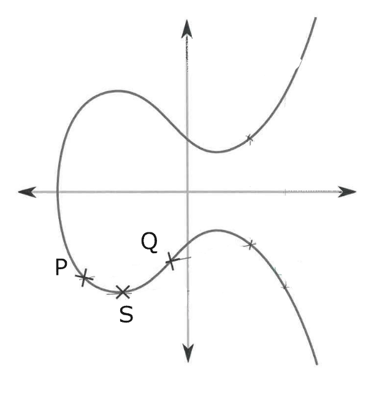

# Altfragen - Einführung in die Kryptographie

## Aufgabe 1

Berechnen Sie $2^{117} \mod 35$ (4P)

## Aufgabe 2

Sei $G = (\Z/16\Z)^{*}$

a) Welche Ordnung hat G? (1P)

b) Welche Ordnung haben jeweils die von den Elementen 3 und 7 aufgespannten zyklischen (Sub)gruppen $G_{3}$ und $G_{7}$? Stellen Sie die beiden Gruppen dar, in dem Sie alle darin enthaltenen Elemente angeben. (2P)

c) Wie ist allgemein ein Ring definiert? Welche Eigenschaften hat er? (1P)

## Aufgabe 4

a) Addieren Sie in der folgenden Zeichnung graphisch die auf einer elliptischen Kurve über $\R$ liegenden  Punkte P und Q und markieren Sie den entstehenden Punkt $R=P+Q$ (2P)

b) Verdoppeln Sie graphisch Punkt S und markieren Sie den entstehenden Punkt $T=2S$ (2P)

## Aufgabe 5

Der Ciphertext c wird aus einer Nachricht m mittels RSA Verschlüsselung nach folgender Vorschrift erzeugt

$$c=m^{e} \mod n$$