# Erstellen von Hidden-Volumes mit VeraCrypt

## Abstract
Die folgende Dokumentation soll den Prozess besschreiben mit dem Sie ein verschlüsseltes und verstecktes Volume mit VeraCrypt erstellen können.

## 1. Erstellen eines Outer Volumes
Im ersten Schritt muss ein äußeres und nicht verstecktes Volumen erstellt werden, da ein verstecktes Volumen mit Veracrypt nur in einem äußeren Veracrypt-Volumen erstellt werden kann.

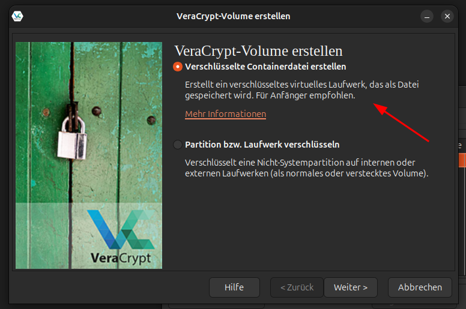

Wählen Sie als erstes aus, dass sie eine verschlüsselte Containerdatei erstellen möchten.

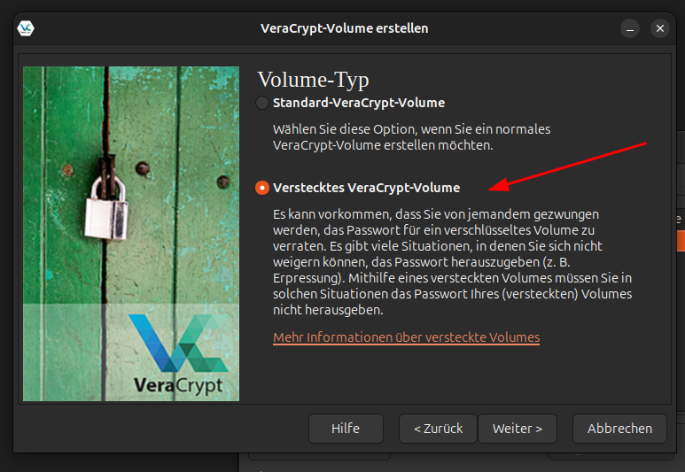

Wählen Sie, dass sie ein verstecktes Veracrypt-Volume erstellen möchten. Veracrypt wird Sie automatisch durch den entsprechenden Prozess begleiten und von Ihnen erst ein Outer Volume anlegen lassen.

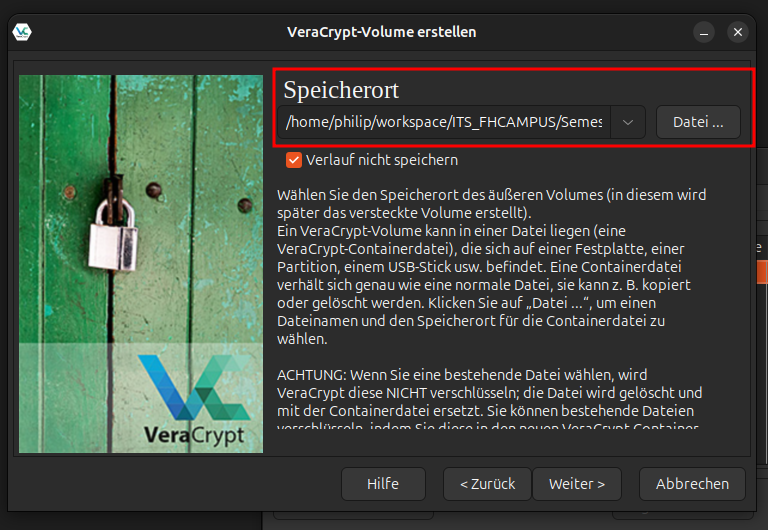

Im dritten Schritt wählen Sie bitte einen Dateispeicherort und Namen für das Outer Volume aus. Ob Sie den Verlauf speichern wollen oder nicht bleibt Ihnen überlassen.

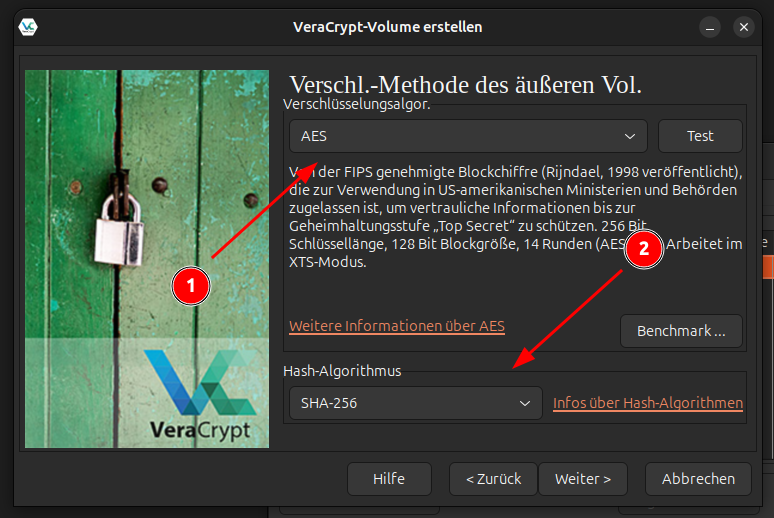

Bitte wählen Sie für das Outer Volume in Schritt 4 den Verschlüsselungsalgotihmus AES und asl Hash-Algorithmus SHA-256.

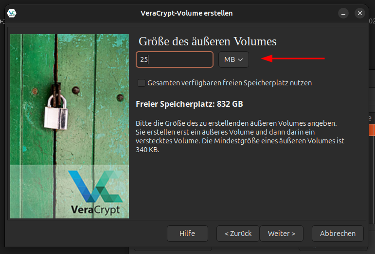

Für unser Beispiel Volumen wählen Sie im 5. Schritt 25MB aus.

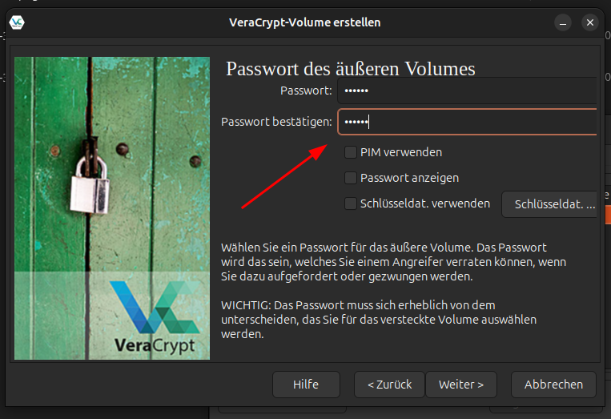

Im nächsten Schritt legen Sie ein password für das Outer Volume fest. Das Passwort kann im Notfall an dritte weitergegeben werden, die Daten im Hidden Volume können hiermit nicht eingesehen werden. Im Beispiel nehmen Sie einfach Ihren Vornamen als Passwort, die anschließende Warnung können Sie in diesem Fall ignorieren.

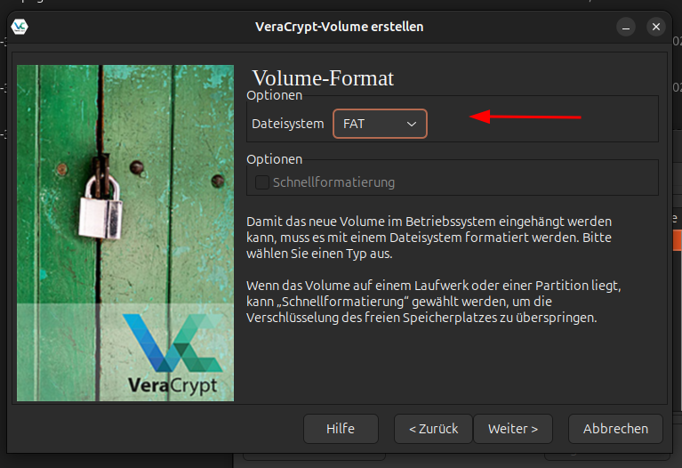

Als Datei-System Format wählen Sie in Schritt 7 FAT.

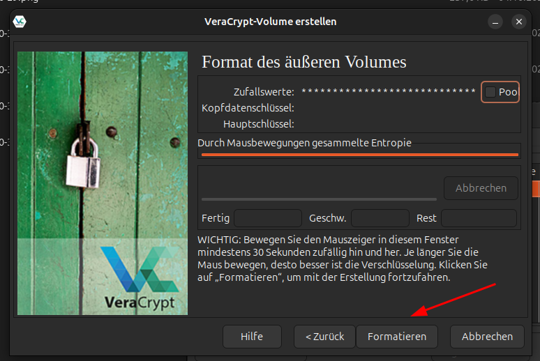

Abschließend bewegen Sie Ihren Mauszeiger im Fenster. VeraCrypt sammelt hier durch Ihre zufällige Mausbewegung Entropie und verbessert, je länger Sie die Maus bewegen, die Verschlüsselung. Bitte bewgen Sie die Maus für mindestens 30 Sekunden.

Anschließend bestätigen Sie die Formatierung des neuen Laufwerks mit dem Button "Formatieren".

## 2. Erstellen eines Hidden Volumes

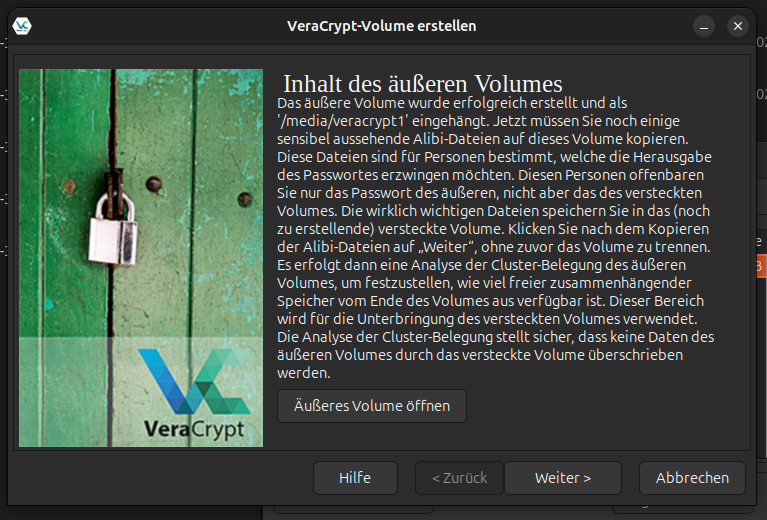

In Schritt 9 werden Sie dazu aufgefordert verschiedene, sensibel aussehende, Dateien in Ihrem Outer Volume abzulegen. Dies soll dazu dienen von einem möglichen Hidden Volume abzulenken. Für unser Beispiel legen Sie einfach ein beliebeg Bild im Outer Volume ab.

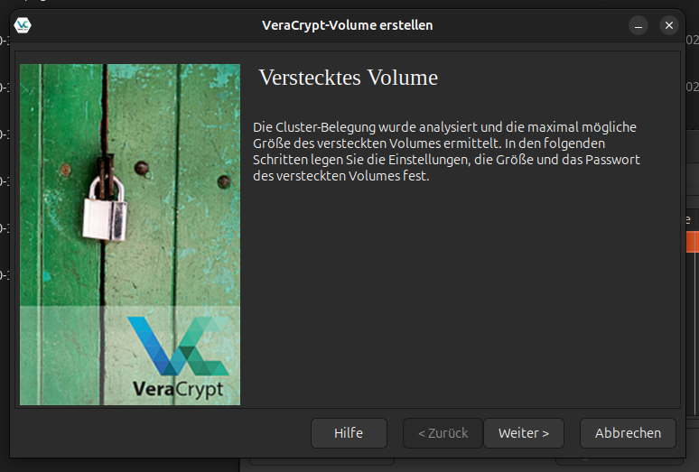

Im nächsten Schritt teilt Ihnen Veracrypt mit das die maximale Größe des Hidden Volumes automatisch bestimmt wurde. In späteren Schritten können Sie die größe des Volumes bis zu dieser Obergrenze anpassen.

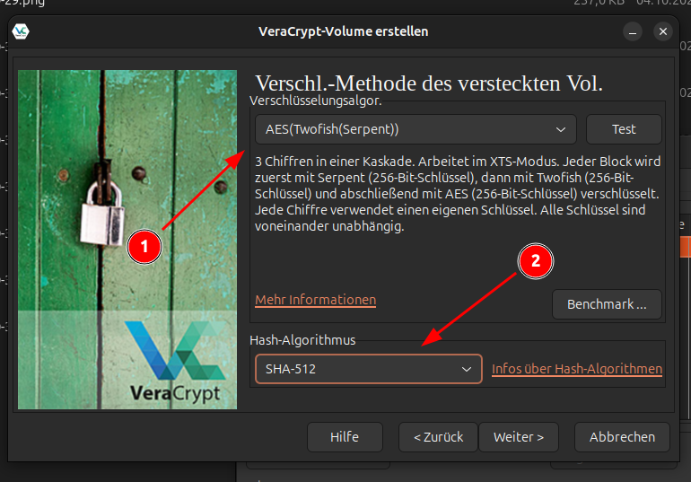

Für das Hidden Volume wählen Sie bitte eine kaskadierende Verschlüsselung aus. Im Beispiel nehmen wir dafür AES(TwoFish(Serpent)). Als Hash-Algorithmus benutzen wir SHA-512.

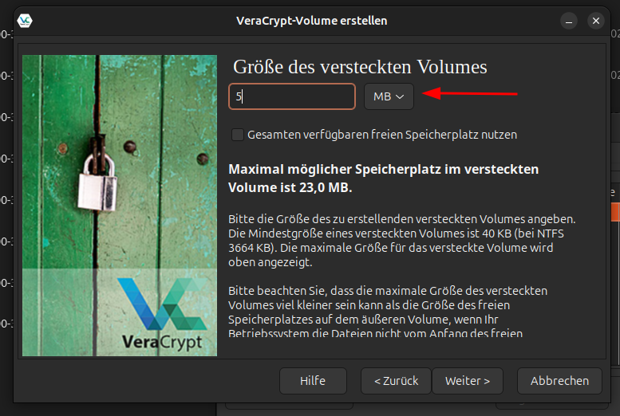

In Schritt 12 legen Sie als maximale größe für das Hidden Volume bitte 5MB fest.

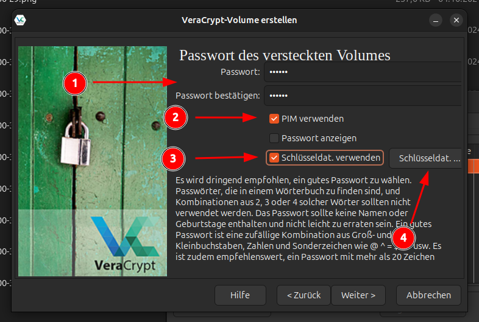

Für das Hidden Volume legen Sie bitte zuerst ein Passwort fest, im Beispiel nehmen wir hierfür den Nachnamen. Wählen Sie dann aus das Sie einen PIM nutzen wollen. Als Beispiel dient hierfür der Wert 500, bitte merken Sie sich diesen genauso wie Ihr Passwort, da Sie ohne diesen Wert das Hidden Volume nicht öffnen können. Als letzten Schritt fügen wir ein Keyfile hinzu, dass wir für die Entschlüsselung des Volumnes nutzen wollen.

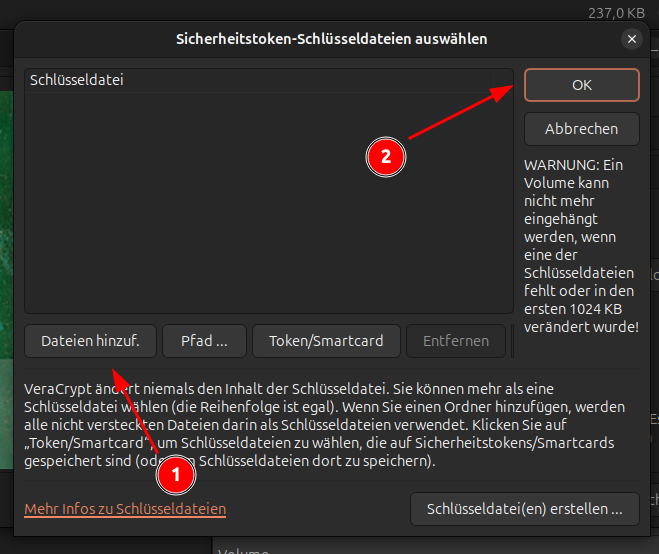

Für das Beispiel nutzen wir das Keyfile.png. Bitte legen Sie Ihr Keyfile dort ab, wo Sie es auch wieder finden, da Sie ohne das Keyfile nicht auf das Volume zugreifen können.

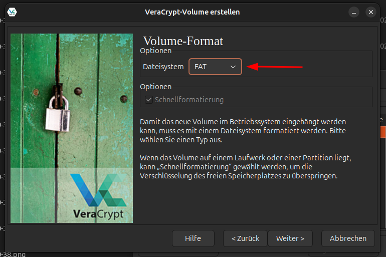

Nachdem Sie Passwort, PIM und Keyfile festgelegt haben wählen Sie auch für das Hidden Volume das Format FAT.

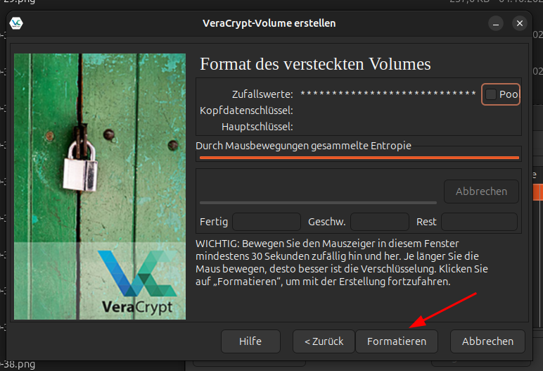

In Schritt 16 bewegen Sie bitte wieder den Mauszeiger im Fenster wie in Schritt 8.

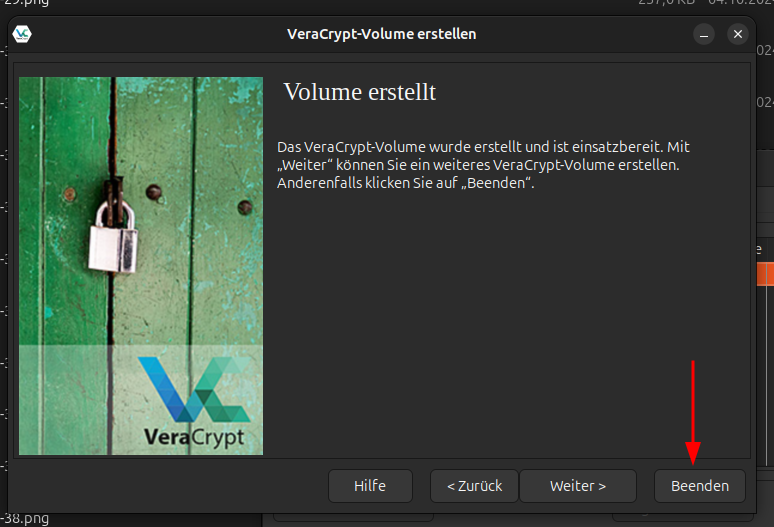

Herzlichen Glückwunsch, Sie haben nurn ein Outer und Hidden Volume erstellt. Sie können den Assistenten zum erstellen von Volumes nun Beenden.

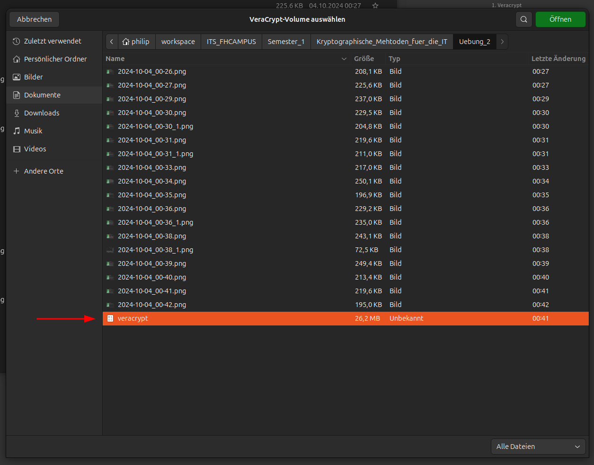

Im Datei-Explorer können Sie nun die Datei sehen, die Ihre beiden Volumes enthält. Von außen betrachtet sieht es nur nach einem standard Veracrypt-Volume aus.

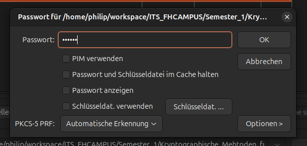

Um zu zeigen, dass unser Beispiel funktioniert entschüsseln und mounten wir nun nur das Outer Volume indem wir die Volume-Datei einhängen und nur unseren Vornamen als Passwort für das Outer Volunme eingeben.

Wenn Sie in das eingehängte Volume navigieren werden Sie nur Ihre zuvor abgelegte Bilddatei finden und merken, dass es keine Spur eines Hidden Volunmes gibt.

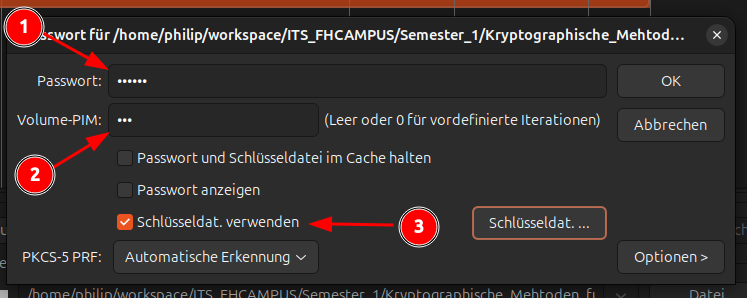

Nun hängen wir die Datei erneut ein, geben als Passwort aber unseren Nachnamen ein, als PIM 500 und nutzen das Keyfile. VerCrypt wird nun automatisch das Hidden Volume entschlüsseln und einhängen.

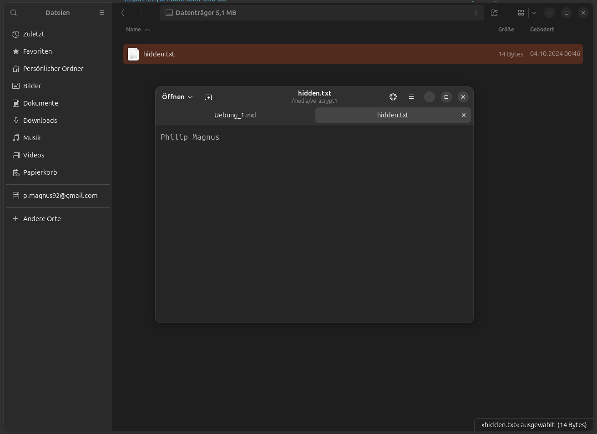

Im Hidden Volume legen Sie um das Beispiel abzuschließen nun eine Textdatei ab, welche Ihren Vor- und Nachnamen enthält. 
Wenn Sie sich versichern wollen, dass alles geklappt hat und die Datei im Hidden Volume wirklich versteckt ist, entschlüsseln Sie das Outer Volume noch einmal wie bereits in Schritt 19. Sie werden wieder nur das Bild in dem gemounteten Laufwerk sehen, welches Sie vorher dort abgelegt haben.

# dm-crypt

## Abstract

Die folgende Dokumentation soll den Prozess besschreiben mit dem Sie ein verschlüsseltes Volumen via `cryptsetup` erstellen und automatisch ohne Interatktion eines Nutzers einhängen können. `cryptsetup` nutzt im Hintergrund `dm-crypt`.

## Vorwort

Vor dem Start sind ein paar Dinge zu beachten:

- Für dieses Beispiel wird auf einer Disk-PArtition gearbeitet und von dieser alle Daten gelöscht. **Bitte gehehn Sie sicher, dass Sie auf einer leeren Partition arbeiten, es werden sonst Daten verloren gehen!**
- Das autmoatische einhängen von verschlüsselten Laufwerken stellt ein Sicherheitsrisiko dar und ist nicht zwangsläufig für eine Produktionsumgebung geeignet.

Die folgenden Schritte wurden in einer Ubuntu-24.04 VM auf einem Ubuntu-24.04 Host ausgeführt.

## Cryptsetup Installation

Cryptsetup kann einfach aus den offiziellen Ubuntu Respositories installiert werden. Hierfür sollte der folgende Befehl genutzt werden.


```
sudo apt install cryptsetup -y
```

Folgende Ausgabe sollte bei einer korrekten Installation erscheinen:

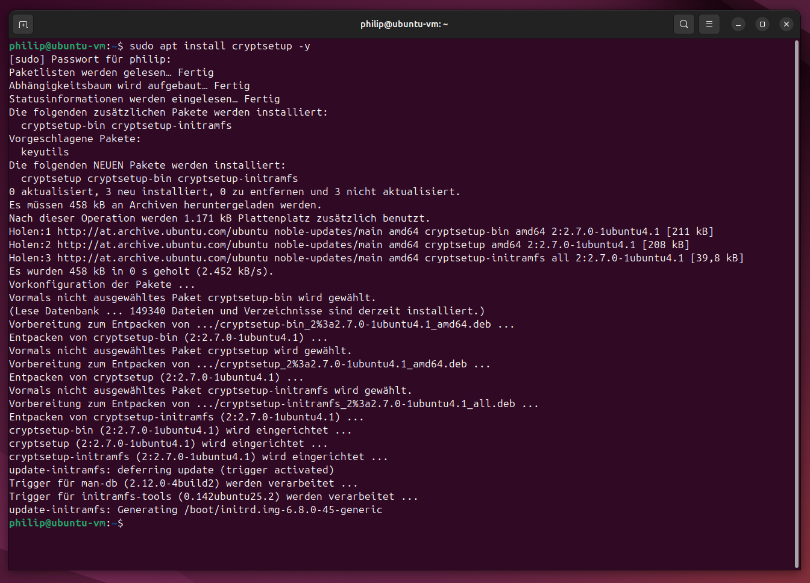

## Erstellen eines verschlüsselten Volumes

1. Wir suchen unsere leere Festplattenpartition und merken uns deren Pfad. Wir können den Pfad über das Kommando `lsblk` oder `sudo fdisk -l` finden. Die Partition lässt sich aber auch über ein Tool mit graphischer Oberfläche wie `Disk Utility` finden.\
\
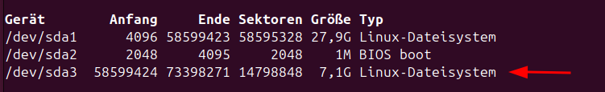

2. Im Terminal kann jetzt das Kommando `sudo cryptsetup luksFormat /dev/sda3` ausgeführt werden um die Verschlüsselung auf der Partition einzurichten.\
**Beachten Sie das /dev/sda3 Ihrem Pfad zur gewünschten Partition entsprechen muss.**\
Lesen sie sich die Anweisungen sorgfältig durch, bestätigen Sie mit `YES` und geben Sie Ihre gewünschte Passphrase ein.\
\
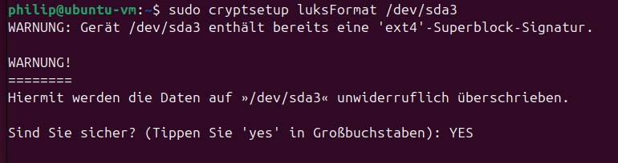