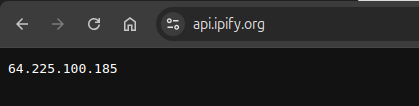

# HÜ4 - SSH

## 0. Intro

**Used equipment:**

- Ubuntu 24.04 LTS local machine
- Ubuntu 24.04 LTS remote machine
- Chrome Browser

## 1. SSH tunneling

In the first step a pair of ne SSH keys needs to be generated, unless you want to use already existent ones.

```bash
❯ ssh-keygen -t ed25519
Generating public/private ed25519 key pair.
Enter file in which to save the key (/home/philip/.ssh/id_ed25519): cryptmeth
Enter passphrase (empty for no passphrase):
Enter same passphrase again:
Your identification has been saved in cryptmeth
Your public key has been saved in cryptmeth.pub
The key fingerprint is:
SHA256:wPQ60jzvVg9qwB/8zDtoxA8nPeTVsJ77u1nSPJEkNzk philip@framework
The key's randomart image is:
+--[ED25519 256]--+
|      .          |
|     o .    .   .|
|      o .    = E |
|     o o  . o = +|
|    ..*oS+ o . o |
|     .o+B B o  o.|
|       +.& + ...+|
|       .B * o  +.|
|       +. .o .=o |
+----[SHA256]-----+
```

For the purpose of this exercise the SSH keys were saved in the `cryptmeth` (private key) file and the `kryptmeth.pub` (public key) file.
For this exercise the keys are not protected with a passphrase.

The public fingerprint of the SSH key was installed to the remote host on creation, if that is not possible the fingerprint can be added after remote machine setup with the following command (keep in mind for the second option the right permissions must be set on the remote machine):

```bash
❯ ssh-copy-id -i cryptmeth.pub root@64.225.100.185
```

After setting up the SSH keys we can check the SSH connection:

```bash
❯ ssh -i cryptmeth root@64.225.100.185
Welcome to Ubuntu 24.04.1 LTS (GNU/Linux 6.8.0-51-generic x86_64)

 * Documentation:  https://help.ubuntu.com
 * Management:     https://landscape.canonical.com
 * Support:        https://ubuntu.com/pro

 System information as of Sun Jan 19 18:06:35 UTC 2025

  System load:  0.01              Processes:             99
  Usage of /:   20.7% of 8.65GB   Users logged in:       0
  Memory usage: 38%               IPv4 address for eth0: 64.225.100.185
  Swap usage:   0%                IPv4 address for eth0: 10.19.0.6

Expanded Security Maintenance for Applications is not enabled.

7 updates can be applied immediately.
3 of these updates are standard security updates.
To see these additional updates run: apt list --upgradable

Enable ESM Apps to receive additional future security updates.
See https://ubuntu.com/esm or run: sudo pro status


root@cryptographic-mehtods:~#
```

>[NOTE] In this example we used a ssh key which was configured via the web interface of our hosting provider. With cloud providers this is one of the more common options. If ypu configure a remote system yourself keep in mind you will need to enable ssh and setup an inital password access and configure ssh key access after that.

>[WARNING] In this example the `root` account is used. This is NOT recommended for production environments. In production use dedicated accounts with a correct permission setup.

## Forwarding browser traffic

With the following command we create a SOCKS proxy on port `8090`:

```bash
❯ ssh -i cryptmeth -D 8090 root@64.225.100.185
Welcome to Ubuntu 24.04.1 LTS (GNU/Linux 6.8.0-51-generic x86_64)

 * Documentation:  https://help.ubuntu.com
 * Management:     https://landscape.canonical.com
 * Support:        https://ubuntu.com/pro

 System information as of Sun Jan 19 18:19:37 UTC 2025

  System load:  0.08              Processes:             104
  Usage of /:   20.7% of 8.65GB   Users logged in:       0
  Memory usage: 37%               IPv4 address for eth0: 64.225.100.185
  Swap usage:   0%                IPv4 address for eth0: 10.19.0.6

Expanded Security Maintenance for Applications is not enabled.

7 updates can be applied immediately.
3 of these updates are standard security updates.
To see these additional updates run: apt list --upgradable

Enable ESM Apps to receive additional future security updates.
See https://ubuntu.com/esm or run: sudo pro status


Last login: Sun Jan 19 18:06:35 2025 from 62.178.13.69
root@cryptographic-mehtods:~#
```

Note that the SSH session starts normally and we can use the session to start/stop tasks on the remote machine. The session can also be stopped normally.

In the `network settings` of our operating system we can now conmfigure our SOCKS proxy to be used to tunnel all network traffic through our remote machine.


For the host we use our localhost and the tunneled port `8090`. After saving the settings we can check if our proxy is working.

First we check our IP address with our proxy active:



Then we compare this to our IP address without our proxy active:


>[NOTE] The second IP was partially blurred for privacy reasons.

When using the verbose mode whe can also see connections which are tunneled via the SSH tunnel proxy:

```bash
root@cryptographic-mehtods:~# debug1: Connection to port 8090 forwarding to socks port 0 requested.
debug1: channel 3: new dynamic-tcpip [dynamic-tcpip] (inactive timeout: 0)
debug1: Connection to port 8090 forwarding to socks port 0 requested.
debug1: channel 4: new dynamic-tcpip [dynamic-tcpip] (inactive timeout: 0)
debug1: Connection to port 8090 forwarding to socks port 0 requested.
debug1: channel 5: new dynamic-tcpip [dynamic-tcpip] (inactive timeout: 0)
debug1: Connection to port 8090 forwarding to socks port 0 requested.
debug1: channel 6: new dynamic-tcpip [dynamic-tcpip] (inactive timeout: 0)
debug1: Connection to port 8090 forwarding to socks port 0 requested.
debug1: channel 7: new dynamic-tcpip [dynamic-tcpip] (inactive timeout: 0)
debug1: Connection to port 8090 forwarding to socks port 0 requested.
debug1: channel 8: new dynamic-tcpip [dynamic-tcpip] (inactive timeout: 0)
debug1: Connection to port 8090 forwarding to socks port 0 requested.
debug1: channel 9: new dynamic-tcpip [dynamic-tcpip] (inactive timeout: 0)
debug1: Connection to port 8090 forwarding to socks port 0 requested.
debug1: channel 10: new dynamic-tcpip [dynamic-tcpip] (inactive timeout: 0)
debug1: Connection to port 8090 forwarding to socks port 0 requested.
debug1: channel 11: new dynamic-tcpip [dynamic-tcpip] (inactive timeout: 0)
debug1: Connection to port 8090 forwarding to socks port 0 requested.
debug1: channel 12: new dynamic-tcpip [dynamic-tcpip] (inactive timeout: 0)
debug1: Connection to port 8090 forwarding to socks port 0 requested.
debug1: channel 13: new dynamic-tcpip [dynamic-tcpip] (inactive timeout: 0)
debug1: Connection to port 8090 forwarding to socks port 0 requested.
debug1: channel 14: new dynamic-tcpip [dynamic-tcpip] (inactive timeout: 0)
debug1: Connection to port 8090 forwarding to socks port 0 requested.
debug1: channel 15: new dynamic-tcpip [dynamic-tcpip] (inactive timeout: 0)
debug1: Connection to port 8090 forwarding to socks port 0 requested.
debug1: channel 16: new dynamic-tcpip [dynamic-tcpip] (inactive timeout: 0)
debug1: Connection to port 8090 forwarding to socks port 0 requested.
debug1: channel 17: new dynamic-tcpip [dynamic-tcpip] (inactive timeout: 0)
debug1: Connection to port 8090 forwarding to socks port 0 requested.
debug1: channel 18: new dynamic-tcpip [dynamic-tcpip] (inactive timeout: 0)
debug1: Connection to port 8090 forwarding to socks port 0 requested.
debug1: channel 19: new dynamic-tcpip [dynamic-tcpip] (inactive timeout: 0)
debug1: Connection to port 8090 forwarding to socks port 0 requested.
debug1: channel 20: new dynamic-tcpip [dynamic-tcpip] (inactive timeout: 0)
debug1: Connection to port 8090 forwarding to socks port 0 requested.
debug1: channel 21: new dynamic-tcpip [dynamic-tcpip] (inactive timeout: 0)
```

## SSH audit