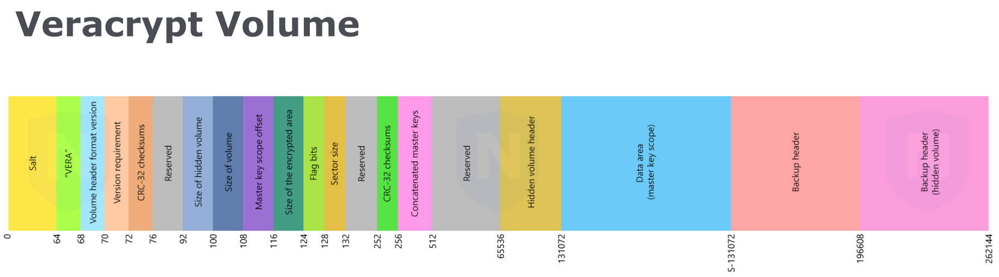
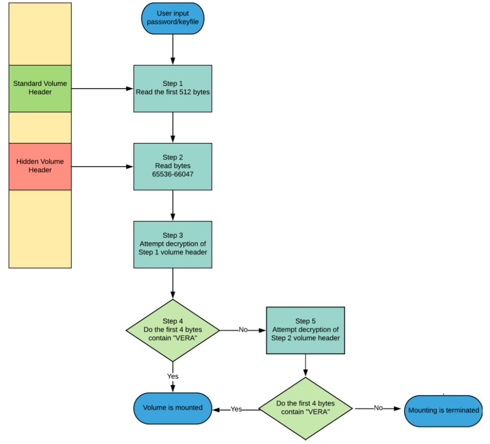
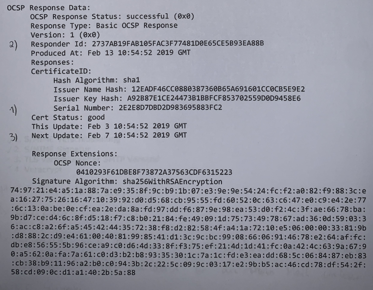

# Altfragen - Kryptographische Methoden für die IT

## Aufgabe 1

<span style="color:red">

<b>Frage:</b><br><br>
a) <br>
Erklären Sie das Konzepot der Plausible Deniability.
<br> <br>
b) <br>
Erklären Sie, wiesofür die Existenz eines Hidden Volume in VeraCrypt Plausible Deniability gilt.
<br> <br>
c)<br>
Sie möchten einige vertrauliche Daten verschlüsselt in einem Clouddienst (z.B. DropBox) ablegen. Sie können entweder ein Stacked Filesystem einsetzen oder eine Veracrypt Containerdatei synchronisieren.
Für welche Variante entscheiden Sie sich? Begründen Sie Ihre Antwort.
Geben Sie außerdem ein Argument an, dass für die andere Variante sprechen würde.

</span>

<br>

**Antwort:**

a) <br>
Plausible Deniability, ist eine steganographische Technik, die es ermöglicht, dass die Existenz von verschlüsselten Dateien oder Nachrichten abgestritten werden kann. Ein Angreifer kann die existenz dieser Nachrichten/Dateien in einem Strom aus Daten, welche wie Zufallsdaten aussehen, nicht beweisen. Die Existenz dieser ist also plausibel abstreitbar.
<br>

b) <br>
Im Kontext von VeraCrypt, bedeutet die Plausible Deniability, dass die Existenz eines Hidden-VeraCrypt-Volume nicht bewiesen werden kann. Bei VeraCrypt kann in einem verschlüsselten Volumen noch ein weiteres Hidden Volume angelegt werden. Das Hidden Volume wird nur entschlüsselt, wenn bei der Einbindung des VeraCrypt Volumes das korrekte Passwort angegeben wird. Die VeraCrypt Datei sieht verschlüsselt aus wie Zufallsdaten aus denen sich die Existenz eines hidden Volumen nicht ableiten lässt. Ein Hidden Volume kann also existieren oder nicht, die Existenz kann also plausibel abgestritten werden, vor allem da sich das Outer Volume auch normal entschlüsseln lässt und Daten enthalten kann.




<br>

c) <br>
Um Dateien verschlüsselt in einem Cloudstorage abzulegen, würde ich ein Stacked Filesystem verwenden.
Mit dem Stacked Filesystem ist es egal, dass man keinen Zugriff auf das unterliegende Blockdevice hat. Benuzter können außerdem,
unabhängig von Adminrechten die Verschlüsselung nutzen und es ist keine a priori Speicherzuweisung notwendig. Außerdem muss nicht wie bei einem VeraCrypt Volume bei jedem Hinzufügen/Entfernen von Dateien
das ganze Volumen im Cloudstorage ausgetauscht werden.

Der Vorteil eines VeraCrypt Volumes wäre aber die umfassende Verschlüsselung, auch von Metadaten und angelegter Dateistruktur. Eventuell könnte die Einbindung des Volumens, nach der Entschlüsselung, in das Betriebssystem auch einen Performancevorteil brinden. Gegenüber der einfacheren Verwendung, erscheinen diese Vorteile aber evtl. marginal.

## Aufgabe 2

<span style="color:red">

<b>Frage:</b><br>
Sie befinden sich in einem öffentlichen WLAN und möchten eine E-Mail an jane.doe@gmail.com verschicken. Aus Compliancegründen ist es notwendig, dass es keinem Google Mitarbeiter möglich ist, den Inhalt der Nachricht zu lesen. 
Geben Sie für jeden der folgende Ansätze an, ob er geeignet ist, dieses Ziel zu erreichen, und begründen Sie jeweils Ihre Antwort.
<br><br>

1. S/MIME Verschlüsselung
2. S/MIME Signatur
3. TLS verschlüsselter SMTP Versand
4. Veracrypt

</span>

<br>

**Antwort:**

1. S/MIME Verschlüsselung ist geeignet um Verschlüsselte Mails zu versenden. Die Mails werden auf Basis von x509 Zertifikaten verschlüsselt, diese müssen vorher von einer CA ausgestellt werden.

2. S/MIME Signatur ist nicht geeignet, wie der Name schon sagt handelt es sich hierbei nur um eine Signatur, also die Bestätigung, dass der Sender über ein passendes Zertifikat verfügt. Der Inhalt der Mail wäre nach wie vor lesbar.

3. TLS verschlüsselter SMTP Versand wäre nicht geeignet. Die Mail wäre nicht Ende-zu-Ende verschlüsselt sondern nur der Weg vom MUA zum MSA. Es handelt sich nur um eine Transportverschlüsselung, d.h. jeder MTA auf dem Weg den die Mail nimmt könnte diese potentiell lesen.

4. VeraCrypt ist ein Spezialfall. Man müsste sich im vorhinein mit dem Empfänger auf einen gemeinsamen Key zum entschlüsseln des Volumes einigen und in dem Volume dann eine Text Datei versenden. Außerdem muss beachtet werden, dass sich das versendete Volume aufgrund seiner Größe überhaupt noch versenden lässt. Hat man sich im vorhinein auf einen Key geeinigt und das Volume ist nicht zu große könnte man so kommunizieren, der Aufwand wäre aber sehr groß und nur geeignet wenn man bereits über einen anderen sicheren Kanal kommuniziert hat.

## Aufgabe 3

<span style="color:red">
<b>Frage:</b><br>
<br>

a) <br>
Nennen Sie 6 Elemente die sich in einem X.509v3 Zertifikat befinden können.
<br>

b) <br>
Sie sehen im Folgenden die openssl Ausgabe des Inhaltes einer CRL. Beantworten Sie zu dieser die folgenden Fragen:	

1. Welche Seriennummer hat die CRL?
2. Welches Subject hat das Zertifikat der Entität, die die CRL ausgestellt hat?
3. Welches kryptographische Verfahren verwendet der Public Key der Entität, welches die CRL ausgestellt hat?
4. Wann endetder Gültigkeitszeitraum der CRL?
5. Wie viele Zertifikate wurden widerrufen?
6. Welche Zertifikate mussten aus Sicherheitsgründen widerrufen werden? (Geben Sie die Seriennummer an bzw. markieren Sie die entsprechenden Zertifikate)
7. Wann endet der reguläre Gültigkeitszeitrum des Zertifikats mit der Seriennummer 4C-61-0B-09-68-0B-E1-97-D8-7C?

Hinweis: Möglicherweise sind nicht alle Antworten aus der Angabe beantwortbar. Geben Sie das in diesem Falle explizit an.

</span>

<br>

```
1 Certificate Revocation List (CRL):
2        Version 2 (0x1)
3     Signature Algorithm: sha256WithRSAEncryption
4        Issuer: /C=US/L=Redmond/O=Microsoft Corporation /CN=Microsoft IT TLS CA 1
5        Last Update: Mar 3 21:34:17 2019 GMT
6        Next Update: Mar 11 21:54:17 2019 GMT
7        CRL extensions:
8            X509v3 Authority Key Identifier:
9               keyid: 58:88:9F:D6:DC:9C:48:22:B7:14:3E:FF:84:88:E8:E6:85:FF:FA:7D
10           1.3.6.1.4.1.311.21.1:
11              [...] 
12           X509v3 CRL Number:
13              173
14           1.3.6.1.4.1.311.21.4:
15              190307214417Z
16 Revoked Certificates:
17    Serial Number: 5475D86F35CC50754549
18       Revocation Date: Sep 23 00:49:00 2017 GMT
19       CRL entry extensions:
20           X509v3 CRL Reason Code:
21              Cessation Of Operation
22    Serial Number: 4FF4BFE3D22D89C6B4F7
23       Revocation Date: Sep 18 11:16:37 2017 GMT
24       CRL entry extensions:
25           X509v3 CRL Reason Code:
26              Superseded
27    Serial Number: 4C610B09680BE197D87C
28       Revocation Date: Sep 12 23:05:23 2017 GMT
29       CRL entry extensions:
30           X509v3 CRL Reason Code:
31              Affiliation Changed
32    Serial Number: 32353D9CAA402807A605
33       Revocation Date: Aug 24 03:28:57 2017 GMT
34       CRL entry extensions:
35           X509v3 CRL Reason Code:
36              Key Compromise
37    Serial Number: 323479639E0E8078AC7A
38       Revocation Date: Aug 24 03:28:57 2017 GMT
39       CRL entry extensions:
40           X509v3 CRL Reason Code:
41              Key Compromise
42    Signature Algorithm: sha256WithRSAEncryption
43       89:d0:bb:cf:a0:2b:ab:9c:16:c8:10:ef:c8:01:f5:0f:78:f0:
44       f2:a5:ed:5c:68:6b:8f:d3:78:7c:b5:24:7b:45:86:2c:15:7d:
45       [...]
46       ee:a4:e9:3f:22:c1:84:e6:85:7a:26:bb:48:46:3e:a1:29:58:
47       df:12:73:cc:65:17:cb:0a
```

<br>

**Antwort:**

a)<br>

- Signature
- Subject
- Issuer
- Validity
- Serial Numbers
- Public Key

<br>

b)<br>

1. 173

2. Microsoft Corp., Redmond, US

3. Der Key wurde mit RSA erstellt.

4. Die CRL muss am 11 März 2019 upgedated werden.

5. 5 Zertifikate wurden widerrufen

6. `323479639E0E8078AC7A, 32353D9CAA402807A605` mussten aufgrund eines Key Compromise widerrufen werden

7. Das Zertifikat wurde am 12.09.2017 widerrufen damit endet die Gültigkeit. Mehr Informationen haben wir hier leider nicht. Um das reguläre Ende der Zertifikatsgültigkeit zu kenne bräuchten wir das Zertifikat selbst.

## Aufgabe 4

<span style="color:red">
<b>Frage:</b><br>
<br>

a) Welche Authentifizierungsmethoden kennt das SSH User Authentication Protocol?

b) Betrachten Sie die folgende Konfigurationsdatei für einen OpenSSH Server (sshd.conf). Welche Security Probleme können Sie darin finden? Begründen Sie Ihre Antwort auch jeweils kurz.	

<br>

</span>

```
1 Protocol 1,2
2 HostKey /etc/ssh/ssh_host_rsa_key
3 HostKey /etc/ssh/ssh_host_ed25519_key
4 PermitRootLogin yes #or 'without−password' to allow SSH key based login
5 StrictModes yes
6 PermitEmptyPasswords yes
7 Ciphers chacha20−poly1305@openssh.com,aes256−gcm@openssh.com 
8 MACs hmac−sha2−512−etm@openssh.com,hmac−sha2−256−etm@openssh.com,hmac−md5
9 KexAlgorithms curve25519−sha256@libssh.org,diffie−hellman−group−exchange−sha256
```

<br>

**Antwort:**

a) <br>

- password: Client übertragt Klartextpasswort über verschlüsselten Kanal an Server

- publickey: für die Authentifizierung muss er Benutzer den Besitz eines privaten Schlüssels nachweisen, der Server kennt den öffentlkichen Teil des Keys

- hostbased: ähnlich wie publickey, Prüfung erfolgt auf Host des Clients und der Server vertraut diesem Host

b) <br>

1. SSH Protocol 1 ist noch aktiv, es sollte nur 2 aktiv sein. Protocol 2 unterstützt stärkere Verschklüsselungsmethoden (AES, ECDSA, ED25519)

2. Der noch aktive Host_key ist nicht unbedingt ein Risiko, es gibt aber effizientere Alternativen

3. PermitRootLogin sollte auf no stehen. Sollten root Rechte gebraucht werden, kann man diese sich immer noch nach dem Login zuweisen

4. PermitEmptyPasswords sollte auf no stehen, es könnte sonst sein das es Benutzer gibt die kein Passwort setzen und dies würde Angreifern ermöglichen sich mit diesen Benutzern ohne Passwort anzumelden

5. hmac-md5, md5 ist ein schwacher Hashing-Algorithmus mit bekannten Fehlern und sollte nicht mehr verwendet werden.


## Frage 5

<span style="color:red">
<b>Frage:</b><br>
<br>

a) Skizzieren und beschreiben Sie den TLS Handshake (Version 1.2) beim Aufbau einer Verbindung und erläutern Sie kurz die einzelnen Phasen.

b) Wann und wie wird festgelegt, mit welchen kryptographischen Algorithmen die SSL/TLS Session arbeiten wird?

c) Wann und wie kann der Browser verifizieren, dass zwischen ihm und dem Server keine Man-in-the-Middle Attacke vorliegt?

d) Ab weichem Zeitpunkt sind Client & Server in der Lage das notwendige symmetrische Schlüsselmaterial zu erzeugen?

</span>

<br>

**Antwort:**

a) <br>

Es gibt vier Phasen im SSL-Handshake-Protokoll. Die folgenden Nachrichten werden in diesen 4 Phasen verwendet.

- Phase-1: Feststellen der security capabilities
- Phase-2: Server-Authentifizierung und Schlüsselaustausch
- Phase-3: Client-Authentifizierung und Schlüsselaustausch
- Phase-4: Finish


1. Die „Client Hello“-Nachricht: Der Client leitet den Handshake ein, indem er eine „Hello“-Nachricht an den Server sendet. Die Nachricht zeigt an, welche TLS-Version und welche Cipher Suites der Client unterstützt. Außerdem enthält sie eine Folge von zufälligen Bytes, die als „Client Random“ bezeichnet werden.

2. Die „Server Hello“-Nachricht: Als Antwort auf die „Client Hello“-Nachricht sendet der Server eine Nachricht, die das SSL-Zertifikat des Servers, die vom Server ausgewählte Verschlüsselungssuite und die „Server Random“ (eine vom Server generierte zufällige Byte-Zeichenfolge) enthält.

3. Authentifizierung: Der Client überprüft das SSL-Zertifikat des Servers bei der Zertifizierungsstelle, die es ausgestellt hat. Dieser Vorgang bestätigt, dass der Server der ist, der er vorgibt zu sein, und dass der Client mit dem tatsächlichen Eigentümer der Domain interagiert.

4. Das Premaster Secret: Der Client sendet eine weitere zufällige Folge von Bytes, das „Premaster Secret“. Das Premaster Secret wird mit dem öffentlichen Schlüssel verschlüsselt und kann vom Server nur mit dem privaten Schlüssel entschlüsselt werden. (Der Client erhält den öffentlichen Schlüssel vom SSL-Zertifikat des Servers.)

5. Privater Schlüssel wird verwendet: Der Server entschlüsselt das Premaster Secret.

6. Sitzungsschlüssel werden erstellt: Sowohl Client als auch Server generieren Sitzungsschlüssel aus dem Client Random, dem Server Random und dem Premaster Secret. Sie sollten zu den gleichen Ergebnissen kommen.

7. Client ist bereit: Der Client sendet eine „Fertig“-Nachricht, die mit einem Sitzungsschlüssel verschlüsselt ist.
Server ist bereit: Der Server sendet eine „Fertig“-Nachricht, die mit einem Sitzungsschlüssel verschlüsselt ist.

8. Sichere symmetrische Verschlüsselung erfolgreich: Der Handshake ist abgeschlossen und die Kommunikation wird mit den Sitzungsschlüsseln fortgesetzt.

b) <br>

Welcher Algorithmus verwendet werden soll, wird im Handshake Prozess, in den ersten beiden Schritten “Client Hello” und “Server Hello” festgelegt. Der Client schlägt dem Server Cipher Suites vor und der Server entscheidet sich für eine, die er ebenfalls unterstützt. Die Auswahl hängt von den gemeinsamen unterstützen Algorithmen ab. 

c) <br>

- Zertifikatsüberprüfung Browser überprüft das Zertifikat, welches der Server an den Client gesendet hat. 
    - vertrauenswürdige Zertifizierungsstelle (CA)
    - ob es bis zur Root-CA gültig ist 
    - Hostname des Servers gleich mit Common Name im Zertifikat
    - Gültigkeit des Zertifikats 
    - Überprüfung der Signatur der CA 

- Schlüsselaustausch / Authentifizierung: Nur der Server mit dem richtigen privaten Schlüssel kann den Handshake erfolgreich beenden (öff. Schlüssel des Servers im Zertifikat → nur echter Server der zugehörigen priv. Schlüssel hat kann die verschl. Nachrichten des Browsers entschlüsseln)

- Forward Secrecy: Wenn ECDH für den Schlüsselaustausch verwendet wird → für jede Verbindung, wird ein neuer Sitzungsschlüssel generiert. Sogar wenn ein Angreifer den priv. Schlüssel des Servers hat, können vergangene Sitzungen nicht entschlüsselt werden, da der Sitzungsschlüssel nicht dauerhaft gespeichert wird. 

- Finished- Message: stellt sicher, dass die Kommunikation nicht manipuliert wurde. Diese Nachricht enthält Hash aller bisherigen Nachrichten des Handshakes → Browser überprüft Korrektheit. (MitM- Hashwerte wären unterschiedlich) 

d) <br>

Zeitpunkt erzeugung symmetrisches Schlüsselmaterial
- symmetrische Schlüssel kann nach der Berechnung des Master-Secret erzeugt werden.
- Bei RSA: Nach der Client-Key-Exchange Nachricht 
- Bei ECDHE: Nach Berechnung des gemeinsamen Schlüssels aus dem Schlüsselaustausch 


## Frage 6

<span style="color:red">
<b>Frage:</b><br>
<br>

Sie betreiben einen Server und möchten dessen Daten auf einer Festplatte auf Ihrem lokalen Rechner sichern. Die Daten sollen dabei über SSH vom Server aus auf das Backupmedium gepusht werden. Zu diesem Zweck haben Sie auf dem Server ein Skript erstellt, welches durch Aufruf von ./backup.sh ssh-host-name ssh-port-number das Backup anstößt.
Unglücklicherweise ist Ihr lokaler Rechner vom Server aus nicht zu erreichen.
Wie können Sie das Backup durch SSH Port Forwarding doch ausführen? Geben Sie auch einen konkreten Aufruf des Backupskripts an. Hinweis: Bitte verwenden sie in Ihrer Erklärung auch konkrete exemplarische Ports.

</span>

<br>

**Antwort:**

Vom Client sollte zum Server eine SSH Verbindung mit einem reverse Port Forwarding aufgenommen werden.

```bash
ssh -R 9999:localhost:8888 user@server
```
Hiermit wird Port 9999 des Servers auf Port `8888` des lokalen Rechners weitergeleitet.

Nun kann das Backup-Script wie folgt ausgeführt werden:

```bash
./backup.sh localhost 9999
```

Das Backup wird dann vom `localhost:9999` über das reverse Portforwarding an den vorher nicht erreichbaren Rechner auf Port `8888` weitergeleitet.


## Frage 7

<span style="color:red">
<b>Frage:</b><br>
<br>
 Beschreiben Sie die Gemeinsamkeiten und die Unterschiede bei der Verschlüsselung einer E-Mail mittels S/MIME bzw. mittels PGP.

</span>

<br>

**Antwort:**

Gemeinsamkeit: 

- Beide verwenden asymmetrische Kryptographie, wobei ein öffentlicher Schlüssel für die Verschlüsselung und ein privater Schlüssel für die Entschlüsselung genutzt wird.

- Beide Systeme nutzen eine Kombination aus asymmetrischer und symmetrischer Verschlüsselung:


Unterschiede: 

- S/MIME: 
    - Basiert auf X.509-Standard und verwendet ein hierarchisches Public Key Infrastructure (PKI)-Modell

    - Identität der Nutzer wird durch Zertifikatsstellen (Certificate Authorities) geprüft und verifiziert.

    - Die Zertifikatsverwaltung passiert dabei teilweise auf Ebene des Betriebssystems (z.B. Outlook/Windows), teilweise im Mail Client selbst (z.B. Thunderbird)

    - Bei internen Mails Austausch der Zertifikate über bspw. Exchange-Server, bei externen Mails muss erst eine unverschlüsselte aber signierte Mail gesendet werden.

- PGP:
    - Nutzt Web-of-Trust-Modell anstatt PKI 

    - Nutzer können ihre Schlüssel gegenseitig signieren

    - Zertifikate können auch selbst signiert sein

    - Schlüssel werden von Nutzer selbst verwaltet

    - Möglichkeit mehrere Schlüssel pro Identität zu verwenden, mit Verwaltung über Master und Sub Keys

    - Austausch der Schlüssel/Zertifikate persönlich oder über öffentliche Server


## Frage 8

<span style="color:red">
<b>Frage:</b><br>
<br>

a) <br>

Wie lauten die drei Bestandteile einer PKI laut PKIX (RFC5280) Standard und was ist ihre jeweilige Aufgabe?

b) <br>

Welches fundamentale Problem von PKIX versucht Certificate Transparency (CT) wie zu lösen?

c) <br>
Sie sehen im Folgenden openssl Ausgabe des Inhaltes einer OCSP Antwort. 
Beantworten Sie dazu folgende Fragen:

1. Welche Seriennummer hat das geprüfte Zertifikat? 
2. Welches Subject hat das geprüfte Zertifikat?
3. Wann endet der Gültigkeitszeitraum des geprüften Zertifikats? 
4. Wurde das Zertifikat widerrufen?
5. Wie lande ist die OCSP Antwort gültig?
6. Ist ein Dokument, welches mit dem geprüften Zertifikat am 24.12.2018 signiert wurde, gültig?

Hinweis: Möglicherweise sind nicht alle Antworten aus der Angabe beantwortbar. Geben Sie das gegebenenfalls explizit an. 

</span>

<br>



**Antwort:**

a) <br>

- CA - Certificate Authoritiy: Stellt das Zertifikat aus

- VA - Validation Authority: Ist für die Validierung der ausgestellten Zertifikate verantwortlich

- RA - Registration Authority: erhält Zertifikatsanfragen (CSR) und entscheidet ob daraufhin ein Zertifikat ausgestellt werden darf

b) <br>

Grundsätzlich kann jede CA jedes beliebige Zertifikat ausstellen. z.B. kann eine CA ein Zertifikat für google.com erstellen, ohne dass dies von Google angefordert wurde.

Durch Certificate Transparency wird vorgeschrieben, dass die CAs jedes ausgestellte Zertifikat in ein öffentlich einsehbares CT Log geschrieben wird, wodurch Google zumindest feststellen kann, wenn ein falsches Zertifikat für google.com erstellt wurde.

c) <br>

1. `2E2E8D7DBD2D983695883FC2`
2. keine Infos zum Subject
3. nur die Gültigkeit der OCSP Response ist gegeben nicht des Zertifikats
4. Nein das Zertifikat ist gültig
5. Bis zum 07.02.2019 10:54:52 GMT
6. Keine Info zum Gültigkeitszeitraum, 24.12.2018 kann vor Gültigkeistbeginn liegen.

## Frage 9

<span style="color:red">
<b>Frage:</b><br>
<br>

a) <br>
Erläutern Sie kurz das Trust on First use (TOFU) Prinzip und geben Sie 2 konkrete Anwendungen an, wo es in der Praxis eingesetzt wird.

b) <br>
Was müsste ein Angreifer tun, um eine Verbindung, bei der TOFU eingesetzt wird, erfolgreich als Machine-in-the-middle anzugreifen?

c) <br>
Erklären Sie, warum weder S/MIME noch PGP Verschlüsselung (Perfect) Forward Secrecy bieten können.


</span>

<br>

**Antwort:**

a) <br>

- TOFU:
    - beim erstmaligen Kontakt einem öffentlichen Schlüssel vertraut wird und dieser für die Zukunft gespeichert wird. Ein Fehler tritt bei einer unerwarteten Änderung auf.
    - Das Modell basiert darauf, dass ein (MitM-)Angriff genau zum Zeitpunkt der erstmaligen Kontaktaufnahme mit einem Server extrem unwahrscheinlich ist.

- Beispiele Praxis: 
    - SSH Server Key 
    - Signal (Messenger)
    - HPKP (HTTP Public Key Pinning) 

b) <br>

Der Angreifer positioniert sich, während des erstmaligen Kontaktes (!), zwischen dem Client und dem echten Server (z. B. durch DNS-Spoofing, ARP-Spoofing). Er präsentiert seinen eigenen öffentlichen Schlüssel als den des Servers. Der Client speichert diesen falschen Schlüssel, da es sich um die erste Verbindung handelt und TOFU keine Authentizität sicherstellt.
Alle zukünftigen Verbindungen des Clients laufen über den Angreifer, der die Kommunikation entschlüsseln und manipulieren kann. 

c) <br>

SMIME und PGP verwenden alte Technologien (entstanden in der ersten Hälfte der 1990er Jahre). Für die Verschlüsselung wird stets derselbe Schlüssel verwendet und es gibt keine Session-Keys. Sollte also der Langzeit-Schlüssel kompromittiert werden, ist damit auch die ganze bisherige Mail-Historie kompromittiert, daher keine Forward Secrecy gegeben ist.

## Frage 10

<span style="color:red">
<b>Frage:</b><br>
<br>

a) Worin besteht der Unterschied zwischen passiven und aktiven Attacken auf einen gesicherten Kommunikationskanal? Welche kryptographischen Schutzziele werden dabei jeweils angegriffen? 

b) Nennen und beschreiben Sie 2 Angriffe, die sich gegen das bei einer gesicherten Kommunikation verwendete Protokoll richten. 

c) Nennen und beschreiben Sie 2 Angriffe, die sich gegen die bei einer gesicherten Kommunikation verwendete Verschlüsselung richten. 

d) Kann ein asymmetrisches Kryptosystem die Eigenschaft der “unconditional security” erfüllen? Wenn ja, was muss gelten? Wenn nein, warum nicht?

</span>

<br>

**Antwort:**
a)

Passive Attacke: 
  
  >  Ein Angreifer beobachtet den Kommunikationskanal, ohne ihn aktiv zu stören oder zu verändern. Das Ziel ist es, Informationen zu sammeln, ohne dass die Kommunikation beeinträchtigt wird oder der Angriff von den Kommunikationspartnern bemerkt wird. Hat nur Auswirkungen auf die Confidentiality

Aktive Attacke:

>Angreifer greift in den Nachrichtenstrom ein und versucht, Nachrichten zu löschen, zu verändern, zu erzeugen oder in anderer Form zu manipulieren. Hat Auswirkungen auf C, I , A und N.

- Confidentiality: Nachricht kann nur vom beabsichtigten Empfänger verstanden werden 

- Integrity: Nachricht kann nicht, für den Empfänger unbemerkt, verändert werden 

- Authenticity: Identität des Senders einer Nachricht ist eindeutig feststellbar 

- Non Repudiation: Sender kann nicht leugnen, Nachricht geschickt zu haben

b) <br>

Known-key 

> Der Angreifer erhält Zugriff auf einige der verwendeten Schlüssel und kann daraus neue Schlüssel ableiten 

Replay 

> Der Angreifer zeichnet eine (oder Teile einer) Protokollsitzung auf und spielt sie zu einem späteren Zeitpunkt wieder ab

c) <br>

 Ciphertext-only 

> Angreifer kennt nur den verschlüsselten Text, und kann daraus den Klartext rekonstruieren. Ein System, das für eine solche Attacke anfällig ist, gilt als völlig unsicher. Sehr leicht auszuführen (wenn auch hoffentlich sehr selten erfolgversprechend) 

Chosen-ciphertext 

> Angreifer wählt Ciphertext aus und erhält dafür den Klartext. Möglich z.b. bei Smartcards; der Angreifer hat keinen Zugriff auf den Schlüssel, aber sehr wohl auf die entschlüsselten Werte

d) <br>

Unconditional Security 
- Stärkste Bewertung, mit informationstheoretischen Ansatz 
- Hypothetischer Angreifer hat unbegrenzte Ressourcen zur Verfügung 
- Geheimtext darf absolut keine Rückschlüsse auf Klartext zulassen 
- Perfektes Kryptosystem 
- Kein Public Key Kryptosystem kann unconditional security erfüllen
    - Public key bekannt, einfach jeden möglichen Klartext verschlüsseln, bis abgefangener Ciphertext herauskommt

Antwort:
> Nein, da die Sicherheit asymmetrischer Kryptosysteme von der Rechenleistung und dem Algorithmus abhängen. Sogar wenn aktuell bekannte Angriffe ineffizient sind, können zukünftige Entdeckungen die Sicherheit gefährden. <br> Eine unconditional Security erfordert, dass es theoretisch unmöglich ist, Informationen aus dem Ciphertext zu extrahieren, sogar bei unendlicher Rechenleistung.


## Frage 11

<span style="color:red">
<b>Frage:</b><br>
<br>

Betrachten Sie die folgende Debug Ausgabe bei einem Verbindungsaufbau mit einem
SSH Server. Beantworten Sie zu dieser Verbindung die folgenden Fragen:

1. Welche SSH Protokoll Version wird eingesetzt? 

2. Welches Key Exchange Verfahren wird eingesetzt?

3. Mit welcher Authentifizierungsmethode hat der User sich erfolgreich am remote System angemeldet?

4. War der Hostkey des Servers dem Client bereits vor der Verbindung bekannt?

Hinweis: Möglicherweise sind nicht alle Antworten aus der Angabe beantwortbar. Geben Sie das in diesem Falle explizit an.

</span>

```bash
> $ ssh -v it-security@its.fh-campuswien.ac.at
OpenSSH_8.2p1 Ubuntu-4, OpenSSL 1.1.1f 31 Mar 2020
debug1: Reading configuration data /etc/ssh/ssh_config
debug1: /etc/ssh/ssh_config line 19: include /etc/ssh/ssh_config.d/*.conf matched
no files
debug1: /etc/ssh/ssh_config line 21: Applying options for *
debug1: Connecting to its.fh-campuswien.ac.at [91.213.77.219] port 22.
debug1: Connection established.
debug1: identity file /home/it-security/.ssh/id_rsa type -1
debug1: identity file /home/it-security/.ssh/id_rsa-cert type -1
[...]
debug1: Local version string SSH-2.0-OpenSSH_8.2p1 Ubuntu-4
debug1: Remote protocol version 2.0, remote software version OpenSSH_8.2p1 Ubuntu-
4ubuntu0.2
debug1: match: OpenSSH_8.2p1 Ubuntu-4ubuntu0.2 pat OpenSSH* compat 0x04000000
debug1: Authenticating to its.fh-campuswien.ac.at:22 as 'it-security'
debug1: SSH2_MSG_KEXINIT sent
debug1: SSH2_MSG_KEXINIT received
debug1: kex: algorithm: curve25519-sha256
debug1: kex: host key algorithm: ecdsa-sha2-nistp256
debug1: kex: server->client cipher: chacha20-poly1305@openssh.com MAC: <implicit>
compression: none
debug1: kex: client->server cipher: chacha20-poly1305@openssh.com MAC: <implicit>
compression: none
debug1: expecting SSH2_MSG_KEX_ECDH_REPLY
debug1: Server host key: ecdsa-sha2-nistp256
SHA256:l/dTLeAnbZxanX0PSqlfwjOfDn8zWwli2JGql1n3x4w
debug1: Host 'its.fh-campuswien.ac.at' is known and matches the ECDSA host key.
debug1: Found key in /home/it-security/.ssh/known_hosts:1
debug1: rekey out after 134217728 blocks
debug1: SSH2_MSG_NEWKEYS sent
debug1: expecting SSH2_MSG_NEWKEYS
debug1: SSH2_MSG_NEWKEYS received
debug1: rekey in after 134217728 blocks
[...]
debug1: Will attempt key: /home/it-security/.ssh/id_ed25519 ED25519
SHA256:Nfk8s1agGOcujQokfguV7oIlrtXwXxI9IKAEORV0by4
debug1: Will attempt key: /home/it-security/.ssh/id_ed25519_sk
debug1: Will attempt key: /home/it-security/.ssh/id_xmss
debug1: SSH2_MSG_EXT_INFO received
debug1: kex_input_ext_info: server-sig-algs=<ssh-ed25519,sk-ssh-
ed25519@openssh.com,ssh-rsa,rsa-sha2-256,rsa-sha2-512,ssh-dss,ecdsa-sha2-
nistp256,ecdsa-sha2-nistp384,ecdsa-sha2-nistp521,sk-ecdsa-sha2-
nistp256@openssh.com>
debug1: SSH2_MSG_SERVICE_ACCEPT received
debug1: Authentications that can continue: publickey,password
debug1: Next authentication method: publickey
[...]
debug1: Offering public key: /home/it-security/.ssh/id_ed25519 ED25519
SHA256:Nfk8s1agGOcujQokfguV7oIlrtXwXxI9IKAEORV0by4
debug1: Authentications that can continue: publickey,password
debug1: Trying private key: /home/it-security/.ssh/id_ed25519_sk
debug1: Trying private key: /home/it-security/.ssh/id_xmss
debug1: Next authentication method: password
it-security@its.fh-campuswien.ac.at's password:
debug1: Authentication succeeded (password).
Authenticated to its.fh-campuswien.ac.at ([91.213.77.219]:22).
debug1: channel 0: new [client-session]
debug1: Requesting no-more-sessions@openssh.com
debug1: Entering interactive session.
debug1: pledge: network
debug1: client_input_global_request: rtype hostkeys-00@openssh.com want_reply 0
debug1: Sending environment.
debug1: Sending env LANG = C.UTF-8
Welcome to Ubuntu 20.04.2 LTS (GNU/Linux 5.4.0-77-generic x86_64)
```

<br>

**Antwort:**

1. SSH Protocol 2.0

2. curve25519-sha256 (basically Elliptic Curve Diffie Helmann)

3. Password, kein Public-Key konnte den User authentifizieren.

4. Ja, der Server-Hostkey war bereits bekannt.