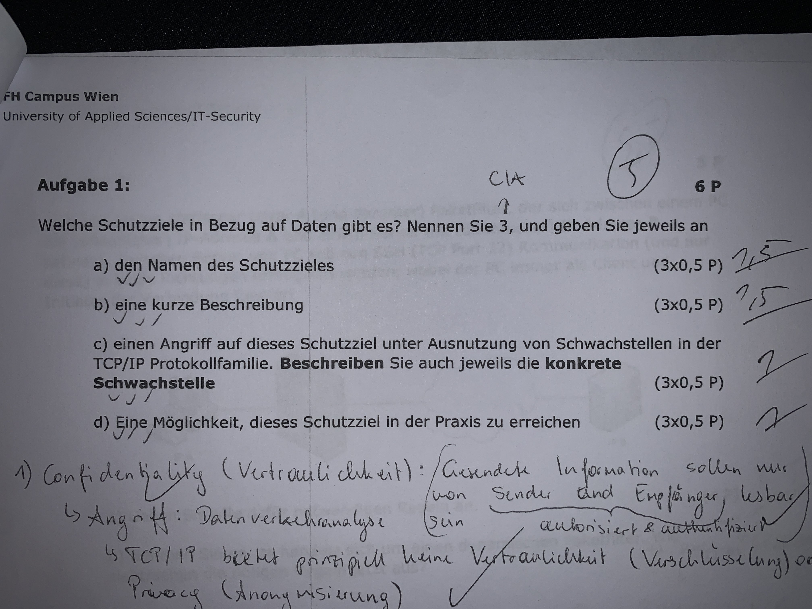
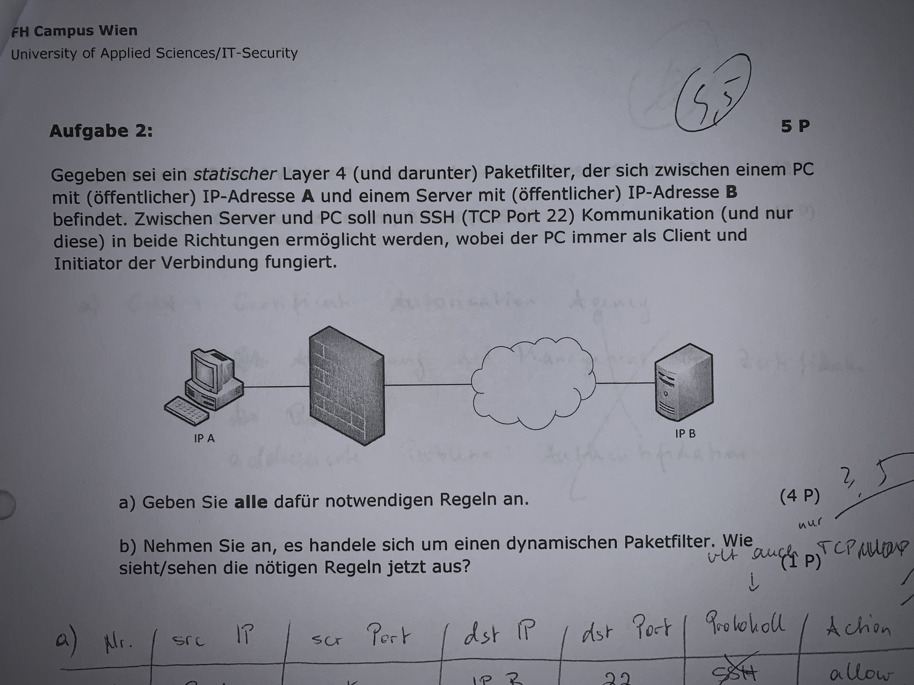
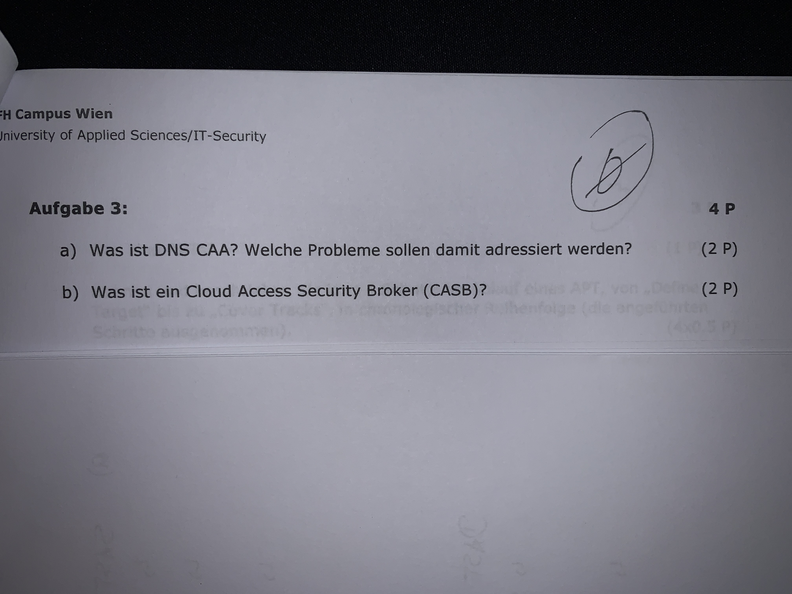
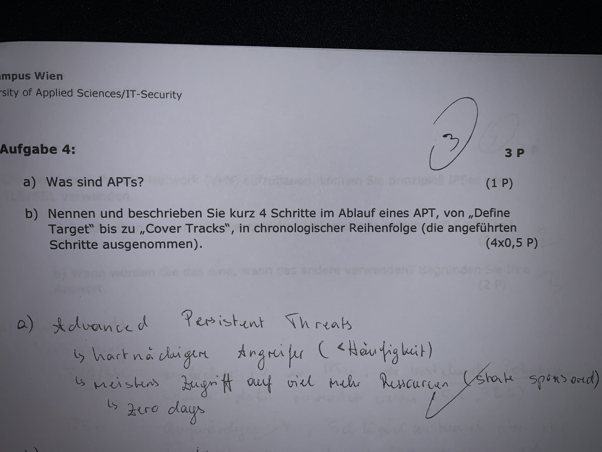
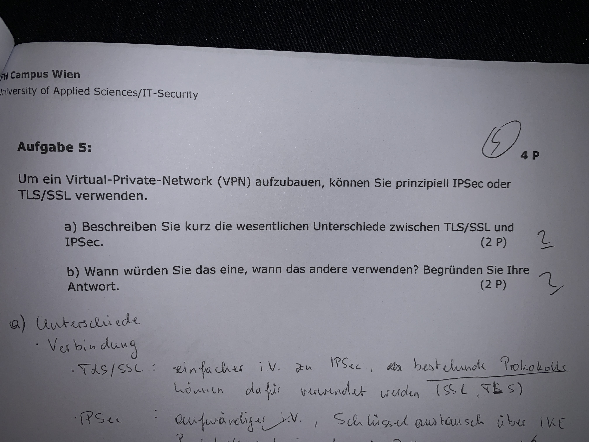

# Altklausur - NDT

Lösung der Network Defense Technologies Alt-Prüfung, zur Prüfungsvorbereitung.

## Aufgabe 1

**Antwort:**

## Aufgabe 2

**Antwort:** 

**a)**

_Rules table_

|  #  | Src IP | Src Prt | Dst IP | Dst Prt | Proto |    Action    |
|:---:|:------:|:-------:|:------:|:-------:|:-----:|:------------:|
|  1  |    A   |  ?(*)   |    B   |    22   |  FTP  |  ALLOW       |
|  2  |    B   |   22    |    A   |   ?(*)  |  FTP  |  ALLOW       |
|  3  |    *   |    *    |    *   |    *    |   *   |  DROP/REJECT |

**b)**

_Rules table_ (static, created by admin):

|  #  | Src IP | Src Prt | Dst IP | Dst Prt | Proto |    Action    |
|:---:|:------:|:-------:|:------:|:-------:|:-----:|:------------:|
|  1  |    A   |  ?(*)   |    B   |    22   |  FTP  |    ALLOW     |
|  3  |    *   |    *    |    *   |    *    |   *   |  DROP/REJECT |

_State table_ (dynamically created at runtime by filter):

|  #  | Src IP  | Src Prt  | Dst IP  | Dst Prt  | Proto | Action   |
|:---:|:-------:|:--------:|:-------:|:--------:|:-----:|:--------:|
|  1  |    A    |   23276  |    B    |    22    |  FTP  |  ALLOW   |

## Aufgabe 3

**Antwort:**

## Aufgabe 4

**Antwort:**

## Aufgabe 5 (VPN Aufgabe, haben wir nicht gemacht in der VL)

**Antwort:**