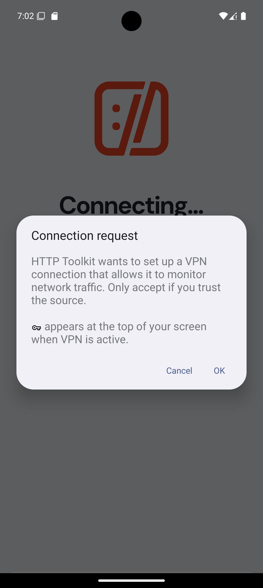

# Übung 4 - Android

Student: Philip Magnus

The steps in this writeup were performed on a Windows 11 (x64) system.

## 1 Lab + App Network Traffic Inspection/Interception Setup

### 1.1 Lab environment using a Android device and/or emulator (e.g. Android Emulator)

The following steps describe the setup of the needed lab environment. For ease of use I choose to setup an android emulator via `Android Studio`.

First `Android Studio` was installed via the JetBrains Toolbox.

In `Android Studio` we open the `Virtual Device Manager` and open the setup wizard for creating a new virtual device.

In the device setup I chose to use the Google APIs for an easier setup of `httptoolkit` later on. Android 15 was chosen as the Android version to install on the virtual device.

As the system image `Google APIs Intel x86_64 Atom System Image` was used. For our scenario there is no need for the pre-relese image.
With clicking the `Finish` button the installation of the device started.

After the installation the "fresh" virtual device can be started simply via the virtual device manager. After starting the device I was greeted by an almost empty home scrren.

### 1.2 Choose an arbitrary app with HTTP(S) backend communication

As the target app I chose the `ORF.at News` app. The app is currently in version 1.99.37 and needs at least Android 5, or the `Lollipop, API 21`, installed.

Installing the app is very simple and can be achieved by dragging the app onto the virtual device. The app is then automatically installed and can be used from there.

Next I installed `httptoolkit`. After the installation under intercept I chose the `Android device via ADB` setup. The setup completes pretty much automatically and lets me sniff any http/https traffic on the device.

During the setup I only needed to approve `httptoolkit`s access only once on the virtual device.

After the approval I was able to see all traffic on the device. For example opening a random article in the `ORF.at News` app resulted in quiet some observable http traffic.

## 2 Perform Static and Dynamic Analysis

### 2.1 Static: inspect the source code to analyze the HTTP(S) implementation
