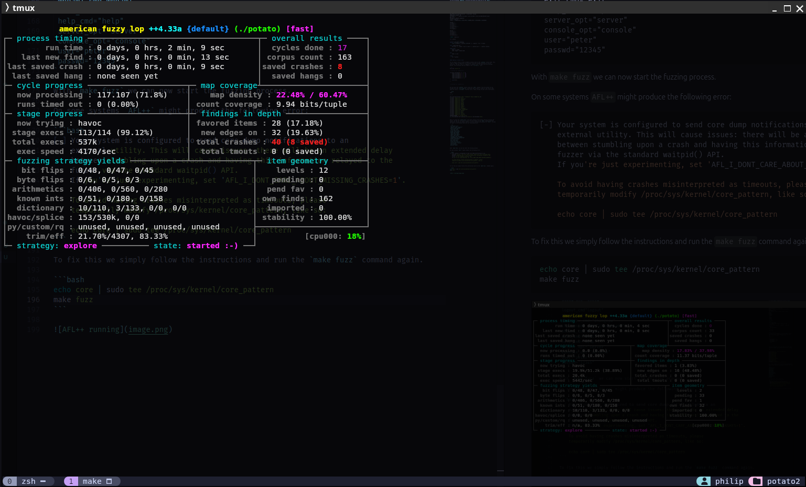
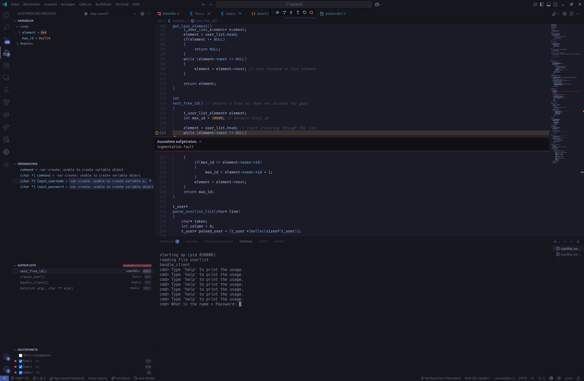
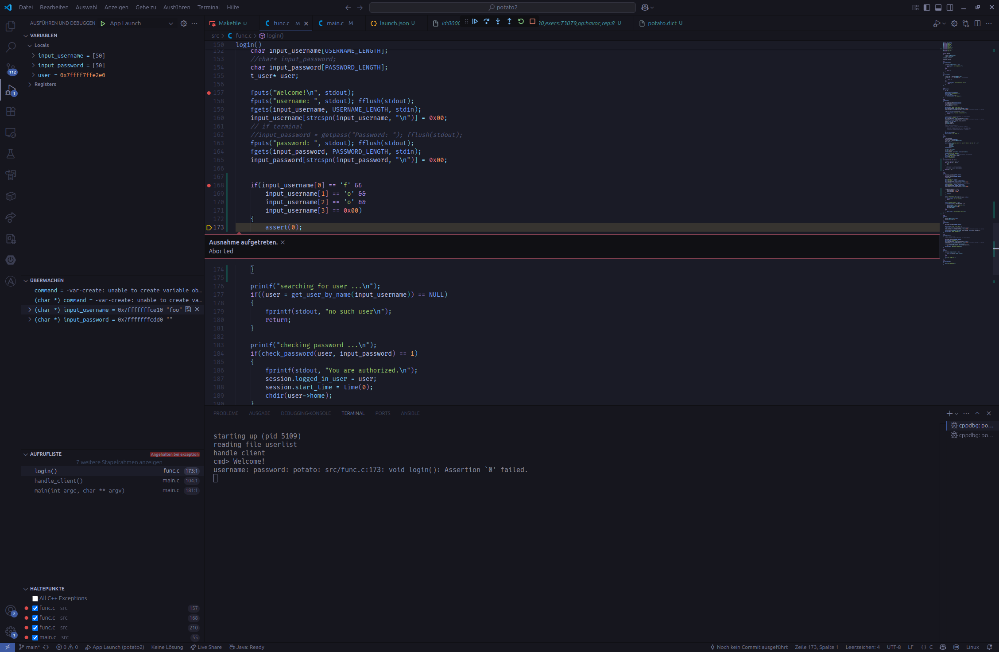

::: title
Fuzzing
:::

::: subtitle
Philip Magnus
:::

# Prerequisites

The following steps were perfomred on an Ubuntu 24.04 LTS system.

## Install dependencies and AFL++

First we install the dependencies listed in the [AFL++ install guide](https://github.com/AFLplusplus/AFLplusplus/blob/stable/docs/INSTALL.md). We do not need to install the `Nyx` or `QEMU` dependencies for this exercise. 

```bash
sudo apt update
sudo apt install build-essential python3-dev automake cmake flex bison libglib2.0-dev libpixman-1-dev python3-setuptools cargo libgtk-3-dev -y
# Install llvm-18 or system default
sudo apt install lld-18 llvm-18 llvm-18-dev clang-18 -y|| sudo apt install lld llvm llvm-dev clang -y
sudo apt install gcc-$(gcc --version|head -n1|sed 's/\..*//'|sed 's/.* //')-plugin-dev libstdc++-$(gcc --version|head -n1|sed 's/\..*//'|sed 's/.* //')-dev -y
git clone https://github.com/AFLplusplus/AFLplusplus
cd AFLplusplus
make all
```

To make AFL++ usable system-wide we simply add the `AFL++` directory to our `$PATH` variable. 

## Building `potato2`

For building the `potato2` binary we also need to link `openssl`. We can download the source code from the GitHub and build it with the following commands:

```bash
git clone https://github.com/openssl/openssl.git
cd openssl
./Configure
make -sj
```

Finally we can checkout the `potato2` source code.

```bash
git clone https://github.com/edgecase1/potato2.git
```

## Identify two inputs that trigger a crash or undefined behavior using a fuzzing technique

Inside of the `potato2` directory we can now build the `potato2` binary. For this we use the following `makefile`. We build the binary by using one of the `AFL++` compilers. These compilers not only build the binary but also inject instrumentation code that is required for fuzzing.

The `Makefile` not only builds the `potato2` binary but also adds an additional `fuzz` target. This target is used by `afl-fuzz` with auto generated input seeds. We also pass a dictionary file to `afl-fuzz` that contains the keywords that are used in the `potato2` protocol. For our example we use the `-p` flag to enable the fast mode of `afl-fuzz`. This mode is used to speed up the fuzzing process by reducing the number of mutations applied to the input seeds.

```makefile
WARN_OPTS=-Wno-deprecated-declarations -Wno-unused-result
SEC_OPTS=-fno-stack-protector -z execstack -no-pie
DEBUG_OPTS=-ggdb3 -O0
INCLUDES=-I../../openssl/include -I/usr/include -I/usr/include/x86_64-linux-
gnu -Isrc
DEFINES=-D_FORTIFY_SOURCE=0
CC=afl-clang-lto
CCOPTS = $(WARN_OPTS) $(SEC_OPTS) $(DEBUG_OPTS) $(INCLUDES) $(DEFINES)

CFILES = \
src/main.c \
src/runr.c \
src/sock.c \
src/userlist.c \
src/func.c \
src/login2.c

HFILES = \
src/runr.h \
src/sock.h \
src/user.h \
src/userlist.h

.PHONY: clean all

all: potato

# binary for usual attacks
potato: $(CFILES) $(HFILES)
	$(CC) $(CCOPTS) -o potato $(CFILES) -L../openssl -lssl -lcrypto

fuzz: seeds/seed out
	afl-fuzz -i ./seeds -o out -p fast -x ./potato.dict -- ./potato console

seeds/seed:
	mkdir -p seeds
	echo "login" >seeds/seed

out:
	mkdir -p out

clean:
	rm -f potato
```

#### Adding a second crash

For an easier crash to find we added a second crash to the `potato2` source code. This crash is added in addtition to the buffer overflow already presented in earlier exercises. The new crash is triggered if someone tries to login with the username foo. The following code was added to the `src/func.c` file:

```c
#include <assert.h>

// Omitted for readability

if(input_username[0] == 'f' &&
    input_username[1] == 'o' &&
    input_username[2] == 'o' &&
    input_username[3] == 0x00)
{
    assert(0); 
}

// Omitted for readability
```

We now build the `potato2` binary using the `make` command. From the output we can already see that `afl-clang-lto` extracted some strings it found in the source code, that are used in `strncmp()` function calls. These strings are put into a dictionary.

```bash
make

[...]

afl-llvm-lto++4.33a by Marc "vanHauser" Heuse <mh@mh-sec.de>
strncmp: length 4/4 "list"
strncmp: length 8/8 "register"
strncmp: length 6/6 "delete"
strncmp: length 4/4 "read"
strncmp: length 5/5 "write"
strncmp: length 5/5 "purge"
strncmp: length 5/5 "debug"
strncmp: length 5/5 "login"
strncmp: length 6/6 "logout"
strncmp: length 5/5 "shell"
strncmp: length 8/8 "changepw"
strncmp: length 10/10 "changename"
strncmp: length 6/6 "whoami"
strncmp: length 4/4 "exit"
strncmp: length 4/4 "help"
strncmp: length 6/6 "server"
strncmp: length 7/7 "console"
AUTODICTIONARY: 17 strings found
[+] Instrumented 135 locations (0 selects) (non-hardened mode).
```

Next we create the `potato.dict` file that contains the strings used for fuzzing the binary. We add the extracted strings from the output of the `make` command and some additional strings are added. Mainly a correct username and password so `AFL++` is able to login to the software and fuzz all functionalities.

```txt
 list_cmd="list"
 register_cmd="register"
 delete_cmd="delete"
 read_cmd="read"
 write_cmd="write"
 purger_cmd="purge"
 debug_cmd="debug"
 login_cmd="login"
 logout_cmd"logout"
 shell_cmd="shell"
 changepw_cmd="changepw"
 changename_cmd="changename"
 whoami_cmd"whoami"
 exit_cmd="exit"
 help_cmd="help"
 server_opt="server"
 console_opt="console"
 username="peter"
 password="12345"
```

With `make fuzz` we can now start the fuzzing process.

On some systems `AFL++` might produce the following error:

```bash
[-] Your system is configured to send core dump notifications to an
    external utility. This will cause issues: there will be an extended delay
    between stumbling upon a crash and having this information relayed to the
    fuzzer via the standard waitpid() API.
    If you're just experimenting, set 'AFL_I_DONT_CARE_ABOUT_MISSING_CRASHES=1'.

    To avoid having crashes misinterpreted as timeouts, please
    temporarily modify /proc/sys/kernel/core_pattern, like so:

    echo core | sudo tee /proc/sys/kernel/core_pattern
```

To fix this we simply follow the instructions and run the `make fuzz` command again.

```bash
echo core | sudo tee /proc/sys/kernel/core_pattern
make fuzz
```

Letting `AFL++` run for a while will produce some output like this:



We can see that after only a few minutes of runtime we already found 40 crashes of which 8 were saved. These crashes can be found in the `out/crashes` directory.

Using the first file with the id `000000` as input for `potato` we can see a `Segmentation Fault`

```bash
./potato console < out/default/crashes/id:000000,sig:11,src:000082,time:600453,execs:2489733,op:havoc,rep:27                                                        
starting up (pid 2165476)
reading file userlist
handle_client
cmd> Type 'help' to print the usage.
cmd> Type 'help' to print the usage.
cmd> Type 'help' to print the usage.
cmd> Type 'help' to print the usage.
cmd> Type 'help' to print the usage.
cmd> Type 'help' to print the usage.
cmd> Type 'help' to print the usage.
cmd> What is the name > Password: [1]    2165476 segmentation fault  ./potato console <
```

If we investigate the output further in our debugger we can see that the fuzzer tried to create a new user  with an empty username and password. This leads to a `Segmentation Fault` in the `potato2` binary. This may not be the buffer overvlow we were looking for, but it is a crash nonetheless. At this point I can spoiler a little bit and say that we will encounter the buffer overflow with LibFuzzer.

```bash



In a second file we can see that the fuzzer found a second crash with the id `000006`. This crash is triggered by the `assert(0)` we added to the source code.

```bash
./potato console < out/default/crashes/id:000006,sig:06,src:000048,time:16880,execs:73079,op:havoc,rep:8
starting up (pid 3877176)
reading file userlist
handle_client
cmd> Welcome!
username: password: potato: src/func.c:173: void login(): Assertion `0' failed.
```

Investigating this crash in the debugger we can see that the fuzzer tried to login with the username `foo` and an empty password. This leads to the `assert(0)` being triggered.



This should also cover the last step of this exercise, which is to triage one input to a function or code area.

In this case we can see that the input with the id `000000` leads to the `register()` function in the `src/func.c` file being called and then used with an empty username and password. This leads to a `segfault` in the `next_free_id()` function. This `segfault` is caused by the `user_list.head` being `NULL` and the code trying to access the `next` pointer of a `NULL` pointer.

In the second case we can see that the input with the id `000006` leads to the `login()` function in the `src/func.c` file being called and then used with the username `foo` and an empty password. This leads to the `assert(0)` being triggered.

## Prepare a command line or script + file to run the input against the vulnerable program

We move the two input files (crash with id 000000 and id 000006) and rename them to `crash1` and `crash2`. We will use these two files as input for `potato` in our script. 

```bash
#!/bin/bash

function usage
{
echo "usage: $1 <1|2>"
echo "crashes potato using crashfile 1 (empty user registration) or 2 (forbidden username)."
exit 1
}

if [ "$#" -ne 1 ]; then
    usage $0
else
    if [ "$1" == "1" ]; then
        crashFile="./crash1"
    elif [ "$1" == "2" ]; then
        crashFile="./crash2"
    else
        usage $0
    fi

echo "./potato console < ${crashFile}"

./potato console < ${crashFile}
fi
```
Using the script yields the following results.

```bash
./input_script.sh
usage: ./input_script.sh <1|2>
crashes potato using crashfile 1 (empty user registration) or 2 (forbidden username).


./input_script.sh 1
./potato console < ./crash1
starting up (pid 34617)
reading file userlist
handle_client
cmd> Type 'help' to print the usage.
cmd> Type 'help' to print the usage.
cmd> Type 'help' to print the usage.
cmd> Type 'help' to print the usage.
cmd> Type 'help' to print the usage.
cmd> Type 'help' to print the usage.
cmd> Type 'help' to print the usage.
cmd> What is the name > Password: ./input_script.sh: Zeile 24: 34617 Speicherzugriffsfehler  ./potato console < ${crashFile}


./input_script.sh 2
./potato console < ./crash2
starting up (pid 32577)
reading file userlist
handle_client
cmd> Welcome!
username: password: potato: src/func.c:173: void login(): Assertion `0' failed.
./input_script.sh: Zeile 24: 32577 Abgebrochen             ./potato console < ${crashFile}
```
## Use sanitizers or assertions to identify another vulnerabiltiy

Done in combination with the usage of LibFuzzer.

## Use libfuzzer to fuzz a vulnerable function

To build the libfuzzer binary we need to edit the `Makefile` in the `potato2` directory.
We add new `CLANGOPTS` to enable linking of the `libfuzz` library and address sanitizers.
`-DLIBFUZZER` is used to create the `LLVMFuzzerTestOneInput()` function which LibFuzzer is expecting:

```makefile
WARN_OPTS=-Wno-deprecated-declarations -Wno-unused-result
SEC_OPTS=-fno-stack-protector -z execstack -no-pie
DEBUG_OPTS=-ggdb3 -O0
INCLUDES=-I ../openssl/include -I/usr/include -I/usr/include/x86_64-linux-gnu -Isrc
DEFINES=-D_FORTIFY_SOURCE=0
CC=afl-clang-lto
CCOPTS = $(WARN_OPTS) $(SEC_OPTS) $(DEBUG_OPTS) $(INCLUDES) $(DEFINES)

CLANGOPTS = $(WARN_OPTS) $(DEBUG_OPTS) $(INCLUDES) $(DEFINES) -DLIBFUZZER -fsanitize=fuzzer,address

CFILES = \
src/main.c \
src/runr.c \
src/sock.c \
src/userlist.c \
src/func.c \
src/login2.c

HFILES = \
src/runr.h \
src/sock.h \
src/user.h \
src/userlist.h

.PHONY: clean all

all: potato fuzz_potato

# binary for usual attacks
potato: $(CFILES) $(HFILES)
	$(CC) $(CCOPTS) -o potato $(CFILES) -L../openssl -lssl -lcrypto

fuzz: seeds/seed out
	afl-fuzz -i ./seeds -o out -p fast -x ./potato.dict -- ./potato console

seeds/seed:
	mkdir -p seeds
	echo "login" >seeds/seed

fuzz_potato:
	clang $(CLANGOPTS) -o fuzz_potato $(CFILES) -L../openssl -lssl -lcrypto

out:
	mkdir -p out

clean:
	rm -f potato
```

Next we need to setup the `main.c` file of `potato2` to use the `LLVMFuzzerTestOneInput()` function. We can do this by adding the following code to the `src/main.c` file.

```c
#ifndef LIBFUZZER

int
main(int argc, char** argv)
{
    // Omitted for readability
}

#else

#include <stdint.h>
static void doFuzz()
{
    init();

    handle_client();

    purge_list();
}

int LLVMFuzzerTestOneInput(const uint8_t *Data, size_t Size)
{
    // use fmemopen() to redirect stdin to the buffer libfuzzer is
    // providing
    FILE *fp = fmemopen((void*)Data, Size, "r");
    if (fp != NULL) {
        stdin = fp; // Redirect stdin
        doFuzz(); // Call the function that reads from stdin
        fclose(fp);
    } else {
        assert(0);
    }
    return 0;
 // Values other than 0 and -1 are reserved for future use.
}

#endif
```
LibFuzzer expects the `LLVMFuzzerTestOneInput()` function to be defined, which is called with the input data provided by the fuzzer. The `doFuzz()` function is where we handle the input as if it were read from standard input.

Libfuzzer stops execution as soon as it encounters a crash or an assertion failure. This means we need to fix the bugs to before we can continue fuzzing.

First we encounter a missing `NULL` check in the `src/uerslist.c` file. Libfuzzer found the missing check we already saw in the previous section with `AFL++`. We can fix this by adding a `NULL` check to the `next_free_id()` function in the `src/userlist.c` file:

```c
int
next_free_id() // returns a free id. does not account for gaps
{
     t_user_list_element* element;
     int max_id = 10000; // default first id


     // BUGFIX
     if(user_list.head == NULL) // empty list
     {
          return max_id;
     }

     element = user_list.head; // start iterating through the list
     while (element->next != NULL) 
     {
          if(max_id <= element->user->id)
          {
               max_id = element->user->id + 1;
          }
          element = element->next;
     }
     return max_id;
}
```

Libfuzzer also found two memory leaks one in the `changepassword()` fucntion and another one in the `check_password()` fucntion. Both of these functions needed fixing as well.

```c
void
change_password()
{
    //char* input_password;
    //input_password = getpass("Password: "); fflush(stdout);

    char input_password[PASSWORD_LENGTH];
    fprintf(stdout, "Password: ");
    fgets(input_password, sizeof(input_password), stdin);
    input_password[strcspn(input_password, "\n")] = 0x00; // terminator instead of a newline

    // strncpy(session.logged_in_user->password_hash, 
    //         str2md5(input_password, strlen(input_password)), 
	//     32);

    // BUGFIX Mem-leak free variant
    char *md5 = str2md5(input_password, strlen(input_password));
    strncpy(session.logged_in_user->password_hash, md5, 32);
    free(md5);

    fprintf(stdout, "Password changed.\n");
}
```

```c
int
check_password(t_user* user, char* password)
{
    // return (0 == strncmp(
    //                     user->password_hash, 
	// 	        str2md5(password, strlen(password)), 
	// 		32)); // md5 length

    // Non-leaking variant
    char *md5 = str2md5(password, strlen(password));
    int ret = strncmp(user->password_hash, md5, 32);
    free(md5);
    return (0 == ret);
}
```

After these fixes and rebuilding the `fuzz_potato` binary we can start fuzzing with `libfuzzer` again. This time the fuzzer runs for a longer time. We are presented with quite the comprehensive output which shows us that libfuzzer found a buffer overflow.

```bash
=================================================================
==93877==ERROR: AddressSanitizer: stack-buffer-overflow on address 0x765d7b03bf52 at pc 0x5776d9aec8e9 bp 0x7fff089cffe0 sp 0x7fff089cf770
WRITE of size 129 at 0x765d7b03bf52 thread T0
    #0 0x5776d9aec8e8 in scanf_common(void*, int, bool, char const*, __va_list_tag*) asan_interceptors.cpp.o
    #1 0x5776d9aed9a9 in __isoc23_fscanf (/home/philip/workspace/potato2/fuzz_potato+0x8d9a9) (BuildId: 9cd0ce565a1d1298e47b6357788c7ad2e72d6aa0)
    #2 0x5776d9ba7752 in change_name /home/philip/workspace/potato2/src/func.c:212:5
    #3 0x5776d9ba2dc9 in handle_client /home/philip/workspace/potato2/src/main.c:124:13
    #4 0x5776d9ba31b9 in doFuzz /home/philip/workspace/potato2/src/main.c:202:5
    #5 0x5776d9ba3119 in LLVMFuzzerTestOneInput /home/philip/workspace/potato2/src/main.c:214:9
    #6 0x5776d9aafe04 in fuzzer::Fuzzer::ExecuteCallback(unsigned char const*, unsigned long) (/home/philip/workspace/potato2/fuzz_potato+0x4fe04) (BuildId: 9cd0ce565a1d1298e47b6357788c7ad2e72d6aa0)
    #7 0x5776d9aaf4f9 in fuzzer::Fuzzer::RunOne(unsigned char const*, unsigned long, bool, fuzzer::InputInfo*, bool, bool*) (/home/philip/workspace/potato2/fuzz_potato+0x4f4f9) (BuildId: 9cd0ce565a1d1298e47b6357788c7ad2e72d6aa0)
    #8 0x5776d9ab0ce5 in fuzzer::Fuzzer::MutateAndTestOne() (/home/philip/workspace/potato2/fuzz_potato+0x50ce5) (BuildId: 9cd0ce565a1d1298e47b6357788c7ad2e72d6aa0)
    #9 0x5776d9ab1845 in fuzzer::Fuzzer::Loop(std::vector<fuzzer::SizedFile, std::allocator<fuzzer::SizedFile>>&) (/home/philip/workspace/potato2/fuzz_potato+0x51845) (BuildId: 9cd0ce565a1d1298e47b6357788c7ad2e72d6aa0)
    #10 0x5776d9a9eb1f in fuzzer::FuzzerDriver(int*, char***, int (*)(unsigned char const*, unsigned long)) (/home/philip/workspace/potato2/fuzz_potato+0x3eb1f) (BuildId: 9cd0ce565a1d1298e47b6357788c7ad2e72d6aa0)
    #11 0x5776d9ac91a6 in main (/home/philip/workspace/potato2/fuzz_potato+0x691a6) (BuildId: 9cd0ce565a1d1298e47b6357788c7ad2e72d6aa0)
    #12 0x765d7ce2a1c9 in __libc_start_call_main csu/../sysdeps/nptl/libc_start_call_main.h:58:16
    #13 0x765d7ce2a28a in __libc_start_main csu/../csu/libc-start.c:360:3
    #14 0x5776d9a93b04 in _start (/home/philip/workspace/potato2/fuzz_potato+0x33b04) (BuildId: 9cd0ce565a1d1298e47b6357788c7ad2e72d6aa0)

Address 0x765d7b03bf52 is located in stack of thread T0 at offset 82 in frame
    #0 0x5776d9ba75cf in change_name /home/philip/workspace/potato2/src/func.c:207

  This frame has 1 object(s):
    [32, 82) 'input_username' (line 208) <== Memory access at offset 82 overflows this variable
HINT: this may be a false positive if your program uses some custom stack unwind mechanism, swapcontext or vfork
      (longjmp and C++ exceptions *are* supported)
SUMMARY: AddressSanitizer: stack-buffer-overflow asan_interceptors.cpp.o in scanf_common(void*, int, bool, char const*, __va_list_tag*)
Shadow bytes around the buggy address:
  0x765d7b03bc80: f5 f5 f5 f5 f5 f5 f5 f5 f5 f5 f5 f5 f5 f5 f5 f5
  0x765d7b03bd00: f5 f5 f5 f5 f5 f5 f5 f5 f5 f5 f5 f5 f5 f5 f5 f5
  0x765d7b03bd80: f5 f5 f5 f5 f5 f5 f5 f5 f5 f5 f5 f5 f5 f5 f5 f5
  0x765d7b03be00: f5 f5 f5 f5 f5 f5 f5 f5 f5 f5 f5 f5 f5 f5 f5 f5
  0x765d7b03be80: f5 f5 f5 f5 f5 f5 f5 f5 f5 f5 f5 f5 f5 f5 f5 f5
=>0x765d7b03bf00: f1 f1 f1 f1 00 00 00 00 00 00[02]f3 f3 f3 f3 f3
  0x765d7b03bf80: 00 00 00 00 00 00 00 00 00 00 00 00 00 00 00 00
  0x765d7b03c000: 00 00 00 00 00 00 00 00 00 00 00 00 00 00 00 00
  0x765d7b03c080: 00 00 00 00 00 00 00 00 00 00 00 00 00 00 00 00
  0x765d7b03c100: 00 00 00 00 00 00 00 00 00 00 00 00 00 00 00 00
  0x765d7b03c180: 00 00 00 00 00 00 00 00 00 00 00 00 00 00 00 00
Shadow byte legend (one shadow byte represents 8 application bytes):
  Addressable:           00
  Partially addressable: 01 02 03 04 05 06 07
  Heap left redzone:       fa
  Freed heap region:       fd
  Stack left redzone:      f1
  Stack mid redzone:       f2
  Stack right redzone:     f3
  Stack after return:      f5
  Stack use after scope:   f8
  Global redzone:          f9
  Global init order:       f6
  Poisoned by user:        f7
  Container overflow:      fc
  Array cookie:            ac
  Intra object redzone:    bb
  ASan internal:           fe
  Left alloca redzone:     ca
  Right alloca redzone:    cb
==93877==ABORTING
MS: 3 PersAutoDict-CMP-InsertRepeatedBytes- DE: "\011\376\377\377"-"\007\000"-; base unit: 0b1f21f3071b8ff8ce2f2dbec851286508c2276a
0x1f,0xa5,0xa,0x68,0x65,0x6c,0xff,0xff,0xff,0xff,0xff,0xff,0x69,0xa,0x72,0x65,0x67,0x69,0x73,0x74,0x65,0x72,0xa,0xa,0x6c,0x6f,0x67,0x69,0x6e,0xa9,0x8a,0xa,0x8,0x97,0x6c,0x72,0x69,0x73,0x74,0x65,0x72,0xa,0xa,0x6c,0x6f,0x67,0x69,0x6e,0xa9,0x8a,0xa,0xa,0x6c,0x6f,0x67,0x69,0x6e,0xa9,0x8a,0xa,0x63,0x68,0x61,0x6e,0x9,0xfe,0xff,0xff,0x8b,0xf8,0x72,0xa,0xa,0x63,0x68,0x61,0x6e,0x67,0x65,0x6e,0x61,0x6d,0x65,0xa,0xa,0x94,0x94,0x94,0x94,0x94,0x94,0x94,0x94,0x94,0x94,0x94,0x94,0x94,0x94,0x94,0x94,0x94,0x94,0x94,0x94,0x94,0x94,0x94,0x94,0x94,0x94,0x94,0x94,0x94,0x94,0x94,0x94,0x94,0x94,0x94,0x94,0x94,0x94,0x94,0x94,0x94,0x94,0x94,0x94,0x94,0x94,0x94,0x94,0x94,0x94,0x94,0x94,0x94,0x94,0x94,0x94,0x94,0x94,0x94,0x94,0x94,0x94,0x94,0x94,0x94,0x94,0x94,0x94,0x94,0x94,0x94,0x94,0x94,0x94,0x94,0x94,0x94,0x94,0x94,0x94,0x94,0x94,0x94,0x94,0x94,0x94,0x94,0x94,0x94,0x94,0x94,0x94,0x94,0x94,0x94,0x94,0x94,0x94,0x94,0x94,0x94,0x94,0x94,0x94,0x94,0x94,0x94,0x94,0x94,0x94,0x94,0x94,0x94,0x94,0x94,0x94,0x94,0x94,0x94,0x94,0x94,0x94,0x94,0x94,0x94,0x94,0x94,0x94,0xa,0x7,0x0,0xa,0x8a,0x72,0xa,0xa,0x63,0x68,0x61,0x6e,0x67,0x65,0x6e,0x61,0x6d,0x65,0xa,0x8b,
\037\245\012hel\377\377\377\377\377\377i\012register\012\012login\251\212\012\010\227lrister\012\012login\251\212\012\012login\251\212\012chan\011\376\377\377\213\370r\012\012changename\012\012\224\224\224\224\224\224\224\224\224\224\224\224\224\224\224\224\224\224\224\224\224\224\224\224\224\224\224\224\224\224\224\224\224\224\224\224\224\224\224\224\224\224\224\224\224\224\224\224\224\224\224\224\224\224\224\224\224\224\224\224\224\224\224\224\224\224\224\224\224\224\224\224\224\224\224\224\224\224\224\224\224\224\224\224\224\224\224\224\224\224\224\224\224\224\224\224\224\224\224\224\224\224\224\224\224\224\224\224\224\224\224\224\224\224\224\224\224\224\224\224\224\224\224\224\224\224\224\224\012\007\000\012\212r\012\012changename\012\213
artifact_prefix='./'; Test unit written to ./crash-6c01dc98adc90862bb19564900f6239907f6c02d
Base64: H6UKaGVs////////aQpyZWdpc3RlcgoKbG9naW6pigoIl2xyaXN0ZXIKCmxvZ2luqYoKCmxvZ2luqYoKY2hhbgn+//+L+HIKCmNoYW5nZW5hbWUKCpSUlJSUlJSUlJSUlJSUlJSUlJSUlJSUlJSUlJSUlJSUlJSUlJSUlJSUlJSUlJSUlJSUlJSUlJSUlJSUlJSUlJSUlJSUlJSUlJSUlJSUlJSUlJSUlJSUlJSUlJSUlJSUlJSUlJSUlJSUlJSUlJSUlJSUlJSUlJSUlJSUlJSUlJSUCgcACopyCgpjaGFuZ2VuYW1lCos=
```

The `ASAN` error message provides us with the input that casued the crash. We can see that the crash seems to appear in the `changename()` function, as we expected. We can now use the base64 coded input and build our own crash file with it.

```bash
echo H6UKaGVs////////aQpyZWdpc3RlcgoKbG9naW6pigoIl2xyaXN0ZXIKCmxvZ2luqYoKCmxvZ2luqYoKY2hhbgn+//+L+HIKCmNoYW5nZW5hbWUKCpSUlJSUlJSUlJSUlJSUlJSUlJSUlJSUlJSUlJSUlJSUlJSUlJSUlJSUlJSUlJSUlJSUlJSUlJSUlJSUlJSUlJSUlJSUlJSUlJSUlJSUlJSUlJSUlJSUlJSUlJSUlJSUlJSUlJSUlJSUlJSUlJSUlJSUlJSUlJSUlJSUlJSUlJSUCgcACopyCgpjaGFuZ2VuYW1lCos= | base64 -d > crash3

hexdump -C crash3
00000000  1f a5 0a 68 65 6c ff ff  ff ff ff ff 69 0a 72 65  |...hel......i.re|
00000010  67 69 73 74 65 72 0a 0a  6c 6f 67 69 6e a9 8a 0a  |gister..login...|
00000020  08 97 6c 72 69 73 74 65  72 0a 0a 6c 6f 67 69 6e  |..lrister..login|
00000030  a9 8a 0a 0a 6c 6f 67 69  6e a9 8a 0a 63 68 61 6e  |....login...chan|
00000040  09 fe ff ff 8b f8 72 0a  0a 63 68 61 6e 67 65 6e  |......r..changen|
00000050  61 6d 65 0a 0a 94 94 94  94 94 94 94 94 94 94 94  |ame.............|
00000060  94 94 94 94 94 94 94 94  94 94 94 94 94 94 94 94  |................|
*
000000d0  94 94 94 94 94 0a 07 00  0a 8a 72 0a 0a 63 68 61  |..........r..cha|
000000e0  6e 67 65 6e 61 6d 65 0a  8b                       |ngename..|
000000e9
```

We can pass the crash file as an input to the `fuzz_potato` binary. Libfuzzer binaries should accept input files by just passing them as an argument. We can see if the binary crashes as expected.

```bash
./fuzz_potato crash3
INFO: Running with entropic power schedule (0xFF, 100).
INFO: Seed: 2207331671
INFO: Loaded 1 modules   (171 inline 8-bit counters): 171 [0x5ad998188020, 0x5ad9981880cb),
INFO: Loaded 1 PC tables (171 PCs): 171 [0x5ad9981880d0,0x5ad998188b80),
./fuzz_potato: Running 1 inputs 1 time(s) each.
Running: crash3
handle_client
Type 'help' to print the usage.cmd>
Type 'help' to print the usage.cmd>
cmd> What is the name > Password: User added.
Type 'help' to print the usage.cmd>
Type 'help' to print the usage.cmd>
cmd> Welcome!
username: password: searching for user ...
checking password ...
You are authorized.

Type 'help' to print the usage.cmd>
Type 'help' to print the usage.cmd>
=================================================================
==101705==ERROR: AddressSanitizer: stack-buffer-overflow on address 0x78d49ae00052 at pc 0x5ad9980838e9 bp 0x7ffeb5a0c440 sp 0x7ffeb5a0bbd0
WRITE of size 129 at 0x78d49ae00052 thread T0

[...]

==101705==ABORTING
```

Fixing the buffer overlfow can simply be achieved by switching `fscanf()` to `fgets()` in the `src/func.c` file. This way we can limit the input size and avoid the buffer overflow.

```c
void
change_name()
{
    char input_username[USERNAME_LENGTH];
        
    fprintf(stdout, "What is the name > ");
    fgets(input_username, sizeof(input_username), stdin);
    // fscanf(stdin, "%s", input_username); // TODO security
    input_username[strcspn(input_username, "\n")] = 0x00; // terminator instead of a newline

    strncpy(session.logged_in_user->name, input_username, strlen(input_username)+1);
    fprintf(stdout, "Name changed.\n");
}
```

We can rebuild the `fuzz_potato` binary and run it again with the same input file. This time we should not see any errors.

```bash
./fuzz_potato crash3
INFO: Running with entropic power schedule (0xFF, 100).
INFO: Seed: 1357500961
INFO: Loaded 1 modules   (171 inline 8-bit counters): 171 [0x5953859fc020, 0x5953859fc0cb),
INFO: Loaded 1 PC tables (171 PCs): 171 [0x5953859fc0d0,0x5953859fcb80),
./fuzz_potato: Running 1 inputs 1 time(s) each.
Running: crash3
handle_client
Type 'help' to print the usage.cmd>
Type 'help' to print the usage.cmd>
cmd> What is the name > Password: User added.
Type 'help' to print the usage.cmd>
Type 'help' to print the usage.cmd>
cmd> Welcome!
username: password: searching for user ...
checking password ...
You are authorized.

Type 'help' to print the usage.cmd>
Type 'help' to print the usage.cmd>
cmd> What is the name > Name changed.

Type 'help' to print the usage.cmd>
Type 'help' to print the usage.cmd>
Type 'help' to print the usage.cmd>
Type 'help' to print the usage.cmd>
cmd> What is the name > Name changed.

cmd> handle_client
Type 'help' to print the usage.cmd>
Type 'help' to print the usage.cmd>
cmd> What is the name > Password: User added.
Type 'help' to print the usage.cmd>
Type 'help' to print the usage.cmd>
cmd> Welcome!
username: password: searching for user ...
checking password ...
You are authorized.

Type 'help' to print the usage.cmd>
Type 'help' to print the usage.cmd>
cmd> What is the name > Name changed.

Type 'help' to print the usage.cmd>
Type 'help' to print the usage.cmd>
Type 'help' to print the usage.cmd>
Type 'help' to print the usage.cmd>
cmd> What is the name > Name changed.

Executed crash3 in 0 ms
***
*** NOTE: fuzzing was not performed, you have only
***       executed the target code on a fixed set of inputs.
***
cmd> %
```
As we can see we do not crash because of a buffer overflow.
Next we can run `fuzz_potato` again and see if we can also find the explicitly build in `assert(0)` in the `login()` function.

For this run we disable the outputs with the flag `-close_fd_mask=3`.

```bash
==109447== ERROR: libFuzzer: deadly signal
    #0 0x592174125c95 in __sanitizer_print_stack_trace (/home/philip/workspace/potato2/fuzz_potato+0x10ec95) (BuildId: 774a621d48818d263debc0386dfc953e675552a5)
    #1 0x59217407f7ac in fuzzer::PrintStackTrace() (/home/philip/workspace/potato2/fuzz_potato+0x687ac) (BuildId: 774a621d48818d263debc0386dfc953e675552a5)
    #2 0x592174065837 in fuzzer::Fuzzer::CrashCallback() (/home/philip/workspace/potato2/fuzz_potato+0x4e837) (BuildId: 774a621d48818d263debc0386dfc953e675552a5)
    #3 0x7d7e1184532f  (/lib/x86_64-linux-gnu/libc.so.6+0x4532f) (BuildId: 42c84c92e6f98126b3e2230ebfdead22c235b667)
    #4 0x7d7e1189eb2b in __pthread_kill_implementation nptl/pthread_kill.c:43:17
    #5 0x7d7e1189eb2b in __pthread_kill_internal nptl/pthread_kill.c:78:10
    #6 0x7d7e1189eb2b in pthread_kill nptl/pthread_kill.c:89:10
    #7 0x7d7e1184527d in raise signal/../sysdeps/posix/raise.c:26:13
    #8 0x7d7e118288fe in abort stdlib/abort.c:79:7
    #9 0x7d7e1182881a in __assert_fail_base assert/assert.c:96:3
    #10 0x7d7e1183b516 in __assert_fail assert/assert.c:105:3
    #11 0x59217415e2f7 in login /home/philip/workspace/potato2/src/func.c:173:9
    #12 0x592174159c8b in handle_client /home/philip/workspace/potato2/src/main.c:104:13
    #13 0x59217415a1b9 in doFuzz /home/philip/workspace/potato2/src/main.c:202:5
    #14 0x59217415a119 in LLVMFuzzerTestOneInput /home/philip/workspace/potato2/src/main.c:214:9
    #15 0x592174066e04 in fuzzer::Fuzzer::ExecuteCallback(unsigned char const*, unsigned long) (/home/philip/workspace/potato2/fuzz_potato+0x4fe04) (BuildId: 774a621d48818d263debc0386dfc953e675552a5)
    #16 0x5921740664f9 in fuzzer::Fuzzer::RunOne(unsigned char const*, unsigned long, bool, fuzzer::InputInfo*, bool, bool*) (/home/philip/workspace/potato2/fuzz_potato+0x4f4f9) (BuildId: 774a621d48818d263debc0386dfc953e675552a5)
    #17 0x592174067ce5 in fuzzer::Fuzzer::MutateAndTestOne() (/home/philip/workspace/potato2/fuzz_potato+0x50ce5) (BuildId: 774a621d48818d263debc0386dfc953e675552a5)
    #18 0x592174068845 in fuzzer::Fuzzer::Loop(std::vector<fuzzer::SizedFile, std::allocator<fuzzer::SizedFile>>&) (/home/philip/workspace/potato2/fuzz_potato+0x51845) (BuildId: 774a621d48818d263debc0386dfc953e675552a5)
    #19 0x592174055b1f in fuzzer::FuzzerDriver(int*, char***, int (*)(unsigned char const*, unsigned long)) (/home/philip/workspace/potato2/fuzz_potato+0x3eb1f) (BuildId: 774a621d48818d263debc0386dfc953e675552a5)
    #20 0x5921740801a6 in main (/home/philip/workspace/potato2/fuzz_potato+0x691a6) (BuildId: 774a621d48818d263debc0386dfc953e675552a5)
    #21 0x7d7e1182a1c9 in __libc_start_call_main csu/../sysdeps/nptl/libc_start_call_main.h:58:16
    #22 0x7d7e1182a28a in __libc_start_main csu/../csu/libc-start.c:360:3
    #23 0x59217404ab04 in _start (/home/philip/workspace/potato2/fuzz_potato+0x33b04) (BuildId: 774a621d48818d263debc0386dfc953e675552a5)

NOTE: libFuzzer has rudimentary signal handlers.
      Combine libFuzzer with AddressSanitizer or similar for better crash reports.
SUMMARY: libFuzzer: deadly signal
MS: 2 PersAutoDict-CrossOver- DE: "help"-; base unit: c6728beddfcd7bf03bfcdb514d87cd4d20416b96
0x8a,0x77,0x68,0x77,0x32,0x69,0x0,0xa,0x6f,0x2,0xff,0xa,0x6c,0x6f,0x67,0x69,0x6e,0xa,0x66,0x6f,0x6f,0xa,0x77,0x68,0x6f,0x61,0x6d,0x69,0x0,0xa,0x6c,0x69,0x73,0x74,0x77,0x68,0xa,0x77,0x68,0x6f,0x61,0x6d,0x69,0x0,0xa,0x6c,0x69,0x73,0x74,0x69,0x6f,0xa,0x77,0x68,0x6f,0x61,0x6d,0x69,0x0,0xa,0x6c,0x69,0x73,0x74,0x77,0x68,0xa,0x77,0x68,0x6f,0x61,0x6d,0x69,0x0,0xa,0x6c,0x69,0xa,0x66,0x77,0x68,0x6f,0x77,
\212whw2i\000\012o\002\377\012login\012foo\012whoami\000\012listwh\012whoami\000\012listio\012whoami\000\012listwh\012whoami\000\012li\012fwhow
artifact_prefix='./'; Test unit written to ./crash-c28c9abaee09ffa0e4f20b8cd242ab589e2902ac
Base64: indodzJpAApvAv8KbG9naW4KZm9vCndob2FtaQAKbGlzdHdoCndob2FtaQAKbGlzdGlvCndob2FtaQAKbGlzdHdoCndob2FtaQAKbGkKZndob3c=
```

After a short runtime we can see that the fuzzer triggered the `assert(0)` in the `login()` function. This is expected behavior, as we have implemented this on purpose and shows the process of fuzzing, triaging and fixing bugs in the code is working.

## Triage one input to a function or code area

See last paragraph of the AFL++ section.