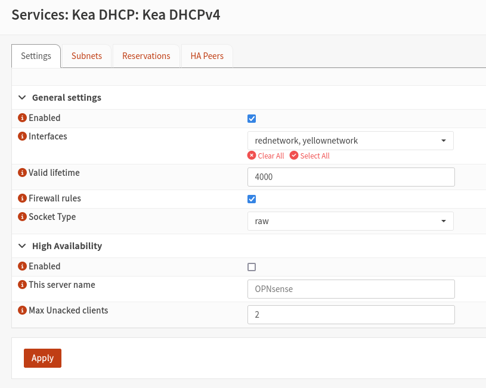
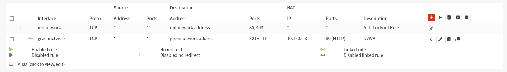

# Übung 3

Gruppenmitglieder: (Gruppe 6)
- Philip Magnus
- Astrid Kuzma-Kuzniarski 

## Configuring Filter Based Forwarding on vSRX

We configured filter based forwarding to allow multiple webservers to exist in our DMZ and be accessible from the WAN. This would also come in handy when configuring more fine grained rules for accessing resources in our DMZ.

### Filter Based Forwarding

The following configuration will enable filter based forwarding on our firewall:

```junos
# 1. Define routing instances for each server (without interfaces)
set routing-instances webserver-ri instance-type forwarding
set routing-instances metasploitable-ri instance-type forwarding

# 2. Define static routes in each routing instance (adjust IP addresses as needed)
set routing-instances webserver-ri routing-options static route 0.0.0.0/0 next-hop 10.120.0.3
set routing-instances metasploitable-ri routing-options static route 0.0.0.0/0 next-hop 10.120.0.10

# 3. Create firewall filters for traffic matching
set firewall filter dmz-traffic term web-traffic from destination-port 80
set firewall filter dmz-traffic term web-traffic from destination-port 443
set firewall filter dmz-traffic term web-traffic then routing-instance webserver-ri

set firewall filter dmz-traffic term metasploitable-traffic from destination-port 22
set firewall filter dmz-traffic term metasploitable-traffic from destination-port 21
set firewall filter dmz-traffic term metasploitable-traffic from destination-port 23
set firewall filter dmz-traffic term metasploitable-traffic from destination-port 445
set firewall filter dmz-traffic term metasploitable-traffic then routing-instance metasploitable-ri

set firewall filter dmz-traffic term default-traffic then accept

# 4. Apply filter to WAN interface (assuming ge-0/0/0 is WAN interface)
set interfaces ge-0/0/0 unit 0 family inet filter input dmz-traffic
```

### How It Works Now

1. The forwarding routing instances are created without interface assignments
2. Traffic is directed to the appropriate instance solely through the firewall filter
3. Once in the routing instance, the traffic follows the static route to reach the appropriate server

### For Multiple Web Servers

If we wanted to direct traffic to multiple web servers, we would still use routing instances but differentiate traffic using criteria like destination IPs:

```junos
# For multiple web servers with different destination IPs
set firewall filter dmz-traffic term webserver1 from destination-address 10.120.0.3/32
set firewall filter dmz-traffic term webserver1 from destination-port 80
set firewall filter dmz-traffic term webserver1 then routing-instance webserver1-ri

set firewall filter dmz-traffic term webserver2 from destination-address x.x.x.x/32 
set firewall filter dmz-traffic term webserver2 from destination-port 80
set firewall filter dmz-traffic term webserver2 then routing-instance webserver2-ri
```


### Firewall Troubleshooting 

We used a Juniper vSRX firewall. However, since our license is set to expire at the end of May, we were unable to use certain features that were essential to continue with the exercise. Extending the license was not a viable option, as it would have required us to reconfigure everything from scratch. As a result, we were forced to switch to a different firewall. We will now switch to the open-source firewall OPNsense, which will also require a complete reconfiguration. As a result, many of the steps from Exercise 2 will have to be repeated. The full configuration process will not be documented again in detail here; instead, we will resume documentation from this point onward.

## OPNSense Firewall

### Firewall replacement

Because the test license for our firewall was only valid and useable for 30 days we needed to replace our vSRX firewall with an open source alternative. For this we use OPNSense as we originally intended.

### Configuration of firewall

We configured the firewall analogous to our vSRX firewall configuration.
We try to use the new firewall as a drop in replacement to not disrupt our work in progress to much. For this we assigned the three network interfaces in the same way as in the first firewall. We configured a port forwarding to our DVWA in the DMZ. 

We also configured our firewall to act as a dhcp server for the yellow and red networks. The DVWA host received a static IP in this configuration.

The following are some sample screenshots from our configuration. We thought it not very target oriented to document the complete configuration again, as it is largely the same as on the old firewall.





