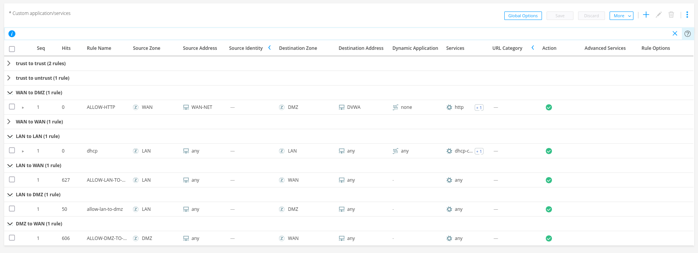

# Übungsblatt 1 & 2. Planung eines Netzwerk (Übung 1.1)


Gruppenmitglieder: (Gruppe 6)
- Philip Magnus
- Astrid Kuzma-Kuzniarski 

This documents shows the implementation of a network infrastructure with three network segments (LAN, DMZ, untrusted zone). A range of different clients and a vulnerable web server will be implemented, such as an internal Windows system and an external Kali Linux -"Attacker", and a Windows Server 2012 with DVWA.

General Information: 
During the lab, we switched to Proxmox to simplify the work and saving of data. 
During work, we also switched the Servers from the Windows 12 Server to an Ubuntu 24.04 Server, due to the configuration of vulnerable Webserver. 

## Network Plan

IP Ranges:

| Network | IP-(Range)            | What       | Interface |
|:--------|:----------------------|:-----------|:----------|
| Green   | 192.168.10.121/24     | Internet   | eno1      |
| Yellow  | 10.120.[0-127].0/17   | DMZ        | enp3s0f0  |
| Red     | 10.120.[128-255].0/17 | LAN        | enp3s0f1  |
| Blue    | 10.0.0.0/24           | Management |           |

Green (Internet):

    192.168.10.121 - router
    192.168.10.195 - Kali/Parrot Client

Yellow (DMZ):

    10.120.0.1 - router
    10.120.0.3 - Windows 2012 Server
    

Red (LAN):

    10.120.128.1 - router
    10.110.128.3 - Windows 7 Client

Blue (management):

    10.0.0.2 - vSRX Firewall # WiP


## Installation 

For our Virtual Maschines we use VirtualBox. We copy the VMs locally and create clones of them. The VMs are installed on two hosts and connected through the physical network. The IP addresses have beed manually assigned to the VMs.

The following clients have beed installed: 

- Kali
- Windows 7_SP1
- Windows Server_2012
- Ubuntu Server 24.04

After the cloning of a machine, we go to the "Settings" -> "Network" and set the adapters as "Bridged Adapter" and connect with the correct interfaces:

###### YELLOW: 


###### RED:


Now we use the following command do activate the physical interfaces: 

```console
$ for x in enp3s0f0 enp3s0f1 ; do suodp ip l set $x up ; done
```


To configure the networks in the router, we modify the `/etc/netplan/00-installer-config.yaml`:

```yaml
network:
    version: 2
    ethernets:
        ens20: # green
            dhcp4: false
            addresses: 
                - 192.168.10.121/24
            routes:
                - to: 0.0.0.0/0
                  via: 192.168.11.1
            nameservers:
                addresses: [8.8.8.8, 8.8.4.4]                
        ens21: # red
            addresses: 
                - 10.120.120.1/17 
        ens22: #yellow
            addresses:
                - 10.120.0.1/17 
```    

Now we activate the frouting from red to yellow: 

```
sudo su -
echo 1 > /proc/sys/net/ipv4/ip_forward
iptables -A FORWARD -i ens21 -o ens22 -j ACCEPT
iptables -A FORWARD -o ens21 -i ens22 -m state --state RELATED,ESTABLISHED -j ACCEPT
```

We set up NAT on the router using the following commands.
NAT: 

```bash
iptables -t nat -P OUTPUT ACCEPT
iptables -t nat -P PREROUTING ACCEPT
iptables -t nat -P POSTROUTING ACCEPT
iptables -t nat -A POSTROUTING -o ens20 -j MASQUERADE
```

To save our `iptables` configuration the `iptables-persistent` package was installed.

```bash
apt install iptables-persistent -y
```

To save the made changes we ran the following command:

```bash
iptables-save > /etc/iptables/rules.v4
```

For making the ipv4 forwarding rule permanent we created a file under ` /etc/sysctl.d/10-forward.conf` with the following single line as its content.

```bash
net.ipv4.ip_forward = 1
```

For our `DNS` and `DHCP` configuration we installed `dnsamasq`. 

```bash
sudo apt install dnsmasq -y
```

To configure dhcp nad dns we create the following config file under `/etc/dnsmasq.d/seclab.conf`.

```conf
# 
# DNS config
#

server=9.9.9.10
server=8.8.8.8

local=/yellow.lab.phi255.at/
local=/red.lab.phi255.at/

interface=ens20
interface=ens21
interface=ens22

# 
# DHCP config
#

log-dhcp

no-dhcp-interface=ens20

# Red network
dhcp-range=ens21,10.120.128.2,10.120.255.204,12h
dhcp-option=ens21,3,10.120.128.1
domain=red.lab.phi255.at,10.120.128.0/17

# Yellow network
dhcp-range=ens22,10.120.0.2,10.120.127.204,12h
dhcp-option=ens22,3,10.120.0.1
domain=yellow.lab.phi255.at,10.120.0.0/17

# Static IPs
dhcp-host=bc:24:11:c7:fa:1b,dwua,10.120.0.3
```

To activate `dnsmasq` we disable the default dns service on our ubuntu server and then activate the `dnsmasq.service`.

```bash
systemctl stop systemd-resolved
systemctl disable systemd-resolved
systemctl enable dnsmasq
```

To check if the `dnsmasq.service` started successfully we can run the following `systemctl` command.

```bash
systemctl status dnsmasq
```

### Windows 7 settings: 

We started our client machine on a Windows 7 VM and set the configuration of the Internet to satic, as follows: 


Now we test, if we have a connection, by usind the `ping`command to our router:


### Windows 12:

On our Windowas 12 Server we make the following configurations: 

Start > Systemsteuerung > Netzwerk- und Freigabecenter

- disable the Firewall (which in general in not recomended)


Then we tried to download and install the XAMPP for the DVWA. 
ATTENTION: Issues with the installed Browser, we needed to install Mozilla Firefox first to continue with the task. 

## Proxmox

We moved our lab setup to a private Proxmox cluster.

The main reasons that we switched to Proxmox: 
- hardware performance 
- persistent: 
    - We don´t have to copy the VMs to and from the computer on which we are working in the lab. 
    - Internet connection works better and we have an improvement in speed
    - Constant access --> We can work from anywhere at anytime 

Main changes: 

- Switching from Windows 12 Server to Ubuntu Server 24.04 LTS
- Vulnerable Web App (DVWA) on Docker

#### New network plan: 


### Installation

The installation didn´t change much, but we needed to adapt a few things. Mainly we needed to reinstall our virtual machines but kept the configuration to the original as close as possible.

In Proxmox we setup virtual networks equivalent to those available to us in the lab.

## Setup DVWA

To setup the Damn Vulnerable Web Application, DVWA for short, we setup a second Ubuntu 24.04 LTS server. We installed docker and launched the DVWA docker image which can be pulled from docker hub.

### Installation Docker

The following commands from the official docker documentation were used to install docker and its cli on the server. 
First the official docker repositories are added to our list of repositories. The docker signing keys have also been added to verify the sources from the docker repositories. 
Lastly the information from the newly added repositories was updated.

```bash
sudo apt update
sudo apt install apt-transport-https curl
curl -fsSL https://download.docker.com/linux/ubuntu/gpg | sudo gpg --dearmor -o /etc/apt/keyrings/docker.gpg
echo "deb [arch=$(dpkg --print-architecture) signed-by=/etc/apt/keyrings/docker.gpg] https://download.docker.com/linux/ubuntu $(. /etc/os-release && echo "$VERSION_CODENAME") stable" | sudo tee /etc/apt/sources.list.d/docker.list > /dev/null
sudo apt update
```

The following software was installed from the docker respositories.

```bash
sudo apt install docker-ce docker-ce-cli containerd.io docker-buildx-plugin docker-compose-plugin -y
```

To run the docker image with the dvwa we ran the following command. This command also exposes the machines port 80 to the docker port 80 so the webserver can be reached from outside the ubuntu server itself.

```bash
docker run --rm -it -p 80:80 vulnerables/web-dvwa
```

To make the webserver accessible from the `green` network (the Internet) we needed to activate port forwarding on our router.

```bash
iptables -t nat -A PREROUTING -p tcp -i ens20 --dport 80 -j DNAT --to-destination 10.120.0.3:80
iptables -A FORWARD -p tcp -d 10.120.0.3 --dport 80 -m state --state NEW,ESTABLISHED,RELATED -j ACCEPT
```

From the Kali machine we can now try to reach the dvwa server simply by trying to connect to the routers IP address on port 80.


## Vulnerability Scanner - Nessus

In our Kali VM we download and install Nessus from: https://www.tenable.com/downloads/nessus
The correct version needs to be selected to work on the operating system. Therefore, for Kali we install: `Linux - Debian - amd64`


After the download process, we install the `.deb` package:

```shell
sudo dpkg -i ~/Downloads/Nessus-10.8.3-ubuntu1604_amd64.deb 
[sudo] Passwort für kali: 
Vormals nicht ausgewähltes Paket nessus wird gewählt.
(Lese Datenbank ... 407856 Dateien und Verzeichnisse sind derzeit installiert.)
Vorbereitung zum Entpacken von .../Nessus-10.8.3-ubuntu1604_amd64.deb ...
Entpacken von nessus (10.8.3) ...
nessus (10.8.3) wird eingerichtet ...
HMAC : (Module_Integrity) : Pass
SHA1 : (KAT_Digest) : Pass
SHA2 : (KAT_Digest) : Pass
SHA3 : (KAT_Digest) : Pass
TDES : (KAT_Cipher) : Pass
AES_GCM : (KAT_Cipher) : Pass
AES_ECB_Decrypt : (KAT_Cipher) : Pass
RSA : (KAT_Signature) : RNG : (Continuous_RNG_Test) : Pass
Pass
ECDSA : (PCT_Signature) : Pass
ECDSA : (PCT_Signature) : Pass
DSA : (PCT_Signature) : Pass
TLS13_KDF_EXTRACT : (KAT_KDF) : Pass
TLS13_KDF_EXPAND : (KAT_KDF) : Pass
TLS12_PRF : (KAT_KDF) : Pass
PBKDF2 : (KAT_KDF) : Pass
SSHKDF : (KAT_KDF) : Pass
KBKDF : (KAT_KDF) : Pass
HKDF : (KAT_KDF) : Pass
SSKDF : (KAT_KDF) : Pass
X963KDF : (KAT_KDF) : Pass                                                                                                                   
X942KDF : (KAT_KDF) : Pass                                                                                                                   
HASH : (DRBG) : Pass                                                                                                                         
CTR : (DRBG) : Pass                                                                                                                          
HMAC : (DRBG) : Pass                                                                                                                         
DH : (KAT_KA) : Pass                                                                                                                         
ECDH : (KAT_KA) : Pass                                                                                                                       
RSA_Encrypt : (KAT_AsymmetricCipher) : Pass                                                                                                  
RSA_Decrypt : (KAT_AsymmetricCipher) : Pass                                                                                                  
RSA_Decrypt : (KAT_AsymmetricCipher) : Pass                                                                                                  
INSTALL PASSED                                                                                                                               
Unpacking Nessus Scanner Core Components...                                                                                                  
 
 - You can start Nessus Scanner by typing /bin/systemctl start nessusd.service                                                               
 - Then go to https://kali:8834/ to configure your scanner   
```

Then we started the Nessus daemon.

```bash
$ sudo systemctl start nessusd.service
```


### Setup Nessus

The setup wizard pops up and we need to follow the following steps: 

- We choose the selection option "Register for Nessus Essentials", which offers the free version of Nessus for educators, students, and hobbyists.


Here we receive the valid licence and the activation code:


Then we need to create an account: 
For the Username we choose: fh-campus-team6
Passwort: fhcampus6


Then we are waiting for the initialization. After that step we should be able to start our first scan. 


Within Nessus we can configure our settings for a fist scan of the DVWA. Our first scan was conducted from inside the same Network.

First we chose to setup a new scan. Here we first choose the `Basic Network Scan` template.


In the "New Scan" window we can configure the host we want to scan. Simply setting the host IP will be enough for our first scan.


After saving the configuration we can see the saved scan in the "My Scans" folder. By clicking the `Launch` button we can start our first scan.


After completing the scan we get the option to generate a report consisting of the scanned hosts and the corresponding found vulnerabilities.


In our report we can see that we do not find many vulnerabilities. This stems from the fact that our server itself is running a recent version and the vulnerabilities provided by the DVWA are strictly web vulnerabilities like cross-site scripting or sql injections.

To those vulnerabilities we can start a `Web Application Test` and provide the login credentials to access the site containing the vulnerabilities.

We created a new `Web Application Test` and configured the host to scan as well as the needed credentials.


Launching the scan resulted in the following report.


For comparison we set up a machine which is not only vulnerable to web vulnerabilities but also other vulnerabilities resulting from the usage of outdated software and misconfigurations on the server. For this we chose the `Metasploitable2` server provided by Rapid7 the developers of the metasploit framework.

We started the machine on `10.120.25.59`. A basic network scan resulted in the following report.


Scanning the DVWA from the external network, i.e. through the port forwarding on our router, resulted in the same report we saw from inside the same network.

## Firewall

### Initial configuration

For our firewall we are using a Juniper Networks vSRX Firewall with the following virutal hardware.


The firewall was installed using the cqow2 Image provided by Juniper Networks.

For an initial configuration we executed the following basic configuration steps.

First we entered `cli mode` in the JunOS system on our vSRX VM.

```bash
root#cli
root@>
```

From the `cli` we activated the configuration mode to start editing our comfiguration.

```bash
configure
[edit]
root@#
```

Next we set a new password for our root user, for this we chose the password `Firewall`. 

```bash
[edit]
root@# set system root-authentication plain-text-password
New password: ********
Retype new password: ********
```

After setting a new password we also set a new host-name for our firewall for which we chose `vSRX`.

```bash
[edit]
root@# set system host-name vSRX
```

Next we set up the `fxp0`managemnt interface to be active and use a dhcp-client to obtain an out-of-band management IP address. This address will later be used to acces the J-Web GUI for easier configuration of the firewall.

```bash
[edit]
root@# set interfaces fxp0 unit 0 family inet dhcp-client
```

After the management interface we setup an initial generic interface and added it to a security trust zone. This interface can later be changed via the web GUI.

```bash
[edit]
root@# set interfaces ge-0/0/0 unit 0 family inet dhcp-client
```

```bash
[edit]
root@# set security zones security-zone trust interfaces ge-0/0/0.0
```

Lastly we checked our changes before a commit for any errors. After the checks completed successfully we commited the changes to the configuration.

```bash
[edit]
root@# commit check
configuration check succeeds
```

```bash
[edit]
root@#commitcommit
complete
```

With the `show` command we can view the config after the initial configuration steps.

```bash
root@vSRX# show 
## Last changed: 2025-04-13 19:07:36 UTC
version 23.2R2.21;
system {
    host-name vSRX;
    root-authentication {
        encrypted-password "$6$TsmRNjet$g6erK1vNp5XNZsIACUfAlemcyYuGaaMxOda0jfaIVppW49eLw0SxU1Z.ltWCHWNxofbvU/F4IpARVHEOqy4Uv."; ## SECRET-DATA
    }
    services {
        ssh;
        web-management {
            http {
                interface fxp0.0;
            }
            https {
                system-generated-certificate;
                interface fxp0.0;
            }
        }
    }
    syslog {
        file interactive-commands {
            interactive-commands any;
        }                               
        file messages {                 
            any any;                    
            authorization info;         
        }                               
    }                                   
    license {                           
        autoupdate {                    
            url https://ae1.juniper.net/junos/key_retrieval;
        }                               
        keys {                          
            key "E419777401 aeaqic apaeor 4altdy arwhqb impacr i6bmed embrgu ydgmbz bqihmu 2slawu u5lonf ygk4sf ozqwyb ziukrz o4t4tq 73ypay 2pgysd icl7im u5x4l3 4pgvmf cggson fslbu7 atr27n sh6zqe s2rq";
        }                               
    }                                   
}                                       
security {                              
    pki {                               
        ca-profile ISRG_Root_X1 {       
            ca-identity ISRG_Root_X1;   
            pre-load;                   
        }                               
        ca-profile Lets_Encrypt {       
            ca-identity Lets_Encrypt;   
            enrollment {                
                url https://acme-v02.api.letsencrypt.org/directory;
            }                           
        }                               
    }                                   
    screen {                            
        ids-option untrust-screen {     
            icmp {                      
                ping-death;             
            }                           
            ip {                        
                source-route-option;    
                tear-drop;              
            }                           
            tcp {                       
                syn-flood {             
                    alarm-threshold 1024;
                    attack-threshold 200;
                    source-threshold 1024;
                    destination-threshold 2048;
                    queue-size 2000; ## Warning: 'queue-size' is deprecated
                    timeout 20;         
                }                       
                land;                   
            }                           
        }                               
    }                                   
    policies {                          
        from-zone trust to-zone trust { 
            policy default-permit {     
                match {                 
                    source-address any; 
                    destination-address any;
                    application any;    
                }                       
                then {                  
                    permit;             
                }                       
            }                           
        }                               
        from-zone trust to-zone untrust {
            policy default-permit {     
                match {                 
                    source-address any; 
                    destination-address any;
                    application any;    
                }                       
                then {                  
                    permit;             
                }                       
            }                           
        }                               
        pre-id-default-policy {         
            then {                      
                log {                   
                    session-close;      
                }                       
            }                           
        }                               
    }                                   
    zones {                             
        security-zone trust {           
            tcp-rst;                    
            interfaces {                
                ge-0/0/0.0;             
            }                           
        }                               
        security-zone untrust {         
            screen untrust-screen;      
        }                               
    }                                   
}                                       
interfaces {                            
    ge-0/0/0 {                          
        unit 0 {                        
            family inet {               
                dhcp;                   
            }                           
        }                               
    }                                   
    fxp0 {                              
        unit 0 {                        
            family inet {               
                dhcp;                   
            }                           
        }                               
    }                                   
}
```

Much of the further configuration will take place via the J-Web GUI which can be reached by calling the webserver running on the management interface of the vSRX-Firewall. The interface can be reached over its out-of-band IP address. This would be equivalent to setting up a hardware firewall through its management port.

> NOTE: The management IP can be set to an in-band address. This is highly discouraged by the manufacturer through their best practices. This is done mainly to reduce security risks and attack surfaces.

### Further configuration

We can login to the management GUI with the known user password combination of `root:Firewall`. 


After a succesful login we are presented with the basic settings screen.


> NOTE: Every configuration change via the GUI also needs to be commited.

### Interfaces, DHCP and Zones

To configure our interfaces for our different zones we navigate to `Network > Connectivity > Interfaces`. Here we can see our interfaces with their respective addresses in a scheme used across all _Juniper_ devices.

For more information on the addressing scheme of the interfaces see: [Understanding Interfaces](https://www.juniper.net/documentation/us/en/software/junos/interfaces-ethernet-switches/topics/topic-map/switches-interface-understanding.html)


For each interface we can add a logical interface unit. With this unit we can configure our zone we want to access, as well as the IP address we want to use in that network.

The following screenshot can be viewed as an example configuration.


Just like the first interface all other interfaces were configured so they can bes used in their respective networks.


Additionally to their IP addresses we configured the zones in which the interfaces are used.
This can be done under `Security Policies & Objects > Zones/screens > Zones List`


Because the firewall is supposed to replace the router we also need to configure DHCP servers and static IP addresses for the VMs in their respective Networks. 

The DHCP servers are configured under `Network > DHCP > DHCP Server`. We configured two servers one for the LAN (red networkt) and one for the DMZ (yellow network), the WAN (green network) does not receive a DHCP server because it is supposed to simulate an external network, i.e. the internet.


For our DMZ we additionally configured the following two static IP addresses, the first for the vulnerable Server, the second for our server hosting our SIEM.


### NAT, Port Forwarding and Policies

To allow communication between our Zones we need to configure some NAT Rules, Port forwarding to make our vulnerable web server reachable from the WAN and some security policies.

Our basic NAT policies allow unfiltered access between the LAN and DMZ, this will probably change in later exercises but is sufficient for now.

For the acces to the vulnerable webserver we allow access to port 80 on our webserver from the WAN.


Four our portfarwarding we need to configure an address pool containing the webserver IP which is then selected as the DNAT target in our ruleset.


With this pool we can create our DNAT rule-set. This rule will make sure incoming traffic on our WAN interface ip and port 80 is forwarded to the web server.


Security on the _Juniper vSRX_ firewall is largely based on zones and their configured security policies. These can be configured under `Security Policies & Objects > Security Policies`

These policies are configured on a zone to zone communication base. This basically means for each direction of traffic from one zone to the other a set of policies can be configured to allow or disallow certain sorts of traffic.

For the basic purpose of our base setup we configured the following `Security Policies`.



We can see that the rules specify a source zone, a destingation zone as well as destination addresses and the allowed services. Lastly the action shows if the kind of traffic is permitted or not.


### Nessus Scan

To have a comparison to our previously executed Nessus scans we repeat the scans through pur firewall.

First we scanned the firewall because we can only reach the friewall itself from the WAN.


Nessus only detects INFO level "vulnerabilities". This is not much different from before which is mainly the result of using an up to date server.

Secondly we scanned the DVWA itself with the webscan template in Nessus.


This resulted in us seeing all the web vulnerabilites. This is expected all these vulnerabilities are achievable over http and don`t need further access into our network or onto our machines.

Lastly we scanned the DVWA and Metasploitable2 from the same network (zone) but with the firewall taking over the routing duties.

Those two scans had the same result we already got when scanning these VMs when we had our basic router as our main hub between the networks. This is expected because in our basic firewall set up we have no restrictions on traffic within our network zone, i.e. the DMZ.


## SIEM 

For the SIEM we will use ELK Stack, Apache Metron

In our DMZ (yellow network) we set up an `ELK-Stack` instance as our SIEM system. The `ELK-Stack` or sometimes known as `Elastic-Stack` is a suite of different tools to ingest and display log, event and process data from different sources. The stack is made up of `Elasticsearch`, `Logstash` and `Kibana`.

### Initial Setup

The system was set up on an Ubuntu Server 24.04 LTS system with the user:password combination `siem:siem`.

For Setting up or SIEM we chose a dockerized version of the ELK-stack primarily to make the deployment of the system as easy as possible. Herefore we chose [docker-elk](https://github.com/deviantony/docker-elk/).

We installed docker as previously described on the Ubuntu server. Then we cloned the git repository and followed the setup steps for an initial deployment.

The setup and deployment basically consists of two docker compose commands.

```bash
$ docker compose up setup

$ docker compose up
```

After this the Kibana UI is ready and can be viewed on our VMs address `10.120.0.10:5061`

To log into the frontend the preconfigured user password combination of `elastic:changeme` can be used.

### Further configuration and connecting the firewall

To connect the firewall to our SIEM we needed to conclude a couple of steps.

First we needed to activate the Juniper logstash integration as well as the filebeat docker container.

The filebeat container is providing an endpoint which can be used to listen for, receive and collect logs from different devices.

To start the filebeat container we ran the following command as described in the elk-docker repository.

```bash
$ docker compose -f docker-compose.yml -f extensions/filebeat/filebeat-compose.yml up
```

To activate the logstash integration we first needed to change permissions on our filebeat.yml file. The file can be found under `extensions/filebeat/config/filebeat.yml`. This needed to be done to activate the juniper integration from insede the docker container with `filebeat modules juniper enable`.


After enabling the integration it needed to be configured. For this we created the `extensions/filebeat/juniper.yaml` with the following contents.

```yaml
- module: juniper
  srx:
    enabled: true
    var.input: udp
    var.syslog_host: 0.0.0.0
    var.syslog_port: 9006
```

To make use of this file we had to mount it inside the filebeat docker container. We achieved this by adding the file as a bind mount via the `filebeat-compose.yml` file.

```yaml
services:
  filebeat:
    build:
      context: extensions/filebeat/
      args:
        ELASTIC_VERSION: ${ELASTIC_VERSION}
    # Run as 'root' instead of 'filebeat' (uid 1000) to allow reading
    # 'docker.sock' and the host's filesystem.
    user: root
    command:
      # Log to stderr.
      - -e
      # Disable config file permissions checks. Allows mounting
      # 'config/filebeat.yml' even if it's not owned by root.
      # see: https://www.elastic.co/guide/en/beats/libbeat/current/config-file-permissions.html
      - --strict.perms=false
    volumes:
      - ./extensions/filebeat/config/filebeat.yml:/usr/share/filebeat/filebeat.yml:ro,Z
      - type: bind
        source: /var/lib/docker/containers
        target: /var/lib/docker/containers
        read_only: true
      - type: bind
        source: /var/run/docker.sock
        target: /var/run/docker.sock
        read_only: true
    environment:
      FILEBEAT_INTERNAL_PASSWORD: ${FILEBEAT_INTERNAL_PASSWORD:-}
      BEATS_SYSTEM_PASSWORD: ${BEATS_SYSTEM_PASSWORD:-}
    networks:
      - elk
    depends_on:
      - elasticsearch
```

We added one line under `volumes:` containing `./extensions/filebeat/juniper.yaml:/usr/share/filebeat/modules.d/juniper.yml`.

To make the integration finally work we needed to get the vSRX firewall to send its syslogs to the SIEM host at the exposed port 9006.

For this we added the following two small configurations.

First we configrued the Security logging in the firewalls basic settings under `Device Administration`. 


It is important to set the format to `SD-Syslog` or else logstash will not be able to parse the received logs correctly.

For our second configuration we neded to add a syslog host via the firewalls cli interface.


For this we executed the following commands in the firewalls configuration mode.

```bash
philip@vSRX> configure
Entering configuration mode

[edit]
philip@vSRX# set system syslog host 10.120.0.10 any any

[edit]
philip@vSRX# set system syslog host 10.120.0.10 port 9006

[edit]
philip@vSRX# set system syslog host 10.120.0.10 structured-data brief

[edit]
philip@vSRX# commit and-quit
```

After this we can check the configuration with:

```bash
philip@vSRX> show configuration system syslog host 10.120.0.10
any any;
port 9006;
structured-data {
    brief;
}
```

To verify that we receive logs on our SIEM system we navigate on the Kibana UI to the discover section under analytics (`"Burger Menu" > Analytics > Discover`).

Here we can see that we are receiving syslogs from our vSRX Firewall.


### Conclusion

In the first two lab sessions we configured a basic router to view a learn about a most network setup. The first setup provides basically no security other than basic routing and port forwarding rules.

The configuration of the firewall has shown us that we can achive better security with a basic setup. We also learned that the firewall is giving us options to define really detailed rulesets to direct the flow of traffic into and out of our networks.

Adding the SIEM was a challenge in our case because of a lack of good documentation and easy to use configurations.

In the next sessions we want to install and integrate OSSEC as our EDR solution and configure our firewall in more detail.


