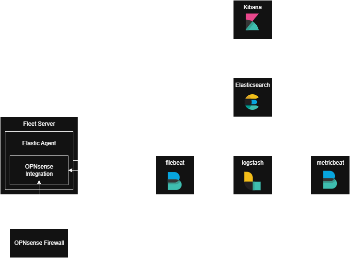

# Übung 4 - Catch up day

## Rebuilding our SIEM





#### Elastic agent
Enables unified monitoring of logs, metrics, security data, and more across hosts and systems. It’s linked to policies that define what data to collect and how to secure it, which can be updated to add new integrations.

#### Elastic Integrations 
are pre-configured packages (with settings, dashboards, and visualizations) that  collect and interpret data from external sources, available directly in Kibana.

#### Policies 
group settings and integrations, allowing consistent and flexible data collection across many agents.

#### Fleet
is the Kibana interface to centrally manage Elastic Agents and policies, track agent health, and push updates or new integrations through the Fleet Server, which acts as a communication hub for all agents.


Environment: 
- Docker needs to be installed
- We clone the repo with the following structure: 

```bash
├── .env
├── docker-compose.yml
├── filebeat.yml
├── logstash.conf
├── metricbeat.yml
```


#### Elasticsearch 

Key configuration: 

```yaml
es01:
  depends_on:
    setup:
      condition: service_healthy
  image: docker.elastic.co/elasticsearch/elasticsearch:${STACK_VERSION}
  volumes:
    - certs:/usr/share/elasticsearch/config/certs
    - esdata01:/usr/share/elasticsearch/data
  ports:
    - ${ES_PORT}:9200
  environment:
    - node.name=es01
    - cluster.name=${CLUSTER_NAME}
    - discovery.type=single-node
    - ELASTIC_PASSWORD=${ELASTIC_PASSWORD}
    - xpack.security.enabled=true
    - xpack.security.http.ssl.enabled=true
    - xpack.security.http.ssl.key=certs/es01/es01.key
    - xpack.security.http.ssl.certificate=certs/es01/es01.crt
    - xpack.security.http.ssl.certificate_authorities=certs/ca/ca.crt
  mem_limit: ${ES_MEM_LIMIT}

```

#### Kibana

This node doesn't start until it sees that the Elasticsearch node above is up and running correctly.

Key configuration: 

```yaml
kibana:
  depends_on:
    es01:
      condition: service_healthy
  image: docker.elastic.co/kibana/kibana:${STACK_VERSION}
  volumes:
    - certs:/usr/share/kibana/config/certs
    - kibanadata:/usr/share/kibana/data
  ports:
    - ${KIBANA_PORT}:5601
  environment:
    - SERVERNAME=kibana
    - ELASTICSEARCH_HOSTS=https://es01:9200
    - ELASTICSEARCH_USERNAME=kibana_system
    - ELASTICSEARCH_PASSWORD=${KIBANA_PASSWORD}
    - ELASTICSEARCH_SSL_CERTIFICATEAUTHORITIES=config/certs/ca/ca.crt
    - XPACK_SECURITY_ENCRYPTIONKEY=${ENCRYPTION_KEY}
  mem_limit: ${KB_MEM_LIMIT}

```

 We load up Kibana and see if we can access it.

 SCREENSHOOT????

#### Metricbeat

Kibana and Elasticsearch are up and running, and comunicating.
For our Metricbeat we will need a configuration in our docker-compose file, and also in a standalone metricbeat.yml file. 


```yaml
metricbeat01:
  depends_on:
    es01:
      condition: service_healthy
    kibana:
      condition: service_healthy
  image: docker.elastic.co/beats/metricbeat:${STACK_VERSION}
  user: root
  volumes:
    - certs:/usr/share/metricbeat/certs
    - metricbeatdata01:/usr/share/metricbeat/data
    - "./metricbeat.yml:/usr/share/metricbeat/metricbeat.yml:ro"
    - "/var/run/docker.sock:/var/run/docker.sock:ro"
    - "/sys/fs/cgroup:/hostfs/sys/fs/cgroup:ro"
    - "/proc:/hostfs/proc:ro"
    - "/:/hostfs:ro"
  environment:
    - ELASTIC_USER=elastic
    - ELASTIC_PASSWORD=${ELASTIC_PASSWORD}
    - ELASTIC_HOSTS=https://es01:9200
    - KIBANA_HOSTS=http://kibana:5601

```

#### Filebeat

Key configuration: 


```yaml
filebeat01:
  depends_on:
    es01:
      condition: service_healthy
  image: docker.elastic.co/beats/filebeat:${STACK_VERSION}
  user: root
  volumes:
    - certs:/usr/share/filebeat/certs
    - filebeatdata01:/usr/share/filebeat/data
    - "./filebeat.yml:/usr/share/filebeat/filebeat.yml:ro"
    - "./filebeat_ingest_data/:/usr/share/filebeat/ingest_data/"
    - "/var/lib/docker/containers:/var/lib/docker/containers:ro"
    - "/var/run/docker.sock:/var/run/docker.sock:ro"
  environment:
    - ELASTIC_USER=elastic
    - ELASTIC_PASSWORD=${ELASTIC_PASSWORD}
    - ELASTIC_HOSTS=https://es01:9200

```

#### Logstash

Key configuration:

```yaml
logstash01:
  depends_on:
    es01:
      condition: service_healthy
    kibana:
      condition: service_healthy
  image: docker.elastic.co/logstash/logstash:${STACK_VERSION}
  user: root
  volumes:
    - certs:/usr/share/logstash/certs
    - logstashdata01:/usr/share/logstash/data
    - "./logstash_ingest_data/:/usr/share/logstash/ingest_data/"
    - "./logstash.conf:/usr/share/logstash/pipeline/logstash.conf:ro"
  environment:
    - ELASTIC_USER=elastic
    - ELASTIC_PASSWORD=${ELASTIC_PASSWORD}
    - ELASTIC_HOSTS=https://es01:9200

```


```bash
CONTAINER ID   IMAGE                                                 COMMAND                  CREATED          STATUS                    PORTS                                                                                      NAMES
c68112b3e08a   docker.elastic.co/logstash/logstash:8.8.2             "/usr/local/bin/dock…"   28 minutes ago   Up 26 minutes             5044/tcp, 9600/tcp                                                                         es-cluster-logstash01-1
b3ed2ed62034   docker.elastic.co/beats/metricbeat:8.8.2              "/usr/bin/tini -- /u…"   28 minutes ago   Up 26 minutes                                                                                                        es-cluster-metricbeat01-1
4c2defd44eed   docker.elastic.co/beats/elastic-agent:8.8.2           "/usr/bin/tini -- /u…"   28 minutes ago   Up 26 minutes             0.0.0.0:8200->8200/tcp, [::]:8200->8200/tcp, 0.0.0.0:8220->8220/tcp, [::]:8220->8220/tcp   es-cluster-fleet-server-1
13f6599baedf   docker.elastic.co/kibana/kibana:8.8.2                 "/bin/tini -- /usr/l…"   28 minutes ago   Up 27 minutes (healthy)   0.0.0.0:5601->5601/tcp, [::]:5601->5601/tcp                                                es-cluster-kibana-1
0cfd2b5f3ea8   docker.elastic.co/beats/filebeat:8.8.2                "/usr/bin/tini -- /u…"   28 minutes ago   Up 27 minutes                                                                                                        es-cluster-filebeat01-1
e8a5f91d65e4   docker.elastic.co/elasticsearch/elasticsearch:8.8.2   "/bin/tini -- /usr/l…"   28 minutes ago   Up 28 minutes (healthy)   0.0.0.0:9200->9200/tcp, [::]:9200->9200/tcp, 9300/tcp                                      es-cluster-es01-1
ed899c7662c0   es-cluster-webapp                                     "uvicorn main:app --…"   28 minutes ago   Up 28 minutes             0.0.0.0:8000->8000/tcp, [::]:8000->8000/tcp 
```

```bash
siem@siem:~$ docker cp es-cluster-es01-1:/usr/share/elasticsearch/config/certs/ca/ca.crt /tmp/.

Successfully copied 3.07kB to /tmp/.

siem@siem:~$ openssl x509 -fingerprint -sha256 -noout -in /tmp/ca.crt | awk -F"=" {' print $2 '} | sed s/://g

5BFF4D169DE6DBCD52DC1B11C043AD2ADDF043749EA478D59D004DA8F4BCB231
```
```bash
siem@siem:~$ cat /tmp/ca.crt 
-----BEGIN CERTIFICATE-----
MIIDSjCCAjKgAwIBAgIVAOHDzxTMpownwBaz2I/SCZZ98T44MA0GCSqGSIb3DQEB
CwUAMDQxMjAwBgNVBAMTKUVsYXN0aWMgQ2VydGlmaWNhdGUgVG9vbCBBdXRvZ2Vu
ZXJhdGVkIENBMB4XDTI1MDUyNDEyMjkyMVoXDTI4MDUyMzEyMjkyMVowNDEyMDAG
A1UEAxMpRWxhc3RpYyBDZXJ0aWZpY2F0ZSBUb29sIEF1dG9nZW5lcmF0ZWQgQ0Ew
ggEiMA0GCSqGSIb3DQEBAQUAA4IBDwAwggEKAoIBAQCx1RlKlmPiWJM3YV9CWlMr
eepZRMoM7DiK9CaIPBAvwfK1CLUsNmPluTh8hJtp158ay4EzAdoFepoITa2Uxvkl
DqVI2PBSonfl4hXYEg2rpdbR1+9BlZdZib43BL0EtKuX+ZjwuNYU/OYW4iqIk3KG
baow/2RPddJh8YXkmSC+N6iIrBm/vED1/Z1YUhpaXVJaP5KQm0r3BDLhXmghtQSs
Z+ZGJy1cwdsKIUxEi9o6qFq0ATvl7woOW3937YMnkCTlIEDpzaCiVE+X384OX0gi
xo5yYf2c+zHZdIaaoxgVtqvGLISCY++Y0btJRylCRaAyMeLGk3DmPsChiLd5fvN/
AgMBAAGjUzBRMB0GA1UdDgQWBBQiX3V+iKv18+Bh66ip3Pk0+/VHhDAfBgNVHSME
GDAWgBQiX3V+iKv18+Bh66ip3Pk0+/VHhDAPBgNVHRMBAf8EBTADAQH/MA0GCSqG
SIb3DQEBCwUAA4IBAQCCgkFLBB7g2B70u6GLnIJqgzQGZCrS+Kj2wKfgJZcM+R2J
EDCKWybDyjqTx4LPef/fDYJB7EVmVpEHWgtca421e2JayZbUTkXjmUc5NWz7eJbg
RNhcm3EwR/IMcm2soPJr6BpN57CFA0bAk+f18aQ8h7Op7M61DJKuU7c+3IqO2nCV
bIl/aeC+9tdfbeDpC4phMhxQcTtUtHoUQmof1haNqIBDWuZOxRmozB8cTXvS0Mb8
jFQvawtLtocLuIcTDgk1A9EVaYZZ+n2zcMts8yw+TR0uKlwNF6W/cpK6YH1WQdEl
LSvMZRI+JOcEU0lGPaf7zgUOiVAxLdYnizCmyvj3
-----END CERTIFICATE-----
```

