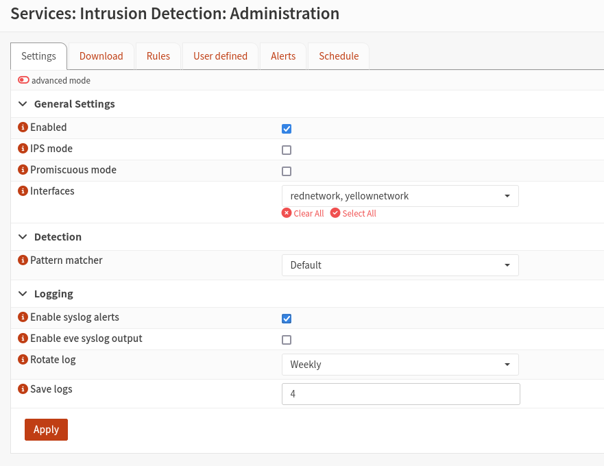

::: title
Exercise 3a - Catch up day
:::

::: subtitle
Astrid Kuzma-Kuzniarski<br>
Philip Magnus
:::

## Rebuilding our SIEM

The basic idea of rebuilding our SIEM is to make integrations for our firewall logs easily accessible as well as combat the huge amount of log data that filled our first SIEMs harddisk fully in only a few days.

For our SIEM we still stick with ELK-stack and use the following architechture realized in docker containers.


#### Elastic agent
Enables unified monitoring of logs, metrics, security data, and more across hosts and systems. It’s linked to policies that define what data to collect and how to secure it, which can be updated to add new integrations.

#### Elastic Integrations 
are pre-configured packages (with settings, dashboards, and visualizations) that  collect and interpret data from external sources, available directly in Kibana.

<div style="page-break-after: always;"></div>

#### Policies 
group settings and integrations, allowing consistent and flexible data collection across many agents.

#### Fleet
is the Kibana interface to centrally manage Elastic Agents and policies, track agent health, and push updates or new integrations through the Fleet Server, which acts as a communication hub for all agents.


Environment: 
- Docker needs to be installed
- We clone the repo with the following structure: 

```bash
├── .env
├── docker-compose.yml
├── filebeat.yml
├── logstash.conf
├── metricbeat.yml
```


#### Elasticsearch 

Key configuration: 

```yaml
es01:
  depends_on:
    setup:
      condition: service_healthy
  image: docker.elastic.co/elasticsearch/elasticsearch:${STACK_VERSION}
  volumes:
    - certs:/usr/share/elasticsearch/config/certs
    - esdata01:/usr/share/elasticsearch/data
  ports:
    - ${ES_PORT}:9200
  environment:
    - node.name=es01
    - cluster.name=${CLUSTER_NAME}
    - discovery.type=single-node
    - ELASTIC_PASSWORD=${ELASTIC_PASSWORD}
    - xpack.security.enabled=true
    - xpack.security.http.ssl.enabled=true
    - xpack.security.http.ssl.key=certs/es01/es01.key
    - xpack.security.http.ssl.certificate=certs/es01/es01.crt
    - xpack.security.http.ssl.certificate_authorities=certs/ca/ca.crt
  mem_limit: ${ES_MEM_LIMIT}

```

<div style="page-break-after: always;"></div>

#### Kibana

This node doesn't start until it sees that the Elasticsearch node above is up and running correctly.

Key configuration: 

```yaml
kibana:
  depends_on:
    es01:
      condition: service_healthy
  image: docker.elastic.co/kibana/kibana:${STACK_VERSION}
  volumes:
    - certs:/usr/share/kibana/config/certs
    - kibanadata:/usr/share/kibana/data
  ports:
    - ${KIBANA_PORT}:5601
  environment:
    - SERVERNAME=kibana
    - ELASTICSEARCH_HOSTS=https://es01:9200
    - ELASTICSEARCH_USERNAME=kibana_system
    - ELASTICSEARCH_PASSWORD=${KIBANA_PASSWORD}
    - ELASTICSEARCH_SSL_CERTIFICATEAUTHORITIES=config/certs/ca/ca.crt
    - XPACK_SECURITY_ENCRYPTIONKEY=${ENCRYPTION_KEY}
  mem_limit: ${KB_MEM_LIMIT}

```

We load up our `docker ps` overview and see our accessible and started containers.


```bash
CONTAINER ID   IMAGE                                                 COMMAND                  CREATED          STATUS                    PORTS                                                                                      NAMES
c68112b3e08a   docker.elastic.co/logstash/logstash:8.8.2             "/usr/local/bin/dock…"   28 minutes ago   Up 26 minutes             5044/tcp, 9600/tcp                                                                         es-cluster-logstash01-1
b3ed2ed62034   docker.elastic.co/beats/metricbeat:8.8.2              "/usr/bin/tini -- /u…"   28 minutes ago   Up 26 minutes                                                                                                        es-cluster-metricbeat01-1
4c2defd44eed   docker.elastic.co/beats/elastic-agent:8.8.2           "/usr/bin/tini -- /u…"   28 minutes ago   Up 26 minutes             0.0.0.0:8200->8200/tcp, [::]:8200->8200/tcp, 0.0.0.0:8220->8220/tcp, [::]:8220->8220/tcp   es-cluster-fleet-server-1
13f6599baedf   docker.elastic.co/kibana/kibana:8.8.2                 "/bin/tini -- /usr/l…"   28 minutes ago   Up 27 minutes (healthy)   0.0.0.0:5601->5601/tcp, [::]:5601->5601/tcp                                                es-cluster-kibana-1
0cfd2b5f3ea8   docker.elastic.co/beats/filebeat:8.8.2                "/usr/bin/tini -- /u…"   28 minutes ago   Up 27 minutes                                                                                                        es-cluster-filebeat01-1
e8a5f91d65e4   docker.elastic.co/elasticsearch/elasticsearch:8.8.2   "/bin/tini -- /usr/l…"   28 minutes ago   Up 28 minutes (healthy)   0.0.0.0:9200->9200/tcp, [::]:9200->9200/tcp, 9300/tcp                                      es-cluster-es01-1
ed899c7662c0   es-cluster-webapp                                     "uvicorn main:app --…"   28 minutes ago   Up 28 minutes             0.0.0.0:8000->8000/tcp, [::]:8000->8000/tcp 
```

<div style="page-break-after: always;"></div>

#### Fleet Server configuration

For the connection to our Fleet Server we need a CA certificate so we can establish a connection to the elastic search container via TLS. We get the certificate fingerprint and the certificate itself.

```bash
siem@siem:~$ docker cp es-cluster-es01-1:/usr/share/elasticsearch/config/certs/ca/ca.crt /tmp/.

Successfully copied 3.07kB to /tmp/.

siem@siem:~$ openssl x509 -fingerprint -sha256 -noout -in /tmp/ca.crt | awk -F"=" {' print $2 '} | sed s/://g

5BFF4D169DE6DBCD52DC1B11C043AD2ADDF043749EA478D59D004DA8F4BCB231
```
```bash
siem@siem:~$ cat /tmp/ca.crt 
-----BEGIN CERTIFICATE-----
MIIDSjCCAjKgAwIBAgIVAOHDzxTMpownwBaz2I/SCZZ98T44MA0GCSqGSIb3DQEB
CwUAMDQxMjAwBgNVBAMTKUVsYXN0aWMgQ2VydGlmaWNhdGUgVG9vbCBBdXRvZ2Vu
ZXJhdGVkIENBMB4XDTI1MDUyNDEyMjkyMVoXDTI4MDUyMzEyMjkyMVowNDEyMDAG
A1UEAxMpRWxhc3RpYyBDZXJ0aWZpY2F0ZSBUb29sIEF1dG9nZW5lcmF0ZWQgQ0Ew
ggEiMA0GCSqGSIb3DQEBAQUAA4IBDwAwggEKAoIBAQCx1RlKlmPiWJM3YV9CWlMr
eepZRMoM7DiK9CaIPBAvwfK1CLUsNmPluTh8hJtp158ay4EzAdoFepoITa2Uxvkl
DqVI2PBSonfl4hXYEg2rpdbR1+9BlZdZib43BL0EtKuX+ZjwuNYU/OYW4iqIk3KG
baow/2RPddJh8YXkmSC+N6iIrBm/vED1/Z1YUhpaXVJaP5KQm0r3BDLhXmghtQSs
Z+ZGJy1cwdsKIUxEi9o6qFq0ATvl7woOW3937YMnkCTlIEDpzaCiVE+X384OX0gi
xo5yYf2c+zHZdIaaoxgVtqvGLISCY++Y0btJRylCRaAyMeLGk3DmPsChiLd5fvN/
AgMBAAGjUzBRMB0GA1UdDgQWBBQiX3V+iKv18+Bh66ip3Pk0+/VHhDAfBgNVHSME
GDAWgBQiX3V+iKv18+Bh66ip3Pk0+/VHhDAPBgNVHRMBAf8EBTADAQH/MA0GCSqG
SIb3DQEBCwUAA4IBAQCCgkFLBB7g2B70u6GLnIJqgzQGZCrS+Kj2wKfgJZcM+R2J
EDCKWybDyjqTx4LPef/fDYJB7EVmVpEHWgtca421e2JayZbUTkXjmUc5NWz7eJbg
RNhcm3EwR/IMcm2soPJr6BpN57CFA0bAk+f18aQ8h7Op7M61DJKuU7c+3IqO2nCV
bIl/aeC+9tdfbeDpC4phMhxQcTtUtHoUQmof1haNqIBDWuZOxRmozB8cTXvS0Mb8
jFQvawtLtocLuIcTDgk1A9EVaYZZ+n2zcMts8yw+TR0uKlwNF6W/cpK6YH1WQdEl
LSvMZRI+JOcEU0lGPaf7zgUOiVAxLdYnizCmyvj3
-----END CERTIFICATE-----
```

<div style="page-break-after: always;"></div>

In the Kibana GUI we navigate to `Fleet > Settings`.


We edit the default Outputs and change the following fields:

- Hosts
- Elasticsearch CA trusted fingerprint
- Advanced YAML configuration


<div style="page-break-after: always;"></div>


We adjust the host to `es01` the name of the elasticsearch container. Then we add the fingerprint to the corresponding field and lastly add the following `yaml` to the advanced configuration field.

<div style="page-break-after: always;"></div>

```yaml
ssl:
  certificate_authorities:
  - |
    -----BEGIN CERTIFICATE-----
    MIIDSjCCAjKgAwIBAgIVAOHDzxTMpownwBaz2I/SCZZ98T44MA0GCSqGSIb3DQEB
    CwUAMDQxMjAwBgNVBAMTKUVsYXN0aWMgQ2VydGlmaWNhdGUgVG9vbCBBdXRvZ2Vu
    ZXJhdGVkIENBMB4XDTI1MDUyNDEyMjkyMVoXDTI4MDUyMzEyMjkyMVowNDEyMDAG
    A1UEAxMpRWxhc3RpYyBDZXJ0aWZpY2F0ZSBUb29sIEF1dG9nZW5lcmF0ZWQgQ0Ew
    ggEiMA0GCSqGSIb3DQEBAQUAA4IBDwAwggEKAoIBAQCx1RlKlmPiWJM3YV9CWlMr
    eepZRMoM7DiK9CaIPBAvwfK1CLUsNmPluTh8hJtp158ay4EzAdoFepoITa2Uxvkl
    DqVI2PBSonfl4hXYEg2rpdbR1+9BlZdZib43BL0EtKuX+ZjwuNYU/OYW4iqIk3KG
    baow/2RPddJh8YXkmSC+N6iIrBm/vED1/Z1YUhpaXVJaP5KQm0r3BDLhXmghtQSs
    Z+ZGJy1cwdsKIUxEi9o6qFq0ATvl7woOW3937YMnkCTlIEDpzaCiVE+X384OX0gi
    xo5yYf2c+zHZdIaaoxgVtqvGLISCY++Y0btJRylCRaAyMeLGk3DmPsChiLd5fvN/
    AgMBAAGjUzBRMB0GA1UdDgQWBBQiX3V+iKv18+Bh66ip3Pk0+/VHhDAfBgNVHSME
    GDAWgBQiX3V+iKv18+Bh66ip3Pk0+/VHhDAPBgNVHRMBAf8EBTADAQH/MA0GCSqG
    SIb3DQEBCwUAA4IBAQCCgkFLBB7g2B70u6GLnIJqgzQGZCrS+Kj2wKfgJZcM+R2J
    EDCKWybDyjqTx4LPef/fDYJB7EVmVpEHWgtca421e2JayZbUTkXjmUc5NWz7eJbg
    RNhcm3EwR/IMcm2soPJr6BpN57CFA0bAk+f18aQ8h7Op7M61DJKuU7c+3IqO2nCV
    bIl/aeC+9tdfbeDpC4phMhxQcTtUtHoUQmof1haNqIBDWuZOxRmozB8cTXvS0Mb8
    jFQvawtLtocLuIcTDgk1A9EVaYZZ+n2zcMts8yw+TR0uKlwNF6W/cpK6YH1WQdEl
    LSvMZRI+JOcEU0lGPaf7zgUOiVAxLdYnizCmyvj3
    -----END CERTIFICATE-----
```

To check if connecting our Fleet server and Elasticsearch correctly we can check the Fleet servers health stats and or the Elastic-Agent metrics.


<div style="page-break-after: always;"></div>

## Running a Burp Webscan

Before activating our IDPS we wanted to run a Burp Scan to have a base level of found vulnerabilities.

We chose to run an automated authenticated scan against the DVWA.


We can clearly see that quite a lot of vulnerabilities were found by the automated scan.

<div style="page-break-after: always;"></div>

## Configuring IPS

To configure our IDPS in the OPNsense firewall we navigated to `Services > Intrusion Detection > Administraion`.



OPNsense provides a really good integration of [*Suricata*](https://suricata.io) an open source network analysis and threat detection software.

To enable *Suricata* we needed to perform a few steps.

1. In the Downloads Tab we enabled all default rules and then triggered their download.

2. In the Schedule Tab we enabled a cron job to update the IDPS rules every 24 hours at `23:55:00`.

3. We set the  pattern matcher to **Hyperscan** because the default matcher could sometimes lead to *Suricata* crashes.

We also enabled syslog alerts for all events generated by *Suricata* rulesets.

Under `Services > Intrustion Detection > Policy` we added a default policy with Alert, Drop on all rulesets we obtained this way.

We also have configured the the special WAF-like rules for suricata from https://github.com/daffainfo/suricata-rules .

To do so, we need to create file /usr/local/opnsense/scripts/suricata/metadata/rules/waf.xml on the Firewall with the content like:

https://gist.github.com/kam193/f39ede18cc4e963b3adefaa9929ecc73 (merged all rules)

> Note: the merged ruleset was provided by our colleague Kamil Mankowski because he already hosted one on his Github and thus we did not need to create basically the same file in a seperate repository.

The `waf.xml` file contained the following:

```xml
<?xml version="1.0"?>
<ruleset documentation_url="https://github.com/daffainfo/suricata-rules/tree/main/http/web-attacks">
    <location url="https://raw.githubusercontent.com/daffainfo/suricata-rules/refs/heads/main/http/web-attacks/" prefix="WAF"/>
    <files>
        <file description="Merged WAF rules" url="https://gist.githubusercontent.com/kam193/f39ede18cc4e963b3adefaa9929ecc73/raw/77fe6f086de0b53441377e155af5af9f23cdb2b7/merged.rules">merged.rules</file>
    </files>
</ruleset>
```

After that we added some custom rules for *Suricata* to block some more specific vulnerabilities:

```bash
alert http any any -> any any (msg:"Suspicious file access: .php.bak file requested"; content:".php.bak"; nocase; http_uri; classtype:web-application-attack; sid:1000001; rev:1;)
alert http any any -> any any (msg:"Suspicious file access: .sql file requested"; content:".sql"; nocase; http_uri; classtype:web-application-attack; sid:1000002; rev:1;)
alert http any any -> any any (msg:"Suspicious http method: TRACK"; content:"TRACK"; nocase; http_method; classtype:web-application-attack; sid:1000003; rev:1;)
alert http any any -> any any (msg:"Suspicious http method: TRACE"; content:"TRACE"; nocase; http_method; classtype:web-application-attack; sid:1000004; rev:1;)
```

To add these rules we added a second `<file>` tag to our `waf.xml` file:

```xml
<file description="Custom WAF rules" url="https://raw.githubusercontent.com/kam193/its26-suricata-rules/refs/heads/main/rules/custom.rules">custom.rules</file>
```

<div style="page-break-after: always;"></div>

### Second Burp scan

To check if our IDPS was now up and running we simply started a second automated Burp scan. After its completion we could see a drastic improvement in the found vulnerabilities.


The IDPS also created several events in our logs when attacks were detected by the *Suricata* rules.


The following screenshot shows an exemple of a blocked event.
We can see the source IP address, which is the IP of our attacker machine, the Destination IP, which is the DVWA servers IP as well as some additional information.

Most interesting is the detailed payload we get to inspect which triggered the IDPS ruleset.


<div style="page-break-after: always;"></div>

## Conclusion

Our new SIEM functions a lot smoother than the first system we set up. Regardless of this we would recommend setting the system up directly on the machine as this makes configuring some services, like the Fleet server a lot simpler.

The IDPS and *Suricata* were fairly easy to configure and show promising results against our automated scans. Never the less some attack surfaces need special rulesets. This shows how important it is to know your systems and their functionality to be able to write specific rulesets for your IDPS to protect the systems in your network.