# Assignment 4: Messaging Security

Student: Philip Magnus

## 1. Aufgabenstellung

**Analysieren Sie eines der drei folgenden Messaging Protokolle bzw. Tools:**
  
Matrix (via Element Client) Signal WhatsApp Falls gewünscht ein anderes, nicht genanntes: in diesem Fall eine
Email mit Begründung an Tobias Buchberger Die gewonnenen Informationen entweder über Quellen belegen
bzw. beschreiben, wie Sie diese in Ihrer Analyse herausgefunden haben. Erstellen Sie ein Protokoll (wie
gewohnt als Markdown/HackMD/PDF).

**Betrachten Sie folgende Eigenschaften (2 Punkte):**

Welche Architektur ist umgesetzt (Centralized/Federated/Distributed)? Ist das Protokoll synchron oder
asynchron?

**Beantworten Sie folgende Fragen (2 Punkte):**

Wie ist Trust Establishment umgesetzt? 
Welche kryptographischen Primitiva werden eingesetzt (hinsichtlich Symmetrische/Asymmetrische Kryptographie, MACs, etc.)? 

**Führen Sie eine Analyse des erzeugten Netzwerktraffics mittels Wireshark durch und versuchen Sie so viele Fragen wie möglich zu beantworten. Dokumentieren Sie entsprechende Screenshots/PCAPs (10 Punkte):**

Analyse des Netzwerktraffics (3 Punkte): Können Sie den initialen Schlüsselaustausch bzw. das übertragene Schlüsselmaterial identifizieren (z.B. Signal X3DH, nicht TLS)? Können Sie einzelne Nachrichten identifizieren? Können Sie unterschiedliche Nachrichten-Typen unterscheiden? (Text, Audio, Telefonat, Medien etc.) Metadaten Analyse (3 Punkte): Scheinen interessante Informationen im Netzwerkverkehr auf? Welche Metadaten werden übertragen bzw. können Sie Metadaten aus dem aufgezeichneten Netzwerkverkehr entnehmen (z.B. DNS, X.509 Zertifikate)? Werden long-term Secrets (Public Keys) als Plaintext übertragen? Oder gibt es Identity Hiding? Sehen Sie Unterschiede zwischen 1:1 Chats bzw. Group Chats?

TLS-Interception und Analyse (4 Punkte): Sind die Netzwerkverbindungen, zusätzlich zur E2EE, transportverschlüsselt (z.B. TLS)? Wenn ja: Können Sie erfolgreich eine MitM Attacke durchführen? auf TLS; E2EE ist out-of-scope vgl. Android Challenge aus CYBERSEC, MitM mittels Burp Suite, Fiddler, mitmproxy.org, Ettercap, ZAP, o.Ä.) Bei WhatsApp könnte SSLKEYLOGFILE ausreichen Können Sie den TLS-Netzwerkverkehr erfolgreich entschlüsseln? Wenn ja: Können Sie nun weitere Fragen beantworten?
Wenn nein: Dokumentation der durchgeführten Schritte. Ist Ihnen sonst etwas
interessantes/erwähnenswertes aufgefallen?

## 2. Vorbereitung

Im zuge dieser Aufgabe habe ich mich für die Analyse des Matrix Protokolls entschieden, welches über den Element Client genutzt wird.

Die Aufgabe wurde auf einem Ubuntu 24.04 LTS System durchgeführt.

Installiert wurde die folgende Software:

- Element Client (Matrix)
- Wireshark
- mitmproxy

Der Element Client wurde mit den folgenden Commands installiesrt:

```bash
sudo apt install -y wget apt-transport-https
‍
sudo wget -O /usr/share/keyrings/element-io-archive-keyring.gpg https://packages.element.io/debian/element-io-archive-keyring.gpg
‍
echo "deb [signed-by=/usr/share/keyrings/element-io-archive-keyring.gpg] https://packages.element.io/debian/ default main" | sudo tee /etc/apt/sources.list.d/element-io.list

sudo apt update

sudo apt install element-desktop
```

## 3.Eigenschaften & Funktion

### 3.1 Welche Architektur ist umgesetzt (Centralized/Federated/Distributed)?

Matrix nutzt eine föderierte Architektur.

- Es gibt keinen zentralen Server.
- Nutzer registrieren sich auf sogenannten Homeservern.
- Diese Homeserver kommunizieren föderiert miteinander.
- Rooms können sich über viele Homeserver erstrecken.
- Jeder Server speichert eine Kopie des Raumzustands und der Nachrichten, die er kennt.

Das Matrix Chatprotokoll ist dezentral, ausfallsicher und hat keinen Single Point of Failure, ist aber kein vollständiges peer-to-peer Protokoll.

### 3.2 Ist das Protokoll synchron oder asynchron? Asynchrone und synchrone Kommunikation möglich.

Matrix unterstützt sowohl asynchrone als auch synchrone Kommunikation.

**Asynchron**

- Klassische Chatnachrichten
- Nutzer müssen nicht gleichzeitig online sein
- Nachrichten werden serverseitig gespeichert und später zugestellt

**Synchron**

- Echtzeit-Chats
- Typing Notifications
- VoIP / Videoanrufe (über WebRTC, Signalisation via Matrix)

Das Protokoll ist primär asynchron, ermöglicht aber synchrone Echtzeitinteraktionen.

### 3.3 Wie ist Trust Establishment umgesetzt?

Matrix verfolgt ein dezentrales, benutzerzentriertes Trust-Modell:

**Server-zu-Server-Trust**

- Homeserver identifizieren sich gegenseitig über Server-Signing-Keys
- Ereignisse (Events) werden kryptographisch signiert
- Föderation basiert auf Verifikation statt implizitem Vertrauen

**Ende-zu-Ende-Verschlüsselung**

- Jeder Client besitzt eigene Geräteschlüssel
- Vertrauen wird pro Gerät, nicht pro Account aufgebaut

**User Verification**

- Key Verification (QR-Code, Emoji-Vergleich)
- Cross-Signing:
  - Master Key
  - Self-Signing Key
  - User-Signing Key
- Ermöglicht automatisches Vertrauen neuer Geräte nach einmaliger Verifikation


### 3.4 Welche kryptographischen Primitiva werden eingesetzt (hinsichtlich Symmetrische/Asymmetrische Kryptographie, MACs, etc.)?

**Asymmetrische Kryptographie**

- Ed25519
  - Digitale Signaturen
  - Geräte- und Serveridentitäten

- Curve25519
  - Schlüsselaustausch (Diffie-Hellman)

**Symmetrische Kryptographie**

- AES-256
  - Nachrichtenverschlüsselung

- Ratchet-Mechanismen
  - Forward Secrecy
  - Post-Compromise Security

**Message Authentication**

- HMAC-SHA256
- Authentifizierung und Integrität von Nachrichten

**Hashfunktionen**

- SHA-256
  - Schlüsselableitungen
  - Event-Referenzen

**Protokolle**

- Olm
  - 1-zu-1-Chats
  - Asynchrones Double-Ratchet-Verfahren

- Megolm
  - Gruppen-Chats
  - Effizient für große Räume, eingeschränkte Forward Secrecy

## 4. Analyse des Netzwerktraffics

### 4.1 Vorbereitung der Analyse

Nach der Installation und dem start des Element Clients wird folgender Startbildschirm angezeigt:

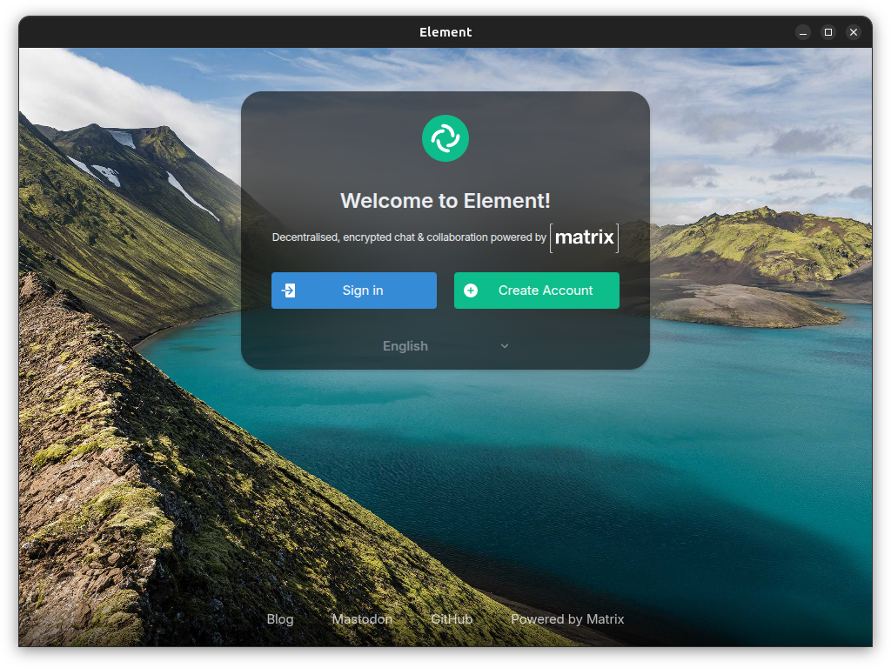

Nach dem erstellen eines Accounts und dem einloggen im Element Client, habe ich zwei private Chats erstellt. Der eine Raum nutzt eine Ende-zu-Ende Verschlüsselung, der andere nicht. Dies habe ich getan um die Unterschiede im Netzwerktraffic zu analysieren.


Im Anschluss bin ich mit einem zweiten Account von meinem Handy in die beiden Räume beigetreten um Nachrichten auszutauschen.

## 4.2 Netzwerktraffic Analyse mit Wireshark

Nach dem Start eines Wireshark Captures während der Nutzung des Element Clients, konnte ich den Netzwerktraffic analysieren. Ich habe zuerst drei Nachricten in der nicht Ende-zu-Ende verschlüsselten Konversation vom Desktop gesendet, gefolgt von einer Nachricht vom Handy und abschließend eine letzte Nachricht vom Desktop.

Um den Wireshark Capture besser filtern zu können habe ich nach den IP Addressen der Homeserver gesucht, welche in meinem Fall die folgenden waren:

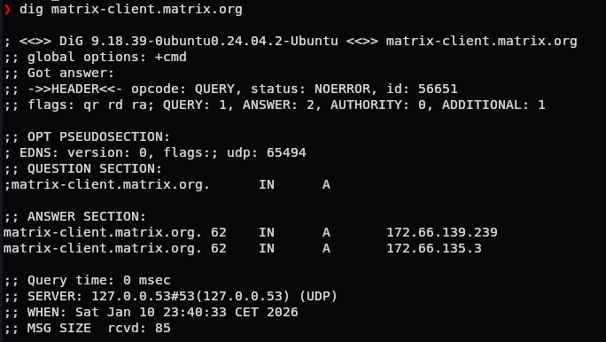

Für den A Record wurden folgende IPs zurückgegeben:

- 172.66.139.239
- 172.66.135.3

Anschließend habe ich in Wireshark nach diesen IPs gefiltert um nur den relevanten Traffic anzuzeigen:

```plaintext
ip.addr == 172.66.139.239 || ip.addr == 172.66.135.3
```
Beim initialen Verbindungsaufbau konnte ich den TLS Handshake beobachten:


**Welche Metadaten werden übertragen?**

Im TLS Handshake kann man den SNI (Server Name Indication) sehen, welcher den Domain Namen des Homeservers überträgt: `matrix-client.matrix.org`
Ein Beobachter kann so sehen, dass der Nutzer sich gerade mit dem Matrix Server verbindet. Innerhalb des TLS Handshakes kann auch die verwendete TLS Version (TLS 1.3) und die unterstützten Cipher Suites eingesehen werden. Es kann in der Server Hello Nachricht auch die ausgewählte Cipher Suite eingesehen werden: `TLS_AES_128_GCM_SHA256`.

Mit dem Filter `tls.handshake.type == 11` können die im Handshake übertragenen Zertifikate eingesehen werden:

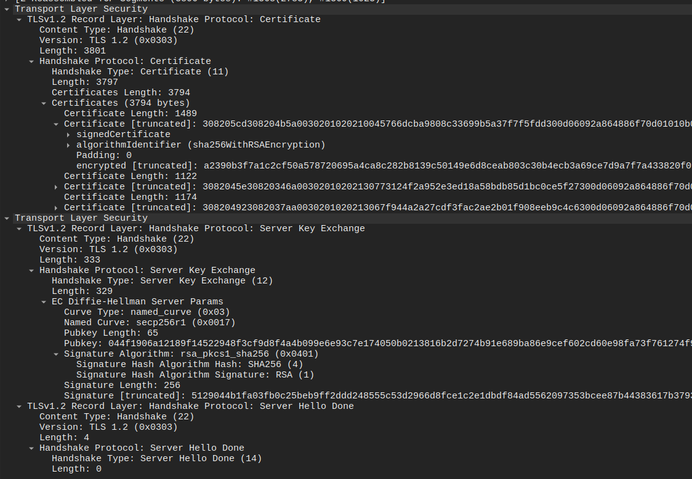

Im Mitschnitt sind TLS-1.2 Handshakes sichtbar, in denen der Server X.509-Zertifikate überträgt. Daraus lassen sich Metadaten wie Issuer (z.B. DigiCert SHA2 Secure
Server CA), Zertifikatskette, Signaturalgorithmus (z.B. sha256WithRSAEncryption), Gültigkeitsdaten und weitere Extensions ableiten.

In Wiresharks Statistikübersicht sind weitere interessante Metadaten ersichtlich, wie z.B. die Anzahl der übertragenen Pakete, Bytes, die Verteilung der Protokolle und die Kommunikationspartner:

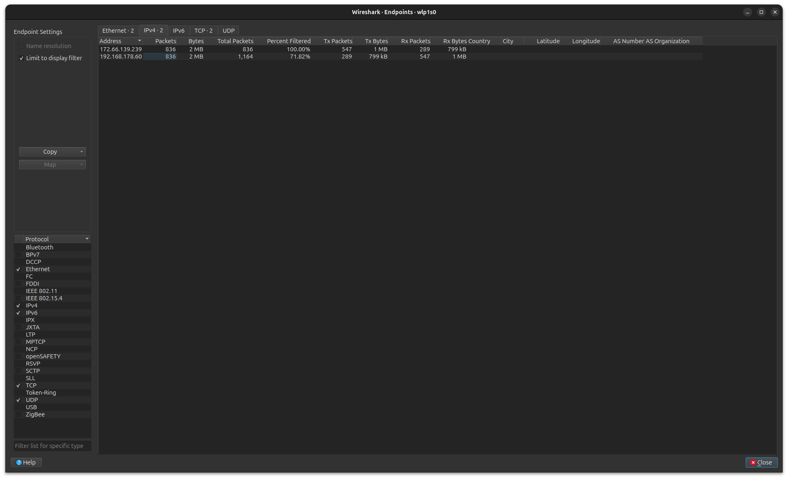

Wir können hier bei beiden Partnern sehen, dass jeweils ca. 1 MB an Daten übertragen wurden, was für eine reine Textübertragung recht viel erscheint. Kombiniert man dies mit der I/O Graphenansicht, so kann man den Datenfluss über die Zeit beobachten und evtl. das senden und empfangen von Nachrichten trotz TLS und E2EE Verschlüsselung korrelieren:

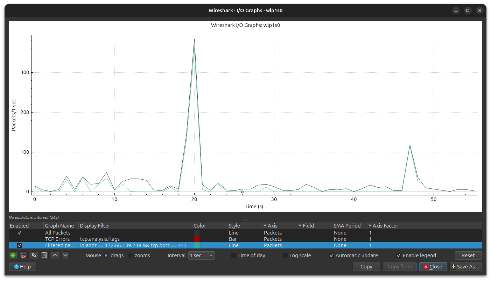


Die im Chat gesendeten Inhalte sind durch die Verschlüsselung, im Capture, weiterhin nicht lesbar:

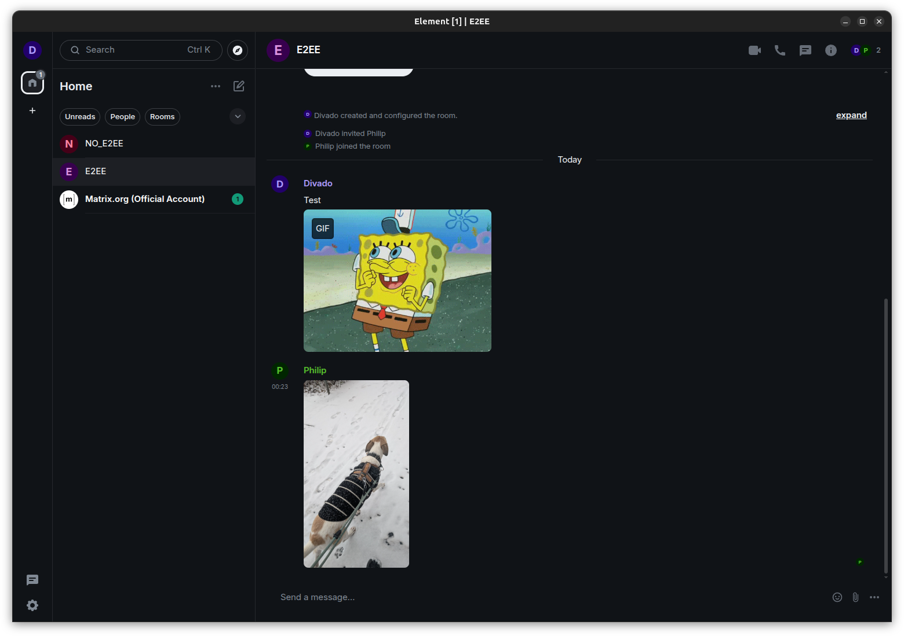

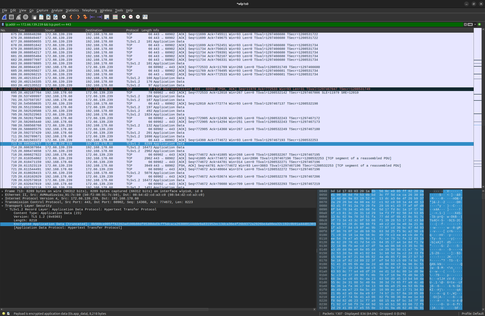

Im TLS-verschlüsselten Datenverkehr zur Matrix-IP lassen sich zeitlich klar abgegrenzte Paket-Bursts beobachten. Jeder Burst umfasst mehrere TLS-Application-Data-Records sowie ACKs, die innerhalb weniger hundert Millisekunden übertragen werden, und steht in Zusammenhang mit einer Nutzeraktion (z. B. dem Senden oder Empfangen einer Nachricht). Ohne Entschlüsselung von TLS bleibt der eigentliche Payload jedoch nicht interpretierbar.

Textnachrichten führen zu kurzen Bursts mit einer geringeren Anzahl und kleineren Paketen. Der Versand von Medieninhalten (z. B. Bildern oder Videos) hingegen erzeugt deutlich größere Bursts mit vielen großvolumigen TCP-Segmenten. Auch ohne Entschlüsselung des Payloads bleiben zeitliche Muster, Burst-Größen und übertragene Datenmengen erkennbar. Insbesondere der Medienversand lässt sich aufgrund des stark erhöhten Traffic-Volumens eindeutig identifizieren.

## 5. TLS-Interception und Analyse

**Sind die Netzwerkverbindungen, zusätzlich zur E2EE, transportverschlüsselt (z.B. TLS)?**

Ja, dies wurde bereits im vorangehenden Abschnitt gezeigt.

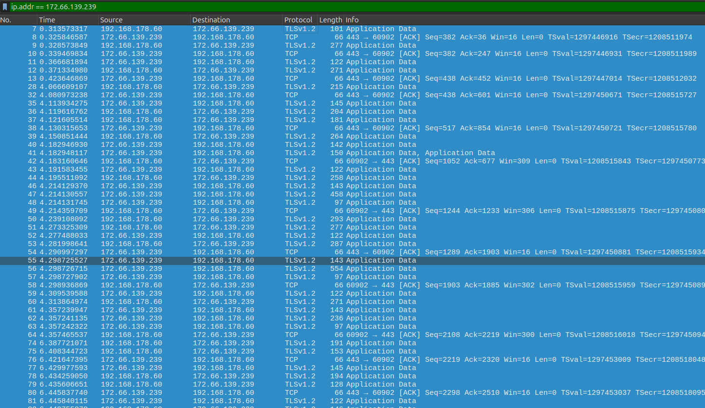

Die Client-Server-Kommunikation von Matrix, im Fall von Element, ist neben der Ende-zu-Ende-Verschlüsselung zusätzlich durch Transportverschlüsselung abgesichert. In den Netzwerkaufzeichnungen sind TLS-Handshakes erkennbar (ClientHello, Handshake-Typ 1), einschließlich SNI mit dem Eintrag `matrix-client.matrix.org`.

### 5.1 MitM Attacke

Zuerst habe ich `mitmproxy` installiert um den TLS Verkehr zu intercepten:

```bash
sudo apt install -y mitmproxy
```

Anschließend habe ich `mitmproxy` auf Port `8080` gestartet:

```bash
mitmproxy -p 8080
```

Da es sich beim Element Client um eine Electron App handelt, musste ich das Proxy Zertifikat in eine NSS Datenbank importieren. Dazu habe ich die folgenden Commands genutzt:

```bash
mkdir -p ~/.pki/nssdb

certutil -N -d sql:$HOME/.pki/nssdb

certutil -A \
  -n "mitmproxy CA" \
  -t "C,," \
  -i ~/.mitmproxy/mitmproxy-ca-cert.pem \
  -d sql:$HOME/.pki/nssdb
```

Anschließend konnte ich den Element Client über die Konsole mit folgendem Command starten, damit der Proxy genutzt wird:

```bash
element-desktop --proxy-server="http://127.0.0.1:8080"
```

Als Test habe ich eine unverschlüsselte Nachricht in dem nicht Ende-zu-Ende verschlüsselten Raum gesendet. In `mitmproxy` konnte ich die Nachricht im Klartext sehen:

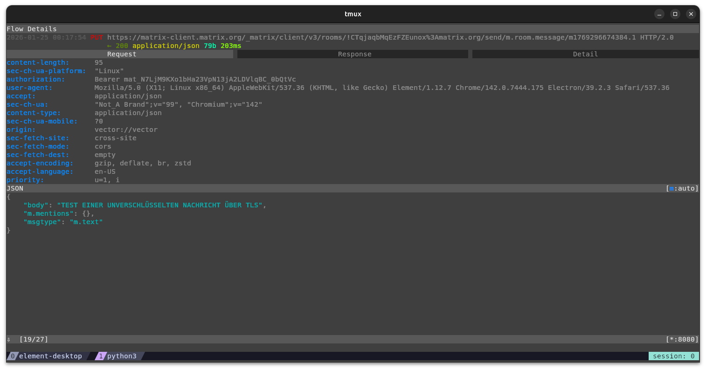

Nachfolgend die gesendete Nachricht im Element Client:

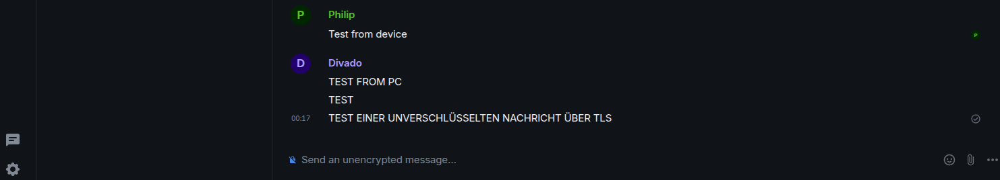

Im Auszug aus dem `mitmproxy` Capture ist die unverschlüsselte Nachricht "TEST EINER UNVERSCHLÜSSELTEN NACHRICHT ÜBER TLS" klar lesbar. Dies bestätigt, dass der TLS-Verkehr erfolgreich abgefangen und entschlüsselt wurde. Außerdem kann man sehen, an welchen Raum die Nachricht gesendet wurde.

Im folgenden Screenshot ist auch eine eingehende Nachricht, welche vom Handy und nicht E2EE gesendet wurde, im Klartext sichtbar:

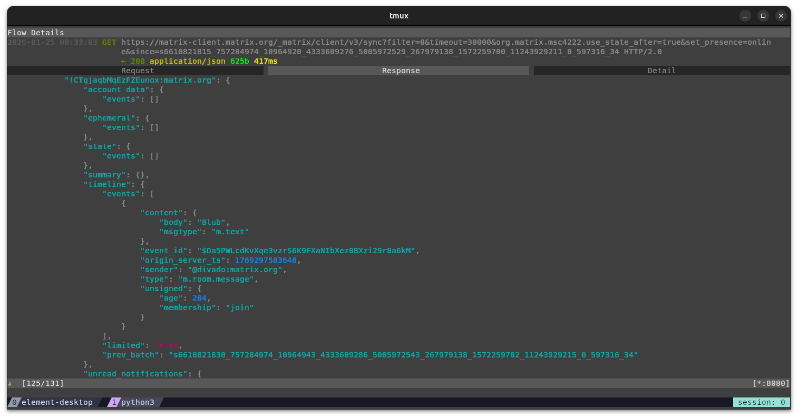

Ich konnte außerdem nachvolllziehen, wenn eine Nachricht ein Bild enthält. Die folgenden Screenshots zeigen die Übertragung eines Bildes im nicht Ende-zu-Ende verschlüsselten Raum. Im `mitmproxy` sind Informationen zum Bild ersichtlich, wie z.B. der Dateiname und die Dateigröße, der dritte Screenshot zeigt das Bild im Element Client:

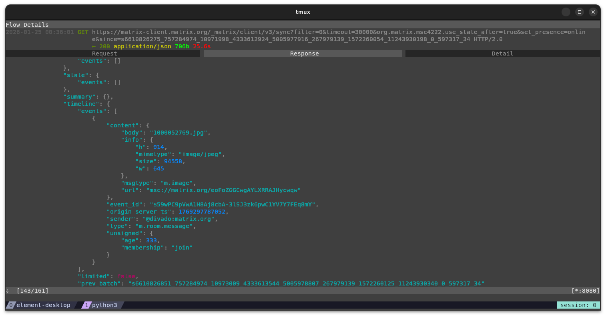

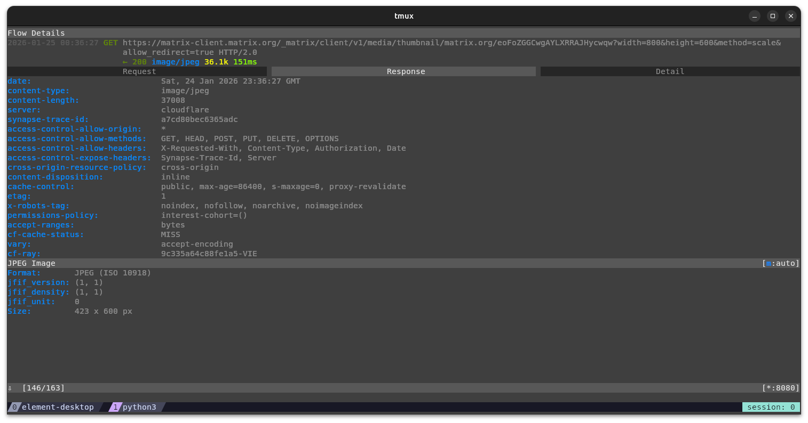

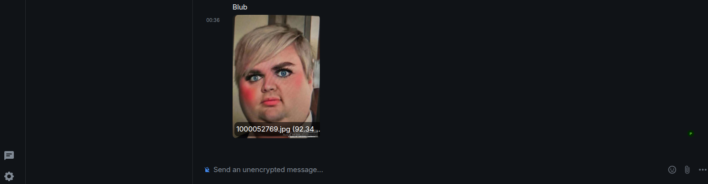

Als Vergleich habe ich anschließend versucht eine Nachricht in dem Ende-zu-Ende verschlüsselten Raum zu senden. In `mitmproxy` war die Nachricht jedoch nicht lesbar:

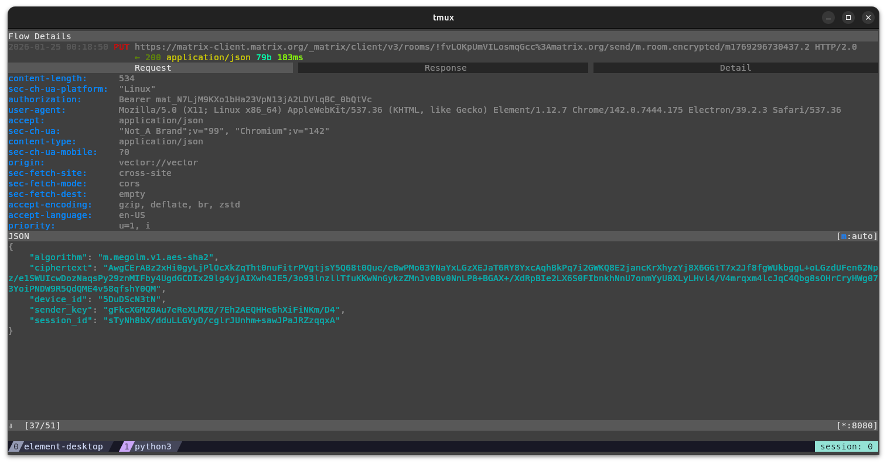


Nachfolgend die gesendete Nachricht im Element Client:

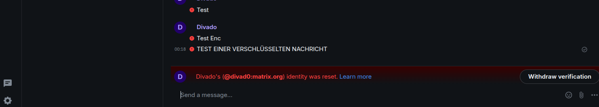

Im Auszug aus dem `mitmproxy` Capture ist die Ende-zu-Ende verschlüsselte Nachricht nicht lesbar. Dies bestätigt, dass trotz erfolgreichem TLS-MitM die eigentliche Chatnachricht durch die Ende-zu-Ende-Verschlüsselung geschützt bleibt. Sichtbar ist nur der verwendete Algorithmus und die Raum ID, nicht jedoch der Nachrichteninhalt.

## Quellen

1. https://spec.matrix.org/latest
2. https://element.io/de/features/device-verification
3. https://docs.rs/matrix-sdk/latest/matrix_sdk/encryption/index.html
4. https://docs.mitmproxy.org/stable/