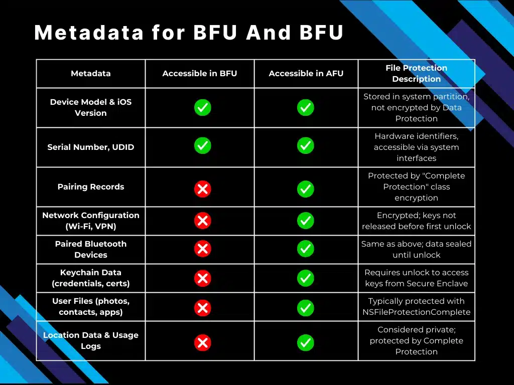

# Test Exam 1 - Digitale Forensik

### Was passiert, wenn man bei ntfs was löscht?
- MFT Entry Bitmap set to 0
- Cluster Bitmap set to 0
- dir Index is deleted

### Was ist die bitallocation map?
- Map die durch bits belegte und freie cluster anzeigt

### Sicherheitskonzept von android (sandboxing)
- Jede app läuft in eigenem prozess mit eigenem user
- Speicherisolation zwischen Apps
- Permissions pro App und zur Laufzeit
- SELinux zur Zugriffskontrolle
- App signing (erlaubt updates und source verification)

### Muss ein Gutachten immer zwei Teile haben
- Ja, Befund und Gutachten
- Befund sammelt Findings und Fakten (z.B. Dateien, Hashwerte, Artefakte etc.)
- Gutachten zieht Schlüsse aus dem Befund (ohne rechtliche Bewertung)

### Wie kann man ram extrahieren (volatility, cold boot, dma)
- Software tools (WinPmem, LiME, LinPmem)
- Hardware tools (DMA Attacks, Cold Boot Attacks)

### Welche mft Einträge sind immer gesetzt
- 0 = $MFT itself, among other information the time of creation
- 1 = $MFTMirr backup of the MFT (usually end of partition)
- 2 = $LogFile journal Log
- 6 = $Bitmap allocation status of each cluster
- 8 = $BadClus for faulty cluster, but: disk controller usually much faster

### iOS file ecryption (was passierrt mit file keys, was is verschlüsselt)
- per file key encryption mit zufälligem key
- file key wird angelegt mit datei
- per file key wird mit case key verschlüsselt und in metadata gespeichert
- class keys liegen in key bag und sind and Hardware gebunden (ggf. mit passcode verknüpft)
- Wenn Gerät gesperrt werden bestimmte class keys aus dem RAM gelöscht
- Generell gillt: alles ist verschlüsselt und Data Protection bestimmt wann etwas nicht verschlüsselt ist, z.B. wenn Gerät entsperrt ist

### Touch/face id: (de)-Aktivierung nach einiger zeit
- BFU (before first unlock) touch-id/face-id deaktiviert
- typischer weise muss nach 72h Passwort eingegeben werden
- generell gillt: nach neustart, 48h inaktivität, 5 fehlgeschlagene versuche

### Unterschied zeuge, sachverständiger
- Zeuge: gibt nur wieder was er gesehen/gehört hat
- Sachverständiger: wertet aus, zieht schlüsse, gibt Fachmeinung ab

### Nachteile invasiver ram acquisition
- funktioniert nur unter bestimmten bedingungen (teuer und nicht reproduzierbar)
- Hoher einfluss auf den ram inhalt (verfälschung der beweise)
- rechtlich/ethisch fraglich

### Vorteile forensischem wissen in unternehmen: kann schwachstellen verhindern, etc?
- Incident handling im eigenen Unternehmen
- Schwachstellen erkennen und evtl. beheben

### Was ist file carving?
- wiederherstellen von Dateien aus dem Rohdatenstrom ohne Dateisystemmetadaten
- Beispiel Tool: bulk_extractor

### Welche filesystems kann man bei ios analyse finden?
- APFS, (HFS+ = ältere Devices z.B. iPods)

### Wer entscheidet welcher sektor bei schreiboperarion geschrieben wird?
- OS schreibt an Logical Block Address (LBA)
- Bei HDD entscheidet der Festplattencontroller (Firmware)
- Bei SSD entscheidet der Flashcontroller (Firmware) mittels Wear Leveling

### Was tun wenn pc am tatort ausgeschalten gefunden wird?
- dokumentieren
- nicht einschalten
- Festplatten ausbauen und peer Hardware Write Blocker ein Abbild erstellen
- Hashes vom Abbild erstellen und mit Original vergleichen
- Ausbauen -> Abbild als Backup -> Copy vom Backup als Arbeitskopie

### Was ist der Grundsatz der freien Beweiswürdigung?
- Richter darf frei entscheiden welche Beweise er wir stark bewertet und in seine Entscheidung einbezieht, es muss nicht nach starren Regeln verfahren werden
- geregelt in StPO und ZPO

### Was ist ein plist file?
- Property List file, speichert strukturierte Daten in XML oder Binär Format
- Typische Inhalte: Key–Value-Paare und Strukturen wie Dictionary, Array, String, Number, Boolean, Date, Data (Bytes)

### Welche Filesystems kann man bei einer Android Analyse auffinden? YAFFS, ext4, HFS+, APFS
- ext4 (bei neueren Geräten)
- YAFFS2 (bei älteren Geräten, vor allem bei NAND Flash Speicher)

### Was macht forensische Analyse von smartphones komplex? Schnelle Updates, viele Versionen, Volatilität
- Vielfältige Hardware und Software Plattformen
- Häufige und schnelle Updates
- Häufig kooperation erforderlich, z.B. bei verschlüsselten Geräten (BFU)

### Welche Berufe haben eine gute Basis um Forensiker zu werden?
- Network Administrator
- System Administrator
- IT Security Specialist