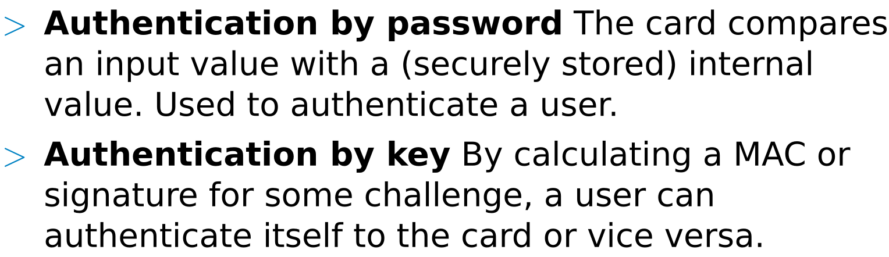
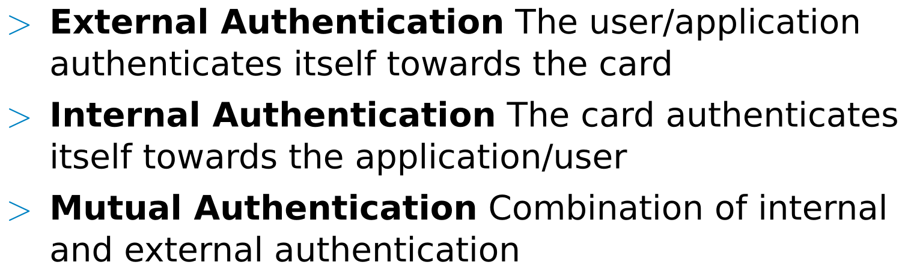
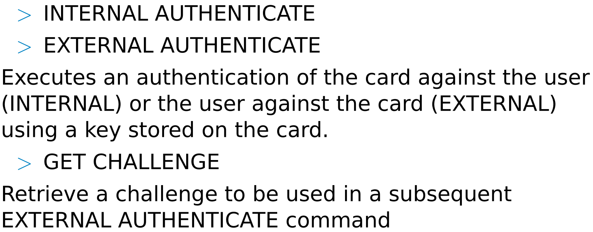
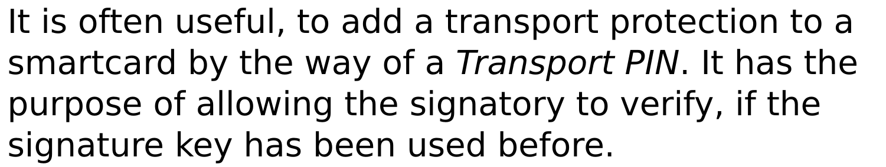
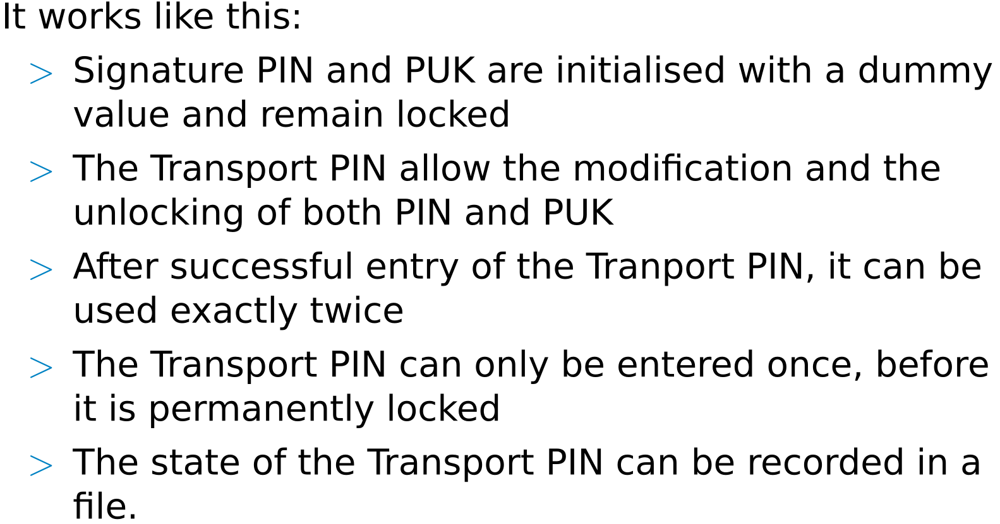
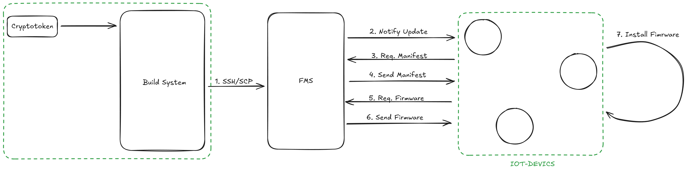
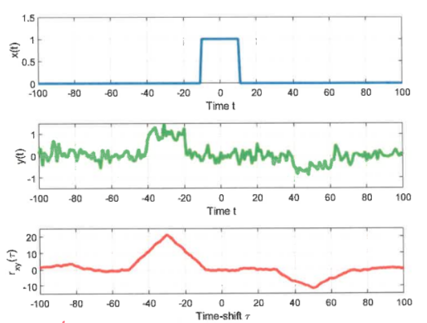

# Exam Questions

## Explain the principle why measuring the supply current allows to detect that a component of a microcomputer system is currently processing data in a specific manner.

The ability to detect what a microcomputer is doing by measuring its supply current is rooted in the physics of **CMOS (Complementary Metal-Oxide-Semiconductor)** technology, which is the foundation of almost all modern processors.

This field of study is often called **Power Analysis**, a type of "side-channel" observation. Here is the breakdown of why this works.

**1. Dynamic Power Consumption**

In a CMOS circuit, the majority of power is consumed during the **switching phase**.

- **Static State:** When a logic gate is holding a steady state (either a 0 or a 1), very little current flows because one of the transistors in the pair is always "off," blocking the path to the ground.
- **Switching State:** When a gate transitions from 0 to 1 or 1 to 0, both transistors are briefly partially on, and internal capacitances must be charged or discharged.

This creates a momentary spike in current draw from the power supply (). Therefore, every time a bit flips inside the CPU, the total supply current increases slightly.

**2. Data Dependency (Hamming Weight and Distance)**

The amount of current drawn is directly proportional to how many bits are changing at once. This is generally measured in two ways:

- **Hamming Weight:** This relates to the number of bits that are "1" in a data word. Loading a byte like `11111111` often requires more energy than `00000000` because more capacitors within the data bus or registers must be charged.
- **Hamming Distance:** This is the number of bits that **change** between two consecutive states. If a register transitions from `0000` to `1111`, four bits are switching, drawing significantly more current than a transition from `0000` to `0001`.

**3. Instruction Dependency**

Different functional units within a microcomputer (like the ALU, the barrel shifter, or the memory controller) have different physical layouts and numbers of transistors.

- An **addition** operation might activate a specific set of logic gates.
- A **multiplication** operation is much more complex, involving many more gates switching simultaneously over multiple clock cycles.
- **Memory access** involves driving signals across long "bus" lines, which have high capacitance and thus draw a large, distinct "gulp" of current.

By looking at a high-resolution oscilloscope trace of the current, an observer can see a "signature" for each instruction.

**4. How the Measurement is Made**

To "see" these patterns, engineers usually place a small **shunt resistor** in series with the power supply line.

According to Ohm’s Law (), the voltage drop across this resistor is directly proportional to the current () being drawn by the processor. By capturing this voltage with a high-speed oscilloscope, one can visualize the "power trace" of the device.

**Summary of the Logic**

1. **Operation/Data**  determines which transistors flip.
2. **Transistor Flips**  cause charging/discharging of internal capacitors.
3. **Capacitor Charging**  draws a specific amount of **Supply Current**.
4. **Supply Current**  can be measured as a **Voltage Trace** over time.

By analyzing these traces, it is possible to identify if a chip is performing a specific cryptographic algorithm, or even to leak the secret keys being used in that algorithm.

## Regarding polynomial key distribution: what does k-secure mean? What is k? Please explain with an example.


- k ist der Grad des Polynoms.
- z.B.  p(x,y) = x²+27xy+y²+42
- der Grad dieses Polynoms ist 2 somit ist es 2-secure.
- k-secure bedeutet, dass das System weiterhin sicher ist, wenn es maximal k malicious Nodes gibt.
- Bei k+1 könnte das Polynom berechnet werden.
- Im Beispiel darf es also maximal 2 kompromittierte Nodes geben.

## For each of the following scenarios, do specify if they are an example for internal authentication, external authentication of mutual authentication:





### (a) A user enters a PIN before withdrawing money with a bank card 
- [ ] Internal authentication
- [x] External authentication

### (b) An application wants to ensure, that it is communication with an expected smartcard 
- [x] Internal authentication
- [ ] External authentication

### (c) An application uses a key to calculate a MAC over a challenge in order to get access to a signature key stored on a smartcard
- [ ] Internal authentication
- [x] External authentication
  
## What does a Transport PIN guarantee?




- [ ] It prevents the usage of the signature key during transport 
- [x] It prevents the unnoticed usage of the signature key during transport 
- [ ] That the signature key can not be read in plaintext if it is exported from the card 
- [ ] That only the legitimate owner of the card can import a signature key to the card

## SFOTA
### (a) The process of remotely updating a firmware is one the most critical processes within the IoT. Why? 

Das Gerät könnte durch einen fehlerhaften Updateprozess unbrauchbar gemacht werden (Bricking). Zudem könnte ein Angreifer versuchen, eine manipulierte Firmware aufzuspielen, um so Kontrolle über das Gerät zu erlangen oder sensible Daten auszulesen.


### (b) Name at least 2 examples what might go wrong during a remote firmware update process. 

- Bitfehler während der Übertragung der Firmware -> beschädigte Firmware -> Bricking (wenn kein Rollback möglich)
- nur ein Teil der Firmware Dateien aktualisiert -> Updateprozess nicht atomic


### (c) Your boss asks you to design a Secure Firmware Update Over the Air (SFOTA) for a recent product idea. This device is a sensor measuring various sensitive data which is sent to a central- app server at the customer for further processing. The usual setting contains 15-20 nodes. A firmware management server at your company distributes the new firmware to the customers. The sensor is based on a SAMR21 (Cortex M0+) which holds a 125kB flash memory. 

- I. Which requirements are reasonable for this setting? 
- II. Choose a suitable SFOTA strategy and explain it thoroughly. 
- III. Draw a sketch for your designed SFOTA

(I) 
- Update muss secure sein ( Confidentiality durch Encryption, Integrity durch Hash, Authenticity durch Signatur)
- Update muss robust sein (Rollback, Atomic Update) -> im Fehlerfall kann alte Firmware wiederhergestellt werden
- Geräte haben Keys bereits beim initialen Flashen (Pre-shared Keys)

(II)

**SUIT mit zusätzlicher Encryption der Firmware:**
  
Am Build System wird eine neue Firmware gebaut. Diese wird verschlüsselt und der Hash der Firmware wird mit weiteren Infos wie, Updatezeitpunkt, Version, betroffene Geräte, Update-File-Location, u.ä. in ein Manifest geschrieben, dieses Manifest wird signiert. Das Manifest & die enc. FW wird auf den Firmware Management Server (FWS) geladen. Dies geschieht über SSH/SCP, dafür findet die Authentifizierung mit Crypto-Token statt. Der FMS sendet eine Nachricht an die zu aktualisierenden Geräte, welche das Manifest herunterladen, dessen Signatur überprüfen und im Falle einer erfolgreichen Überprüfung die FW herunterladen. Von der FW wird der Hash geprüft, die FW entschlüsselt und anschließend im zweiten Slot installiert, um die Möglichkeit eines Rollback zu haben (Slot 0 laufende FW, Slot 1 installiert Update). Anschließend wird die FW im Slot 1 gestartet. Im Fehlerfall wird die FW im Slot 0 wiederhergestellt.
Es handelt sich um Full-Image Updates.

(III)



## Why is Key Management essential? Describe the phases of the Key Management Life Cycle in general

Für kryptographische Operationen (Encryption, Decryption, Signature, etc.) werden Keys benötigt. Diese Keys müssen sicher verwaltet werden, kurz Key Management (Keys erstellen, verteilen, speichern, austauschen etc.).

4 Phasen des Key Management Life Cycle:

1. Pre-Operational (Key wird noch nicht genutzt)
   - Key Zustände: Pre-Active
   - Aufgaben:
     - Key Generierung
     - Key Agreement
     - Key Distribution

2. Operational (Key wird genutzt)
    - Key Zustände: Active, Suspended
    - Aufgaben:
      - Key Nutzung
      - Key Derivation
      - Key Recovery

3. Post-Operational (Key wird nicht mehr genutzt)
    - Key Zustände: Deactivated, Compromised
    - Aufgaben:
      - Key Archiving
      - Key Destruction
      - Key Reconstruction

4. Destruction (Key ist nicht mehr existent)
    - Key Zustände: Destroyed
    - Aufgaben:
      - Keine Aktionen möglich
  

## Describe and compare 3 different key distribution possibilities

1. **Key Distribution Center (KDC):**
   - Zentraler Server, der Keys generiert und an berechtigte Parteien verteilt.
   - Vorteile: Einfach zu verwalten, zentralisierte Kontrolle.
   - Nachteile: Single Point of Failure, Skalierbarkeitsprobleme.
  
2. **Public Key Infrastructure (PKI):**
   - Verwendung von asymmetrischer Kryptographie, bei der öffentliche Schlüssel verteilt werden.
   - Vorteile: Skalierbar, keine Notwendigkeit für sichere Kanäle zur Verteilung von Schlüsseln.
   - Nachteile: Komplexität, Verwaltung von Zertifikaten erforderlich.

3. **Pre-Shared Keys (PSK):**
   - Schlüssel werden vorab zwischen den Parteien ausgetauscht.
   - Vorteile: Einfach zu implementieren, keine Notwendigkeit für komplexe Infrastruktur.
   - Nachteile: Skalierbarkeitsprobleme, unsicher bei vielen Teilnehmern, Schlüssel müssen sicher gespeichert werden

## Describe the correlation of key management life cycle, key life cycle states, and key management objectives

|State| Correlation to Life Cycle| Allowed Actions |
|-----|--------------------------|-----------------|
|Pre-activation|Pre-operational|Key exists but cannot yet be used for cryptographic operations|
|Active|Operational|Key can be used to both protect (encrypt/sign) and process (decrypt/verify) data.|
|Suspended|Operational|Usage is temporarily halted (e.g., during a pending investigation).|
|Deactivated|Post-operational|Key can no longer protect new data but is used to process old data.|
|Compromised|Any|Key is revoked; used only under high-risk scenarios to recover data.|
|Destroyed|Destruction|No actions allowed; the key material is gone.|

The Life Cycle provides the workflow, the States provide the technical enforcement, and the Objectives provide the justification.

For example, when a key moves from Active to Deactivated (a State change) during the Key Rotation (a Life Cycle phase), the primary Objective being met is Risk Mitigation (limiting the amount of data encrypted by a single key to preserve Confidentiality).

## Describe the various types of keys thoroughly

**Key-Encrypting Key (KEK):**

A cryptographic key that is used for the encryption or decryption of other keys to provide confidentiality protection for those keys.

**Key-Wrapping Key (KWK):** 

A symmetric key that is used to provide both confidentiality and integrity protection for other keys.

**Key-Derivation Key (KDK):**

A key used with a key-derivation method to derive additional keys. Sometimes called a master key.

**Data Authentication Key (DAK)**

A key used for the computation of Message Authentication Codes (MACs) in order to provide assurance of content integrity and (some level of) source authentication for cryptographically protected information.

**Endorsement Key (EK):**

An EK is stored by the manufacturer and used to decrypt certificates and pass passwords into the TPM during provisioning. Group Key is a key used to secure communication within a group of entities.

**Session Key:**

Keys used only for the duration of an active session. A session is the duration in which two entities have a logical connection between each other.

## STRIDE

### 4. (a) What are the 3 main threats, i.e. attack scenarios in the IoT? Elaborate thoroughly what each means and provide an example for each. 

- Taking control of devices: An attacker gains control over IoT devices to manipulate their behavior, steal data, or use them for malicious purposes. Example: A hacker takes control of smart home devices to unlock doors or disable security systems. An example is the Jeep Hack, in which attackers remotely took control of a Jeep Cherokee's systems.

- Stealing sensitive data: IoT devices often collect and transmit sensitive information. An attacker may intercept this data during transmission or extract it from the device itself. Example: A fitness tracker transmitting health data over an unsecured connection, which is intercepted by an attacker.

- Disrupting services: IoT devices can be targeted to disrupt their normal operation, leading to denial of service or other interruptions. Example: Disruption of service for connected medical devices, such as insulin pumps or pacemakers, which can have life-threatening consequences.

### (b) The IEEE characterized the Thing by 2 main properties. Name and explain these properties.

- globally unique identifier - a Thing must be uniquely identifiable globally
- ubuiquitious accessibility from anywhere - a Thing must be accessible from anywhere at any time

## Elaborate the firmware update process security issues thoroughly.

## Discuss general requirements for a firmware update.

## Discuss firmware integrity in the context of SFOTA.

## Name to advantages that high end HSM has over a standard smartcard.

## How can a CoAP connection be secured? Describe different security modes.

## How can resources be obeserved with CoAP? Describe and compare the possibilities.

## Power analysis


### (a) Explain the principle why measuring the supply current allows to detect that a component of a microcomputer system is currently processing data in a specific manner. (6)

### (b) What information can generally be extracted from the correlation of two signals? In particular, what quantitative conclusions can be drawn from the graphs below and why? (6)



### (c) Name three methods to prevent power analysis / EM emissions based side channel attacks. (3)


## Given the following source code for a JavaCard applet:

```java
public class KeyApplet extends Applet {
    OwnerPIN pin;
    byte[] pinValue = new byte[]{0x31, 0x33, 0x33, 0x37};
    byte[] flag = new byte[]{0x6d, 0x65, 0x73, 0x2b, 0x2b};
    boolean verified = false;

    protected KeyApplet() {
        pin = new OwnerPIN((byte)3, (byte)4);
        pin.update(pinValue, (short)0, (byte)4);
    }

    public static void install(byte[] buffer, short offset, byte length) {
        (new KeyApplet()).register();
    }

    public void process(APDU apdu) throws ISOException {
        if(selectingApplet())
            return;

        byte[] buf = apdu.getBuffer();
        switch(buf[ISO7816.OFFSET_INS]) {
            case 0x01:
                byte lc = buf[ISO7816.OFFSET_LC];
                if(lc != 4 || !pin.check(buf, ISO7816.OFFSET_CDATA, lc))
                    ISOException.throwIt(ISO7816.SW_DATA_INVALID);
                verified = true;
                break;
            case 0x02:
                if (!verified)
                    ISOException.throwIt(ISO7816.SW_SECURITY_STATUS_NOT_SATISFIED);
                Util.arrayCopy(flag, (byte)0, buf, ISO7816.OFFSET_CDATA, (byte)5);
                apdu.setOutgoingAndSend(ISO7816.OFFSET_CDATA, (byte)5);
                break;
            case 0x03:
                break;
            default:
                ISOException.throwIt(ISO7816.SW_UNKNOWN);
        }
    }
}
```

The following sequences of APDUs are sent to the card (each one after selecting the applet:

1. 00-02-00-00-00 and 01-02-00-00-00
2. 00-01-00-00-04-31-33-33-37 and 00-02-00-00-00
3. 01-00-00-00-04-31-33-33-37 and 02-03-04-05
4. 01-00-00-00-04-31-33-33-37 and 02-00-00-00-05

Asnwer the following questions:

(a) Which sequence is going to return the flag? Sequence 2

(b) Which sequences are going to return an error on the final APDU? Sequence 1 and 4

(c) What is going to be the response APDU for the command successfully requesting the flag? 6d-65-73-2b-2b-90-00